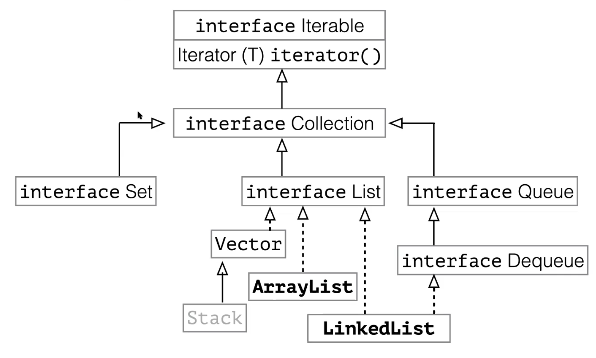
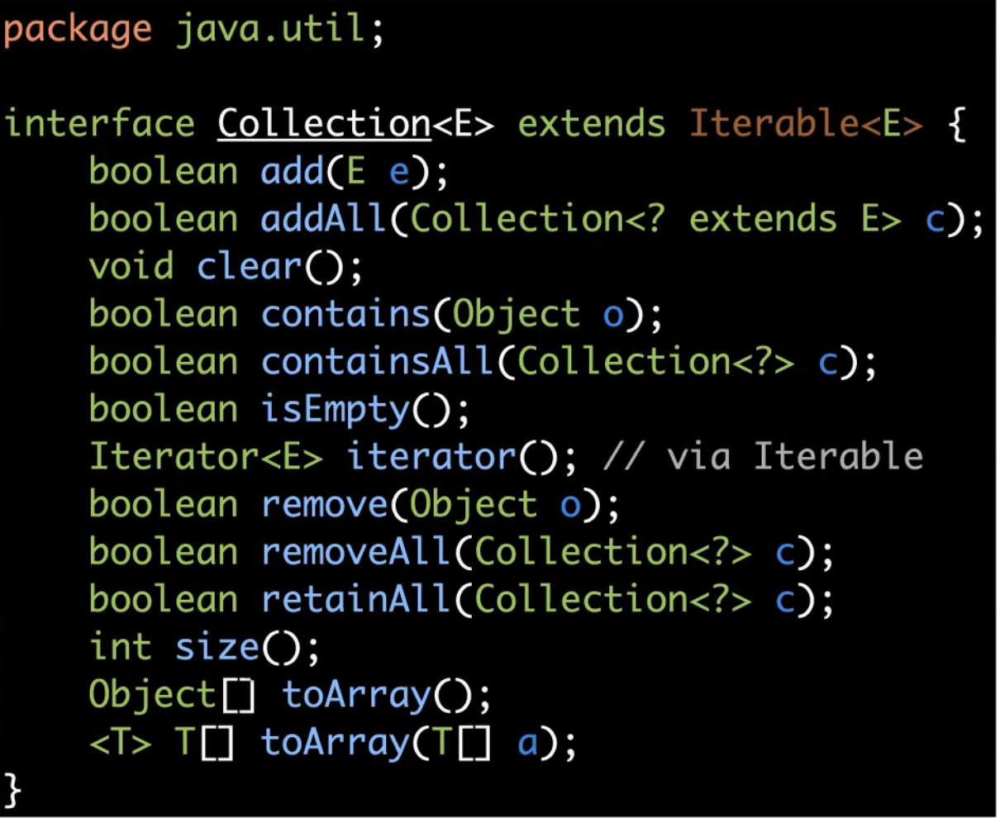
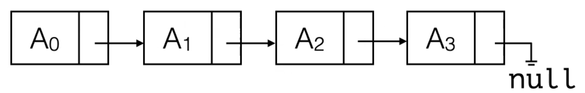
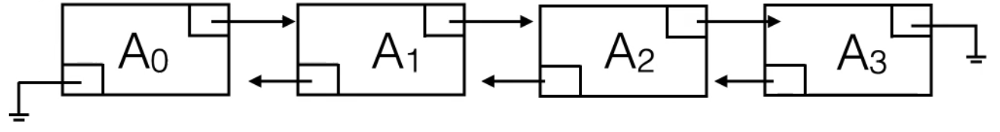
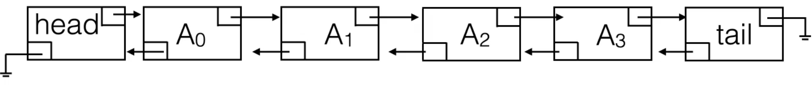
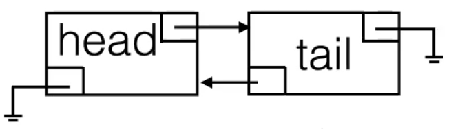

24 Jan 2022

## Linear Search

```java
public static int linearSearch(Integer[] a, Integer x) {
    for (int i = 0; i<a.length; i++) {
        if (a[i].equals(x)) {
        return i;
    	}
    }
    return -1;
}
```

## Binary Search

```java
public static int binarySearch(Integer[] a, Integer x) {
    int low = 0;
    int high = a.length - 1;

    while (low <= high) {
        int mid = (high + low) / 2;
        if (a[mid] < x) {
            low = mid + 1;
        } else if (a[mid] > x) {
            high = mid - 1;
        } else {
            return mid;
        }
    }

    return -1; // not found
}
```

To perform binary search on an array of objects, those objects have to use **Comparable** and be able to be sorted (ie. have a natural order).

## The Comparable Interface

```java
package java.lang;

public interface Comparable<AnyType> {
	int compareTo(AnyType other);
}
```

Classes that use the `Comparable` interface must have a `compareTo` method.

`compareTo` returns negative int if this < 0 (item calling is less than other), positive int if this > 0 (item calling is greater than other), 0 if this == 0 (they're equal).

- Comparison usually involves querying some member of `other`
- The type parameter makes sure that all `other` objects have these fields

Example of comparing people by their names:

```java
public class Person implements Comparable<Person> {
// The subtype (type parameter) of Comparable should also be Person.
//    Means whatever class implements this Comparable class needs to be allowed to compare itself to other objects that are also of type Person

    String first_name;
    String last_name;

    public Person(String first, String last) {
        first_name = first;
        last_name = last;
    }

    public int compareTo(Person other) {
        // Compare last names | Strings also implement Comparable
        if (last_name.equals(other.last_name)) {
            // Compare first names if last names equal
            return first_name.compareTo(other.first_name);
        }
        return last_name.compareTo(other.last_name);
    }

}
```


Using `Comparable` and generics with our search methods:

```java
public static <T extends Comparable<T>> int linearSearch(T[] a, T x) {
    for (int i = 0; i<a.length; i++) {
        if (a[i].equals(x)) {
            return i;
        }
    }
    return -1;
}

public static <T extends Comparable<T>> int binarySearch(T[] a, T x) {
    // We subtype this type parameter. i.e. This T needs to be a subtype of Comparable<T> | Like a variable declaration for a generic type
    int low = 0;
    int high = a.length - 1;

    while (low <= high) {
        int mid = (high + low) / 2;
        if (a[mid].compareTo(x) < 0) {
            low = mid + 1;
        } else if (a[mid].compareTo(x) > 0) {
            high = mid - 1;
        } else {
            return mid;
        }
    }

    return -1; // not found
}
```

This binary search assumes that `T[] a` is sorted in ascending order and will run in $O(log\ n)$

## Data Types in Programming Languages

All languages have data types. Most object-oriented languages include the concept of a **type hierarchy** (different types are related by inheritance).

- i.e. subtype of Person could be Teacher, Student and super-type of Person could be LivingBeing
- Type hierarchy allows a degree of type inference

When the data type of a variable has to be declared and can't change, it's called **static typing**.

When the data type of a variable doesn't need to be declared and can change, it's called **dynamic typing**.

### Data Types

- Basic data types: booleans, bytes, integers, floats, characters...
- Simple abstractions: arrays, String
- More complex, structured data types: Lists, Stacks, Trees, Sets, Graphs

#### Abstract Data Types

An Abstract Data Tpe (ADT) is a collection of data together with a set of operations.

- ADT are different from data structures
- A particular way of arranging information together with a set of operations
- We know what properties/methods this object has, but don't know how it is actually built underneath
  

**ADTs vs. Data Structures**:

- A data *type* is a well-defined collection of data with a well-defined set of operations on it
- A data *structure* is an actual implementation of a particular abstract data type
- There can be multiple data structures implementing the same data type

#### The List ADT

A list $L$ is a sequence of $n$ objects: $A_0, A_1, A_2, ..., A_{n-1}$

- $n$ is the length/size of the list. A list with length $n=0$ is called an *empty list*.
- $A_i$ follows/succeeds $A_{i-1}$ for $i>0$
- $A_i$ precedes $A_{i+1}$ for $i<n$

Typical List Operations:

- `void printList()`
- `void makeEmpty()`
- `int size()`
- `Object findKth(k)`/ `get(k)`
- `boolean insert(x, k)`, `append(x)`
- `boolean remove(k)`
- `int find(x)`/ `indexOf(x)`

​		where k = index and x = element

Java already provides different list implementations for us:



In particular, the Java Collections framework that is part of the standard library.

**The Collection interface**:

- Doesn't add/remove based on index, but based on element value
- Doesn't assume items are in order

- The Java Collection API

  

**interface List**:

- Two different implementations: ArrayList + LinkedList
- ArrayList exists in contiguous memory and LinkedList can be in arbitrary memory locations

#### ArrayList

Generic classes, so need to specify particular type of the class (with angled brackets/diamond operator)

Example:

```java
import java.util.ArrayList;

public class ListTest {

    public static void main(String[] args) {
        ArrayList<Integer> li = new ArrayList<>();

        // Adds at end of list
        li.add(1);
        li.add(2);
        li.add(3);

        // Adds at specified index (0 here)
        li.add(0, 5);

        System.out.println(li.get(0));
        System.out.println(li.get(1));
        System.out.println(li.get(2));
        System.out.println(li.get(3));
        // prints 5, 1, 2, 3
    }

}
```

Instead of declaring `ArrayList<Integer> li = new ArrayList<>()`, we can declare `List<Integer> li = new ArrayList<>()` and also import `java.util.List`

- `List` is an interface (abstract data type)
- `ArrayList` is a concrete data structure implementing the `List` interface
- This way, we can only use methods that are in the `List` API
- Advantage: Can swap out `ArrayList` for `LinkedList` and have everything still work
  - Performance might be different, but overall behaviour should be guaranteed

##### ==Implementation:==

- Just a thin layer wrapping an array

```java
public class ArrayList {

    public static final int DEFAULT_CAPACITY = 10;
    private int theSize; // stores how many items are in list rather than allocated 							slots
    private Integer[] theItems;

}
```

We typically do not know what kind of object to expect in a data structure. Thus, Java allows to add **type parameters (<> syntax)** to the definitions of classes. Such classes are called **generic classes**.

```java
public class ArrayList<AnyType> {

    public static final int DEFAULT_CAPACITY = 10;
    private int theSize;
    private AnyType[] theItems;
    ...
    public AnyType get(int idx) {...}
    public boolean add(int idx, AnyType x) {...}

}
```

`<AnyType>` can be any reference object.

- Type parameters make it possible to create a new instance of data structure that stores objects of specific data types (and their sub-types).

- In Java >=7, this can be simplified using the <>(Diamond) operator:

  `List<Integer> l = new MyArrayList<>()`

  - Type of `l` is inferred automatically

##### ==Running Time for ArrayList Operations==

| Operation      | Number of Steps               |
| -------------- | ----------------------------- |
| `printList`    | N                             |
| `find(x)`      | N                             |
| `findKth(k)`   | 1                             |
| `insert(x, k)` | Best Case: 1 \| Worst Case: N |
| `remove(x)`    | Best Case: 1 \| Worst Case: N |

N = size of list

*NB: Always think of worst case first*

##### ==Expanding ArrayLists==

If we are running out of space during append/insert, we need to expand the size of the array

- First, copy all elements into a new array of sufficient size

  ```java
  newCapacity = arr.length * 2;
  Integer[] old = theItems;
  theItems = new Integer[newCapacity];
  for(int i = 0; i < size(); i++)
      theItems[i] = old[i];
  ```

- Implementation of our own ArrayList class:

  ```java
  /**
   * Honors Data Structures in Java 
   * COMS W3137, Columbia University - Spring 2022
   * 
   * MyArrayList implements a generic array list. 
   * Adapted from Weiss, Data Structures and Algorithm Analysis in Java. 3rd ed. 
   * http://users.cis.fiu.edu/~weiss/dsaajava3/code/MyArrayList.java
   */
  
  public class MyArrayList<AnyType> implements List<AnyType> {
  
      private static final int DEFAULT_CAPACITY = 10;
      
      private AnyType [ ] theItems;
      private int theSize;
  
      /**
       * Construct an empty ArrayList.
       */
      public MyArrayList() {
          clear();
      }
     
      /**
       * Change the size of this list to zero.
       */
      @Override
      public void clear( ) {
          theSize = 0;
          ensureCapacity( DEFAULT_CAPACITY );
      }
  
      /**
       * @return the number of items in this list. 
       */
      @Override
      public int size( ) {
          return theSize;
      }
      
      /**
       * @return true if this list is empty.
       */ 
      @Override
      public boolean isEmpty( ) {
          return size( ) == 0;
      }
      
      /**
       * @return the item at position idx.
       * @param idx the index to search in.
       * @throws ArrayIndexOutOfBoundsException if index is out of range.
       */
      @Override
      public AnyType get( int idx ) {
          if( idx < 0 || idx >= size() )
              throw new ArrayIndexOutOfBoundsException( "Index " + idx + "; size " + size( ) );
          return theItems[ idx ];    
      }
          
      /**
       * Changes the item at position idx.
       * @param idx the index to change.
       * @param newVal the new value.
       * @return the old value.
       * @throws ArrayIndexOutOfBoundsException if index is out of range.
       */
      @Override
      public AnyType set( int idx, AnyType newVal ) {
          if( idx < 0 || idx >= size( ) )
              throw new ArrayIndexOutOfBoundsException( "Index " + idx + "; size " + size( ) );
          AnyType old = theItems[ idx ];    
          theItems[ idx ] = newVal;
          
          return old;    
      }
  
      /**
      * Adds an item to this list, at the end.
      * @param x any object.
      * @return true.
      */
      public boolean add( AnyType x ) {
      add( size(), x );
         return true;            
      }
  
      /**
      * Adds an item to this list, at the specified index.
      * @param x any object.
      * @return true.
      */
      @Override
      public void add( int idx, AnyType x ) {
         if( theItems.length == size( ) )
             ensureCapacity( size() * 2 + 1 );
  
         for( int i = theSize; i > idx; i-- )
             theItems[ i ] = theItems[ i - 1 ];
  
         theItems[ idx ] = x;
         theSize++;  
      }
   
      /**
      * Removes an item from this list.
      * @param idx the index of the object.
      * @return the item was removed from the list.
      */
      @Override
      public AnyType remove( int idx ) {
         AnyType removedItem = theItems[ idx ];
         
         for( int i = idx; i < size( ) - 1; i++ )
             theItems[ i ] = theItems[ i + 1 ];
         theSize--;    
         
         return removedItem;
      }
  
      /**
      * Returns a String representation of this list.
      */
      @Override
      public String toString( ) {
         StringBuilder sb = new StringBuilder( "[ " );
        
         for(int i=0; i < theSize; i++) 
             sb.append( theItems[i] + " " );
         sb.append( "]" );
  
         return new String(sb);
      }
  
      private void ensureCapacity( int newCapacity ) {
          if( newCapacity < theSize )
              return;
  
          AnyType [ ] old = theItems;
          theItems = (AnyType[ ]) new Object[ newCapacity ];
          // can't instantiate new array of a generic type since Java needs to know how much memory to allocate to the array. So we create an array of Objects then downcast it into an array of generic type
          // Generics in java exist only in compile time, not in runtime. When the code is compiled, all the generic types become objects
          for( int i = 0; i < size( ); i++ )
              theItems[ i ] = old[ i ];
      }
  
      public static void main(String[] argv){
          
          MyArrayList<Integer> list = new MyArrayList<Integer>();
          list.add(1);
          list.add(2);
          list.add(3);
            
      }
  
  }
  ```

  

#### Linked Lists

##### Simple Linked Lists

Instead of using an array, we use a series of **Nodes**. Each `Node` contains:

- A reference to the data object it contains

- A reference to the next node in the List

- ```java
  private static class Node<T> {
  	public T data;
  	public Node next;
  	
  	public Node(Integer d, Node<T> n) {
  		data = d;
  		next = n;
  	}
  }
  ```



##### ==Running Time for Simple Linked List Operations==

| Operation      | Number of Steps                         |
| -------------- | --------------------------------------- |
| `printList`    | N                                       |
| `find(x)`      | N                                       |
| `findKth(k)`   | k                                       |
| `next()`       | 1                                       |
| `insert(x, k)` | k + 1 (for changing the references)     |
| `remove(k)`    | k + 1 (for changing the next reference) |

*NB: In many applications we can use next() instead of findKth(k). (for every element in the list, do... / filter the list ...)*

*NB: In order for removed node to be garbage collected, all references to it and references from it must be removed.*

To make operations easier, linked lists should remember the first and last node.


To **remove an element** at index k, we first need to find the node at k-1, change its next variable to be the next variable of node~k~ , then to ensure proper garbage disposal of node~k~ , sever the next reference of node~k~ .


To **insert an element** at index k, we first need to create the new node, find node~k-1~ and set its next reference to point to the new node, and set the next reference of the new node to be what was previously the next reference of node~k-1~ .

- Code would look something like this:

  ```java
  Node current = start;
  
  for (int i = 0; i < index - 1; i++) {
  	current = current.next;
  }
  
  Node new = new Node(5, current.next);
  
  current.next = new;
  size++;
  ```


**Reverse a Singly Linked List with No Sentinels:**

```java
/**
 * Definition for singly-linked list.
 * public class ListNode {
 *     int val;
 *     ListNode next;
 *     ListNode() {}
 *     ListNode(int val) { this.val = val; }
 *     ListNode(int val, ListNode next) { this.val = val; this.next = next; }
 * }
 */
class Solution {
    public ListNode reverseList(ListNode head) {
        if(head == null) {
            return null;
        }
        ListNode prevNode = null;
        ListNode currentNode = head;
        ListNode nextNode;
        while (currentNode != null) {
            
            nextNode = currentNode.next;
            
            currentNode.next = prevNode;
            
            prevNode = currentNode;
            currentNode = nextNode;
            
        }
        return prevNode;
        
    }
}
```


##### ==Doubly Linked Lists==

- Also maintains reference to previoius node in the list

- Speeds up appending at end of list

- For `findKth(k)`: if k is closer to the end, search can be started from the end and cut down the number of steps, with the most being $n/2$. However, this is still treated as $O(n)$ time.

- ```java
  private static class Node<AnyType> {
  	public AnyType data;
  	public Node next;
  	public Node prev;
  	public Node(Node<AnyType> d, Node n, Node<AnyType> p) {
  		data = d;
  		next = n;
  		prev = n;
  	}
  }
  ```



##### ==Doubly Linked List with Sentinel Nodes==

**Sentinel nodes** are placeholder header and tail nodes, which don't have any data in them but go at the start and end of the linked list. They make implementation of `next`/ `previous` easier and remove special cases like removing first/last node.



An empty doubly linked list with sentinel nodes would look like:



To **insert an element** at index k:

```java
Node current = head;
for (int i = 0; i < index; i++) {
	current = current.next;
}

Node new = new Node(5, current.next);
new.prev = current;

new.next.prev = new; // could replace with current.next.prev = new;
current.next = new;
size++;
```

Using sentinel nodes can avoid NullPointerExceptions since if end node wasn't there, `current.next` could be null.

- `current.next.prev` refers to the node, but `current.next` refers to the `next` pointer that leaves `current`

