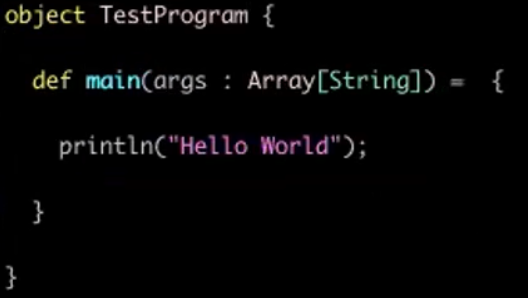
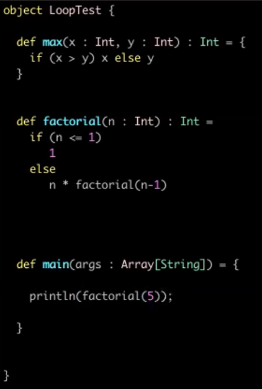
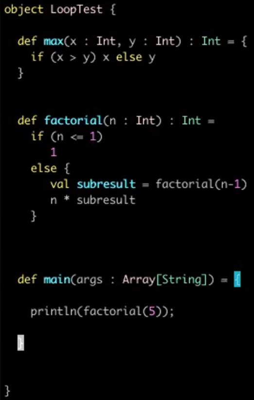
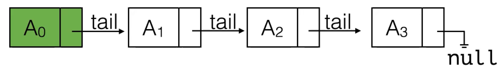
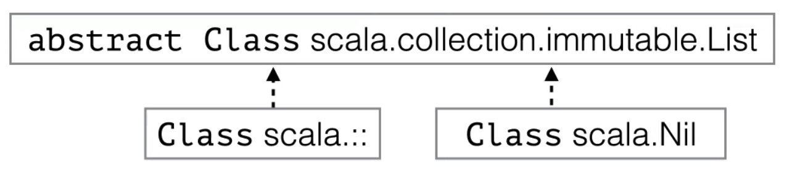
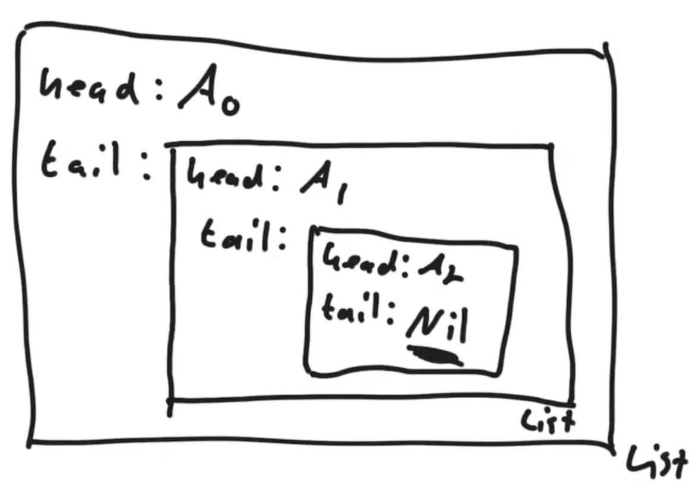
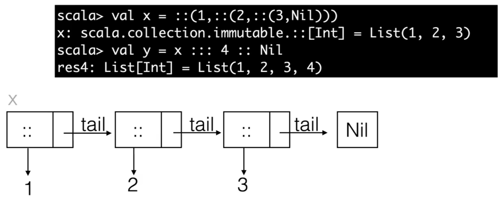
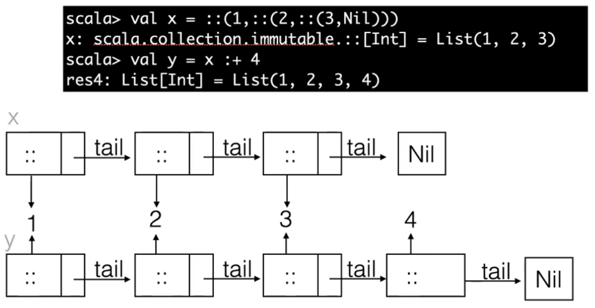

28 Jan 2022

Recitation 2

## Scala Basics

- Is mainly a funcional programming language, but can also be an interpretive language
- Runs on Java Virtual Machine, and can be compiled into the same byte code as a Java file, so can mix and match


3 ways of running Scala:

1. Using the interative Read Evaluate Print Loop (REPL)
2. Running a Scala script which is evaluated in the REPL line-by-line
3. Compiling scala to byte code and then running the byte code (identical to how Java runs)


### Read Evaluate Print Loop

To open the Read Evaluate Print Loop


A method is a function that belongs to a class instance, whereas a function is not bound to a particular instance.






is equivalent to



Vals don't use extra memory but also don't provide extra power

---

## Immutable Lists

In Scala, immutable data structures are called persistant data structures.

- Any insertion and deletion operation must leave the original List unchanged, including when the list is built.
- All operations that "change" the list must return a new list
- The recursive definition of an immutable list is similar to the standard linked list. A list consists of:
  - a data item (the "head"/ the first element)
  - a (possibly empty) List (the "tail")



---

Scala has an operator `::`, pronounced cons, which means construct new list; can think of it as a function; is actually a constructor of the cons class.

- Syntax: `::(data, tail_list)` ; takes the first element and combines it with a sublist(tail list) to create an object (the list)
- `val x = ::(1, ::(2, ::(3, Nil)))`
  - Creates a list (1, 2, 3) at val x
  - **Nil** represents an empty list ; is the 'base case'
  - `::` represents a non empty list with a head and tail





### List Object

`::` constructs a List object, which can also be constructed by using `val li = List(1,2,3,4,5,6)`

- List objects have a .head and .tail
- `li.head` = 1
- `li.tail` = List(2,3,4,5,6)
- To get the second element: `li.tail.head` = 2

==In Scala, whenever a function takes two arguments, it can also be used as an **infix operator**==, the operator can be placed in between the two arguments instead and brackets removed.

`::` takes two arguments and can therefore be used as an infix operator with the syntax `a :: b` = `::(a, b)`

`1 :: 2 :: 3 :: Nil` = List(1, 2, 3)

- The brackets are not necessary
  


To **concatenate** two lists, we use the triple colon operator `:::`

- To concatenate list a and list b: `a ::: b`


#### Appending to a List

Concatenation can be used to **append** to a list.

- *Example*:



`:+` is also an operator that appends to a list.

- *Example:*

  

---

## Functions in Scala

To create a recursive method that gets the sum of a list:

```scala
def sum_list(li : List[Int]) : Int = 
	if (li == Nil) {
        0
    } else {
        li.head + sum_list(li.tail)
    }
```

