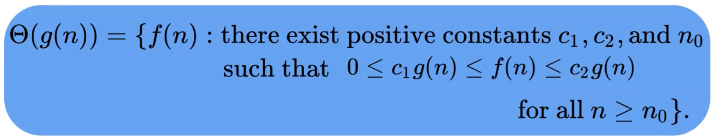
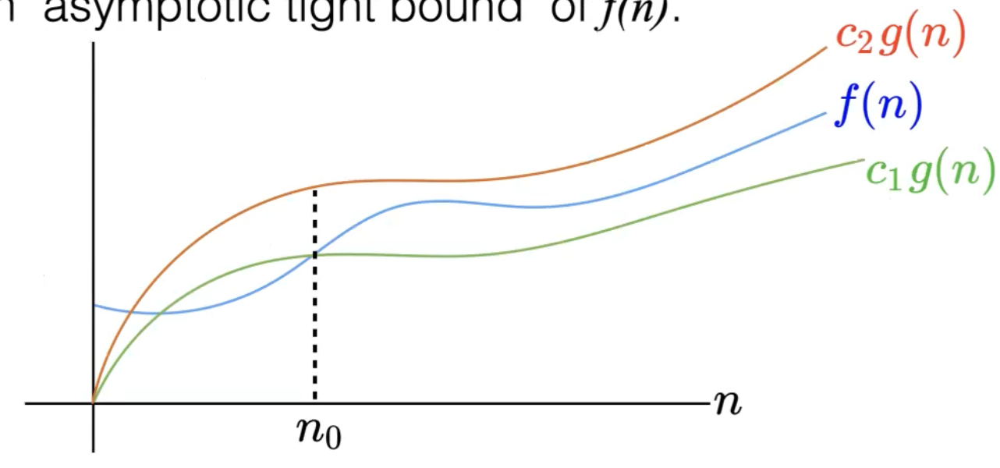
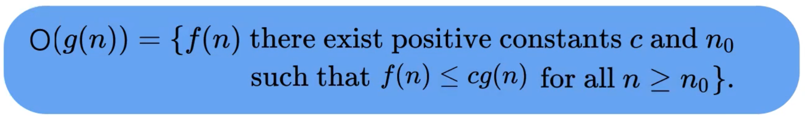
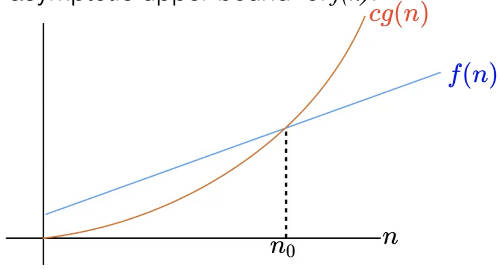
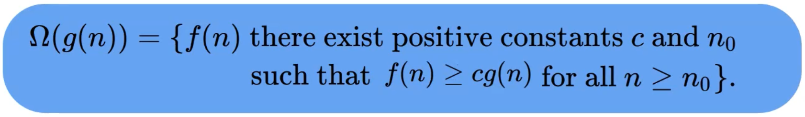
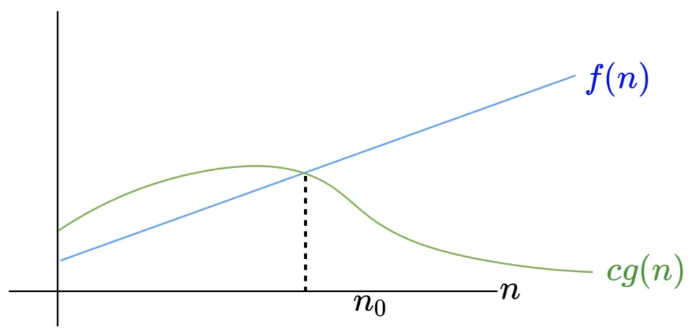
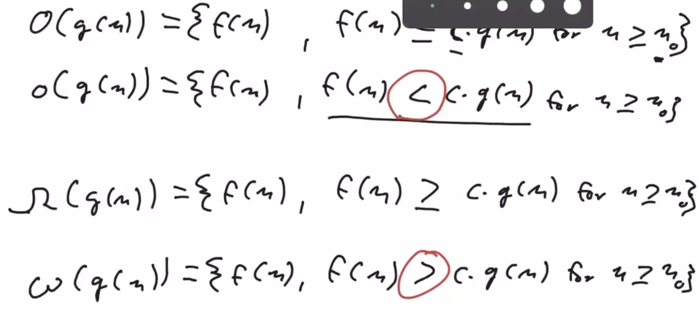
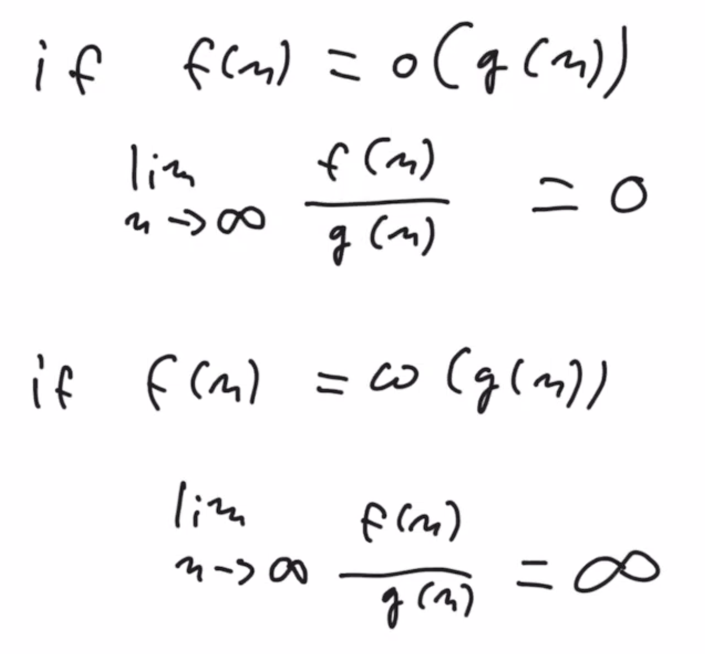

31 Jan 2022

## Functional Programming

In the functional programming paradigm, functions must not have any "side effects". They must not change:

- The argument they are called on or instance vaiables of a class instance.
- The instance variables of any class instance (if a method)
- Any other state of the program

Therefore, in functinal programming, **all objects are immutable**.

Objects of an **immutable** data type cannot be changed once they have been created.

- How do we construct immutable data structures?
- How to efficiently implement operations like insert(x, k) if the underlying data structure can't be modified?
  - Will probably need to copy the data structure, but copying is expensive, but also sometimes could just retain an reference without copying

Objects that are immutable can also save space, by creating one version of the object that can always be referred to.

## Introduction to Asymptotic Notation

**What is an algorithm?**

An algorithm is a clearly specified set of simple instructions to be followed to solve a problem.

Questions in **algorithm analysis**:

- Does the algorithm terminate?
  - Can be hard to determine
- Does the algorithm solve the problem? (Is the algorithm correct)
- What resources does the algorithm use?
  - Time/Space

### Analyzing Runtime

We often want to compare several algorithms.

- Compare between different algorithms how the runtime $T(n)$ Grows with increasing input sizes $n$.

We are using Java or Scala, but the same algorithms could be implemented in any language on any machine.

We can't just compare the runtime in seconds because there are confounding factors like the speed of the machine that is running the code.

So we ask: How many basic operations/**steps** does the algorithm take? All operations assumed to have the same time.

*NB:*

- *An **algorithm** is the series of instructions.*

- *A **program** is the implementation of algorithms.*
- *A **process** is a program in execution.*

#### Worst and Average Case

When we are analyzing runtine, we are usually asking about the worst case and average case.

- Usually the runtime depends on the type of input.
  - ie. Sorting is easy if the input is already sorted
- $\Large T_{worst} (n)$: **worst case** runtime for the algorithm on ANY input. The algorithm is **at least** this fast.
- $\Large T_{average} (n)$: **average case** analysis - the expected runtime on typical input.
- $\Large T_{best} (n)$: Rarely, we are interested in the **best case** analysis.
  - But sometimes can still be relevant, like in sorting algorithms

#### Asymptotic Notation, Big-$\Uptheta$

Big Theta, The **average case**

- We assume that each atomic operation takes a single unit of time so are not interested in the specific time for these atomic operations
- We are only interested in input sizes that are sufficiently large
  - As the input size goes towards infinity, how does the runtime increase?
- $\Uptheta(g(n))$ is a set of functions which contains all the functions that grow at the same rate as $g(n)$.
  - Instead of $T(n) \in \Uptheta(g(n))$, we usually write $T(n) = \Uptheta(g(n))$; which means that the runtime of $T(n)$ is in the order of/grows at the same rate as $g(n)$
- For example, the worst case running time of binary search is in $\Uptheta(log_n)$

**==Big-$\Uptheta$ definition==**

- Ie. **Once the input size, $n$, reaches a certain constant $n_0$, $f(n)$ will be sandwiched by $c_2\,g(n)$ on the top and $c_1\, g(n)$ at the bottom**
- means that $c_2\,g(n)$ and $c_1\,g(n)$ are growing at the same rate

$g(n)$ is an "**asymptotic tight bound**" of $f(n)$.

#### Comparing Function Growth: Big-O

Big O, The **worst case**

**==Big-O definition==**

- ie. **Once the input size $n$ reaches a certain constant $n_o$, $cg(n)$ grows at least as fast (equal or faster) as $f(n)$**
- Big-O is the best upper bound (most precise), otherwise trivial statements can be made such as Big-O is at least 2^n^.

$g(n)$ is an "**asymptotic upper bound**" of $f(n)$.

#### Comparing Function Growth: Big-$\Upomega$

Big Omega, The **best case**

**==Big-$\Upomega$ definition==**

- The Big-$\Upomega$ is a lower bound which cannot be exceeded, ie. cannot be faster

$g(n)$ is an "**asymptotic lower bound**" of $f(n)$

*NB: The Big-O could equal the Big-$\Upomega$. In such case, Big-O = Big-$\Uptheta$ = Big-$\Upomega$*

- *Big-$\Uptheta$ is in between Big-$\Upomega$ and Big-O*

- Difference is the strict equalities

- Only works for strict equalities (o and $\omega$)