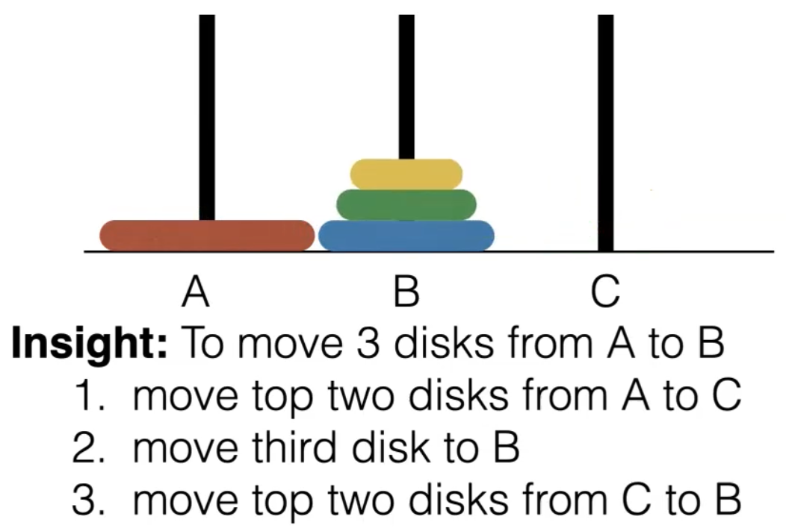

2 Feb 2022

## Rules for Big-O

1. 
   - Means that all the lower order of polynomials do not matter
2. 

- No matter how many $log(N) * log(N) * log(N) * ....$, it will always be ==slower?== than $O(N)$
- $O(N)$ is the upper bound

3. 


- Constants don't matter

4. 

- Similar to first rule, where only the highest order matters
- 2. here would apply to things like nested loops


Example for analyzing runtime:

**Basic For Loops:**


- To be super precise, for loop parameters is 3 steps each
  - $T(N) = 7N + 4 = O(N)$ instead
- *Note: Loops don't always depend on input size!*


**Nested Loops**


- Generally analyze inside out


**Consecutive Statements**


- Highest order of $N$ is only one that matters


**If/Else Conditionals**


- Look at the worst case; maximum time required out of the if/else statements


**Calling Methods**


- Have to take into account the time for the method to run


**Logarithms in the Running Time**


---


## Recursion

**Fibonacci Sequence**

- 1, 1, 2, 3, 5, 8, 13, 2, ...

​	$F_1 = 1, F_2 = 1, F_{k+1} = F_k + F_{k-1}$

The fact that the fibonacci relates to so many things in nature is incidental, and in many cases is only an approximation.

- Closed form solution for $F_n$ is complicated
- Instead, it is easier to compute this algorithmically


Code in Scala:

```scala
object Fibonacci {
    def fib(k : Int) : Int = {
        if (k == 1 || k == 2)
        1
        else
        fib(k-1) + fib(k-2)
    }
    
    def main(args : Array[String]) = {
        println(fib(3))
    }
}
```


Q. How many steps does the algorithm need?

Fibonacci in Java:


### Recursion Tree Method


- Closed form solution
- Repeating Work
- Less than exponential runtime because some branches (ie. Rightmost) get the to leaves faster

---


### Four Rules for Recursion

1. Base Case - If no base case, recursion will keep running and eventually cause a stack overflow
2. Making Progress - Need to make progress towards the base case, otherwise, there will be a stack overflow
3. Design Rule - Assume all recursive calls work
4. Compound Interest Rules - Never duplicate work by solving the same instance of a problem in separate recursive calls

---


Our previous fibonacci method violates rule 4 of recursion, let's fix it!


Now let's do the same fibonacci method without vars, using **tail recursion**.

- **Tail Recursion** means that the last thing done in a function is the recursive call (a call to the tail)
- Tail recursion can substitute for loops while not using vars, and many compilers actually translate tail recursion into loops, rather than recursion.

```scala
object Fibonacci {

    // doubles work
    def fib(k : Int) : Int = if (k == 1 || k == 2) 1 else fib(k-1) + fib(k-2)

    // doesn't double work, but uses vars
    def fib_iter(k : Int) : Int = {
        var fiba : Int = 1
        var fibb : Int = 1
        var current_fib = 0
        var t = 1
        while (t <= k) {
            current_fib = fiba
            var next_fib = fiba + fibb
            fiba = fibb
            fibb = next_fib

            t = t + 1
        }
        return current_fib
    }
    
    // doesn't double work or use vars; tail recursion
    def fib_tail(k : Int, fiba : Int, fibb : Int) : Int = {
        if (k == 1)
        	fiba
        else
        	fib_tail(k-1, fibb, fiba + fibb);
    }
    
    // for convenience so don't need to call fib_tail(k, 1, 1)
    def fib_tail_driver(k : Int) =
    	fib_tail(k, 1, 1)

    def main(args : Array[String]) = {
        println(fib_iter(10))
        println(fib(10))
        println(fib_tail_driver(10))
    }
}
```

All the pending functions in recursion are kept track of in a stack (Last in, First out).

- Since the compiler translates tail recursion into loops, tail recursion doesn't need to go through the runtime stack


---


### Towers of Hanoi





==The Algorithm:==


**Code in Scala:**

```scala
object Hanoi {

  def hanoi(k : Int, src : String, temp : String, target : String) : Unit = {
//    Base Case
    if (k == 1) {
      println("Move " + src + " to " + target)
    } else {
      //    Step 1: Move k-1 disks out of the way
      hanoi(k - 1, src, target, temp) // target becomes temp and temp becomes target

      //    Step 2: Move the bottom disk
      println("Move " + src + " to " + target);

      //    Step 3: Move k-1 disks back
      hanoi(k - 1, temp, src, target)
    }
  }

  def main(args : Array[String]) = {
    hanoi(4, "A", "B", "C") // number of discs, source peg, helper peg, destination peg
  }

}
```

*Counting the steps:*

```scala
object Hanoi {

  def hanoi(k : Int, src : String, temp : String, target : String) : Int = {

//    Base Case
    if (k == 1) {
      println("Move " + src + " to " + target)
      return 1
    } else {
      //    Step 1: Move k-1 disks out of the way
      val left_steps = hanoi(k - 1, src, target, temp) // target becomes temp and temp becomes target

      //    Step 2: Move the bottom disk
      println("Move " + src + " to " + target);

      //    Step 3: Move k-1 disks back
      val right_steps = hanoi(k - 1, temp, src, target)

      return left_steps + right_steps + 1
    }
  }

  def main(args : Array[String]) = {
    val total : Int = hanoi(4, "A", "B", "C") // number of discs, source peg, helper peg, destination peg
    println("Total Steps: " + total)
  }

}
```

Input doubles with input + 1. Therefore, the time complexity is exponential


Recurrent relation of Runtime Function:

T(1) = 1 	To solve a puzzle with 1 disc takes 1 step

T(N) = 2T(N-1) + 1	Each T(N-1) is move n-1 disks out of the way, and then the same back

Unrolling:

T(N) = 2T(N-1) + 1

​		= 2 * (2T(N-2) + 1) + 1 = 2^2^ T(N-2) + 2 + 1

​		= 2^2^ * (2. T(N-3) + 1) + 2 + 1

​		= 2^3^ * T(N-3) + 2^2^ + 2 + 1

​		= 2^4^ * T(N-3) + 2^3^ + 2^2^ + 2 + 1

​		= 2^n-1^ * T(1) + 2^n-3^ + 2^n-2^ + ... + 2^1^ + 2^0^

​		= $\large \sum_{i=0}^{n-1} 2^j = 2^N -1 = \Uptheta(2^N)$			<-- Geometric Series

We can do this n-1 times. Base case is the nth time


Perfect Binary Tree:	


