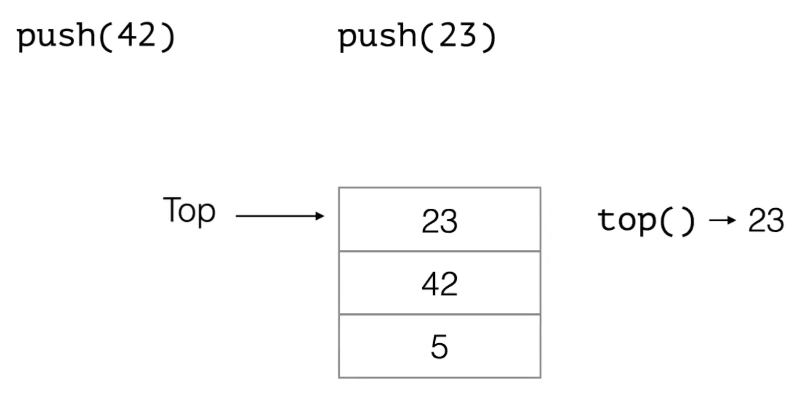
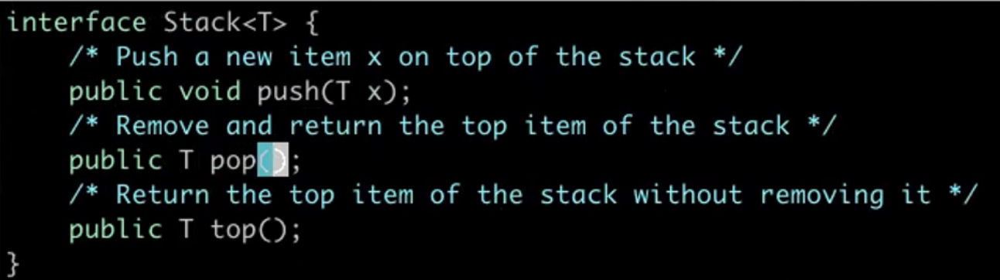
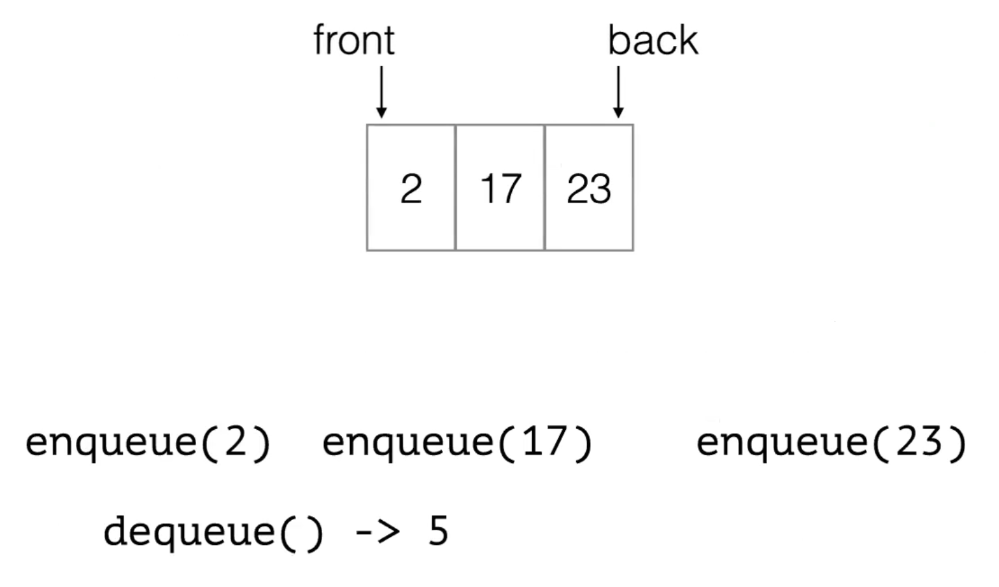
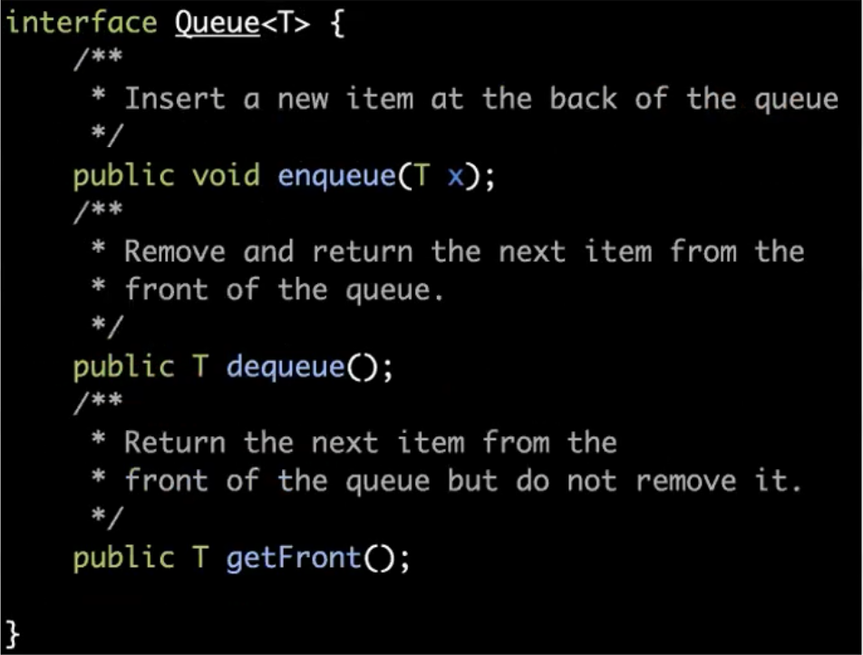
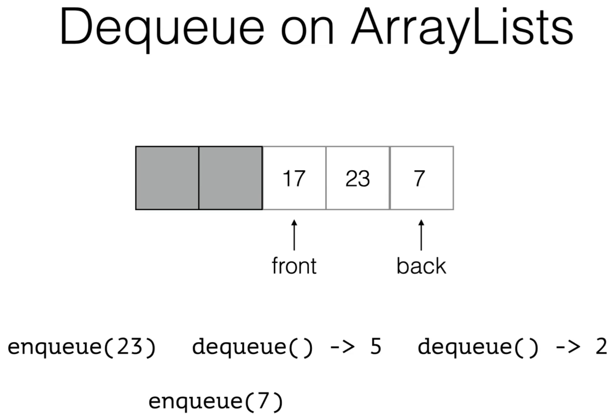
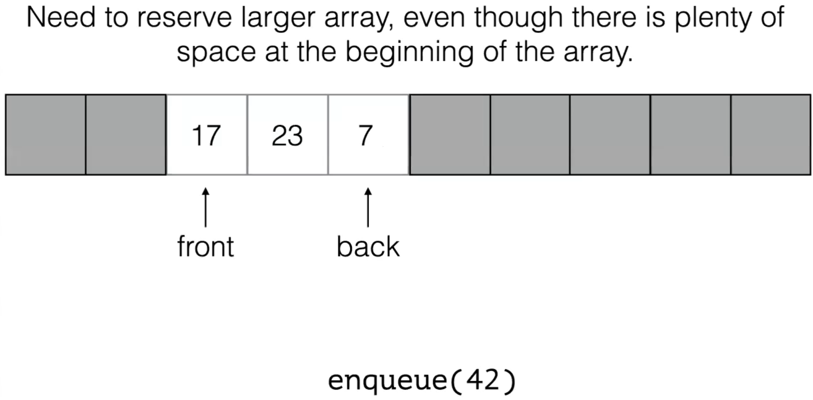
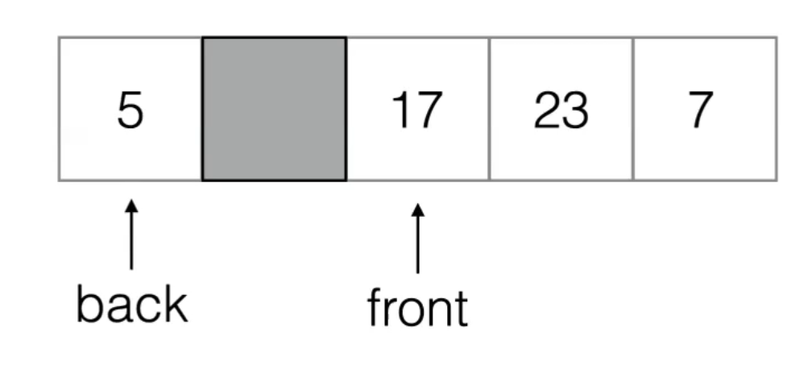
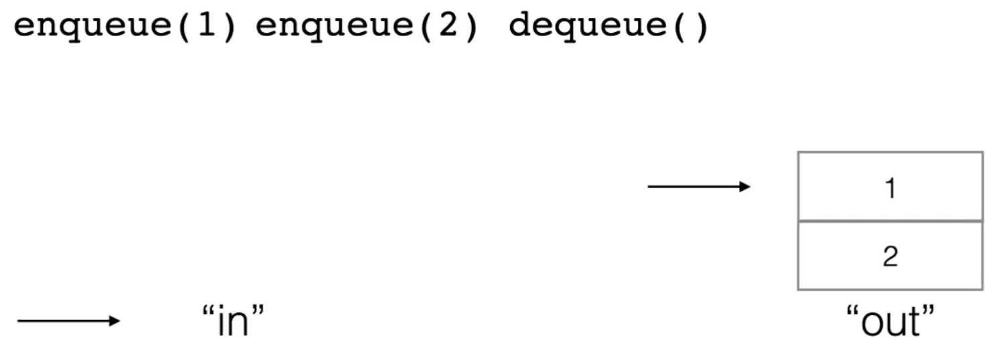

7 Feb 2022

## Stacks

Stack Overflow means that a stack ran out of memory (because it had to keep track of how many recursive calls there were)


- A Stack S is a sequence of N objects A~0~, A~1~, A~2~, ..., A~N-1~ with three operations:
  - `void push(x)` - append element x to the end (on "top") of S
  - `Object top()` / `peek()` - returns the last element of S
  - `Object pop()` - remove and return the last element from S
- Stacks are also known as ==**L**ast **I**n **F**irst **O**ut (LIFO) storage==


Example: (Often written from bottom to top)



Stack methods run in constant time, so an algorithm utilizing stacks will be efficient.


### Implementing Stacks

Think of a Stack as a specialized List:

- push: Inserts only allowed at the end of the list
- pop: Remove only allowed at the end of the list

push and pop run in O(1) time with ArrayList or LinkedList


*NB: Can implement Stack using any List implementation*


==Implementation of Array Stack in Java==



```java
public class ArrayStack<T> implements Stack<T> {

    private static final int DEFAULT_SIZE = 10; // size the array will initialize to
    int topOfStack;
    private T[] theArray;
    public ArrayStack(){
        theArray = (T[]) new Object[DEFAULT_SIZE];
        // Remember: Java doesn't allow us to create generic arrays directly, so we need to allocate an Object array then downcast to T
        topOfStack = -1; // 0 means stack with 1 element in it; -1 means nothing in stack
    }
    private void ensureCapacity(int size) {
        if (size > theArray.length) {
            T[] old = theArray;
            theArray = (T[]) new Object[old.length * 2 + 1]; // copies from old array to new array
            for (int i = 0; i < old.length; i++)
                theArray[i] = old[i];
        }
    }
    public void push(T x) {
        topOfStack++;
        ensureCapacity(topOfStack + 1); // make sure we have enough space in array
        theArray[topOfStack] = x;
    }

    public T pop() {
        if (topOfStack == -1)
            throw new IndexOutOfBoundsException("Pop from empty stack!");
        T result = theArray[topOfStack];
        theArray[topOfStack] = null; // allow the garbage collector to recycle the pop-ed object
        topOfStack--;
        return result;
    }

    public T top() {
        return theArray[topOfStack];
    }

    public String toString() {
        StringBuilder sb = new StringBuilder( "[ " );

        for(int i=0;i<=topOfStack;i++)
            sb.append(theArray[i] + " ");
        sb.append("]");
        return new String( sb );
    }

    /**
     * Test the stack.
     */
    public static void main(String[] args) {
        Stack<Integer> s = new ArrayStack<>();
        s.push(5);
        s.push(42);
        System.out.println(s);
        s.push(23);
        System.out.println(s);
        System.out.println("Top: " + s.top());
        System.out.println("Pop: " + s.pop());
        System.out.println(s);
    }
}
```


---

==Implementation of ArrayStack in Scala==

```scala
class Stack(theList : List[Int]) {

    def push(x : Int) : Stack = {
        new Stack(x :: theList) // returns new stack, but doesn't copy over data, just retains reference to old list
    }

    def pop : (Int, Stack) = {
        (theList.head, new Stack(theList.tail)) // returns head and remaining tail
    }

    def this() = this(Nil)
}

object StackTest {

    def main(args : Array[String]) : Unit = {

        val s : Stack = new Stack;
        val t : Stack = s.push(1)
        val q : Stack = t.push(2)
      

        val (x,r) = q.pop; 
        println(x);

    }

}
```


---


## Queue

- A Queue Q is a sequence of N objects A~0~, A~1~, A~2~, ..., A~N-1~
- A~0~ is called the front of Q, A~N-1~ is called the back of Q.
- A queue has two operations:
  - `void enqueue(x)` - append element x to the back of Q
  - `Object dequeue()` - remove and return the front of Q
- Queues are also known as ==**F**irst **I**n **F**irst **O**ut (FIFO) storage== ; first come first serve


*Example*:




A Queue Interface:




### Implementing Queues

Think of a Queue as a specialized List:

- `enqueue`: Inserts only allowed at the end of the list
- `dequeue`: Remove only allowed at the beginning of the list
- Can implement Queue using LinkedList implementation or using arrays


PROBLEM:







SOLUTION:

Use a **Circular Array**



- Have the back pointer circle back to use the space at the beginning of the array
- Use **mod** to calculate wraparound

At some point, the circular array will run out of space, and we will need to create a new array with larger size.

- Index needs to count from front marker to back marker, not iterating through list.

==Implementation in Java==

```java
public class CircularArrayQueue<T> implements Queue<T> {

    private T[] theArray;
    private static final int DEFAULT_SIZE = 10;
    private int theSize;
    private int front; 
    private int back;

    @SuppressWarnings("unchecked")
    public CircularArrayQueue() {
        theArray = (T[]) new Object[DEFAULT_SIZE];
        front = -1; back = -1; // because array is empty
        theSize = 0;
    }

    public void enqueue(T x) {
        ensureCapacity(theSize+1);
        theSize++;
        back = (back + 1) % theArray.length; // index 0 will be empty because array size is already checked by ensureCapacity, which would've increased size of array if necessary
        theArray[back] = x;
        if (theSize == 1) 
            front = back; // front and back same position if only 1 element
    }

    /*
      dequeue an item
     */

    public T dequeue() {
        if (theSize == 0) 
            throw new IndexOutOfBoundsException("Dequeue from empty queue!");
        T result = theArray[front];
        front = (front+1) % theArray.length;
        theSize--;
        return result;
    }

    private void ensureCapacity(int size) {
        if (size > theArray.length) {
            T[] old = theArray;
            theArray = (T[]) new Object[old.length * 2 + 1];
            for (int i = 0;i<theSize; i++)
                theArray[i] = old[(front + i) % old.length];
            front = 0; // front of new array will be at index 0
            back = old.length-1;
        }
    }
    
    public String toString() {
        StringBuilder sb = new StringBuilder( "[ " );
        
        for(int i=0;i<theSize;i++) 
            sb.append(theArray[(front + i) % theArray.length] + " ");
        sb.append("]");

        return new String( sb );
    }   
    
    public String printArray() {
        StringBuilder sb = new StringBuilder( "Array: [ " );
        
        for(int i=0;i<theArray.length;i++){ 
            if (i==front)
                sb.append("<");
            sb.append(theArray[i]);
            if (i==back)
                sb.append(">");
            sb.append(" ");
        }
        sb.append("]");

        return new String( sb );
    }   


    public static void main(String[] args) {
        CircularArrayQueue<Integer> q = new CircularArrayQueue();
        
        for (int i=1;i<=5;i++)
            q.enqueue(i);
        System.out.println(q.printArray());
        System.out.println(q);

        System.out.println("Dequeue(): " + q.dequeue());
        System.out.println(q.printArray());
        System.out.println(q);

        for (int i=1;i<=5;i++)
            q.enqueue(0);
        System.out.println(q.printArray());
        System.out.println(q);
            
        q.enqueue(42);
        System.out.println(q.printArray());
        System.out.println(q);
        
        q.enqueue(23);
        System.out.println(q.printArray());
        System.out.println(q);
    }

}
```


## Banker's Queue

- Implements a queue using two stacks "in" and "out".
- `enqueue(x)`: push x to the "in" stack
- `dequeue(x)`: if the "out" stack is empty, "shuffle" all elements from "in" to "out," then pop from "out." ; shuffle: pop from "in" and push to "out"




- Runtime of `enqueue` is constant
- Runtime of `dequeue` is linear, but the amortized runtime is still constant (in aggregate)