9 Feb 2022

## Collection and Lists

**The Java Collection API**

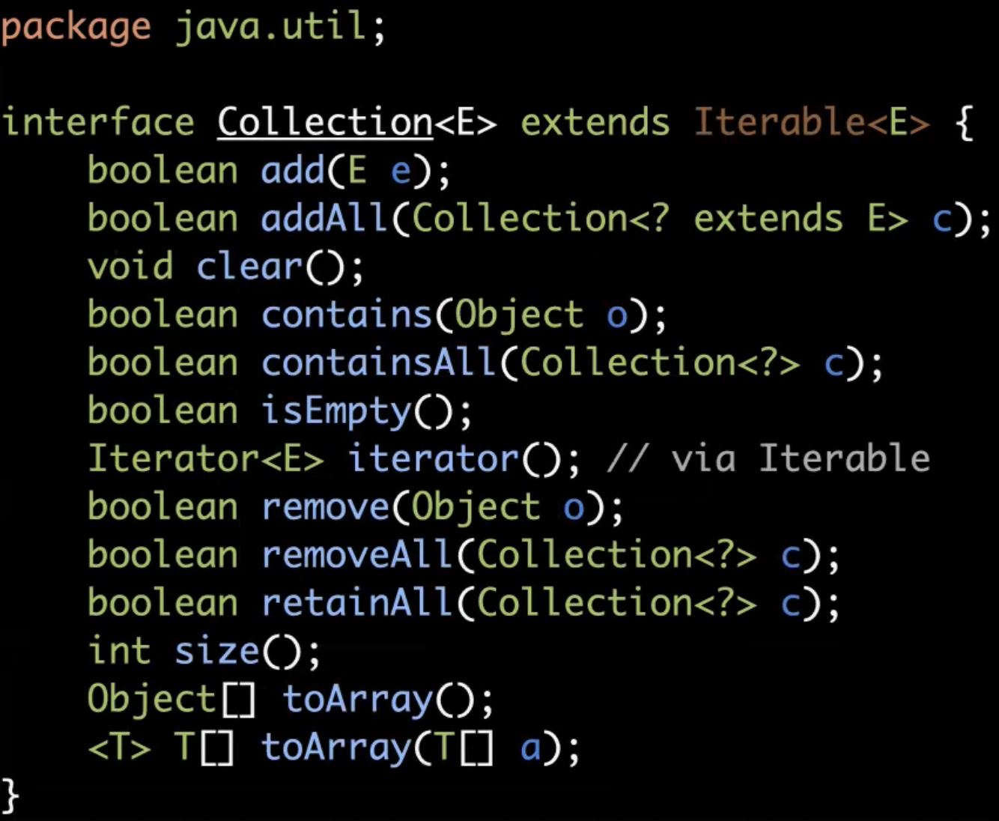


**Lists in the Java API**

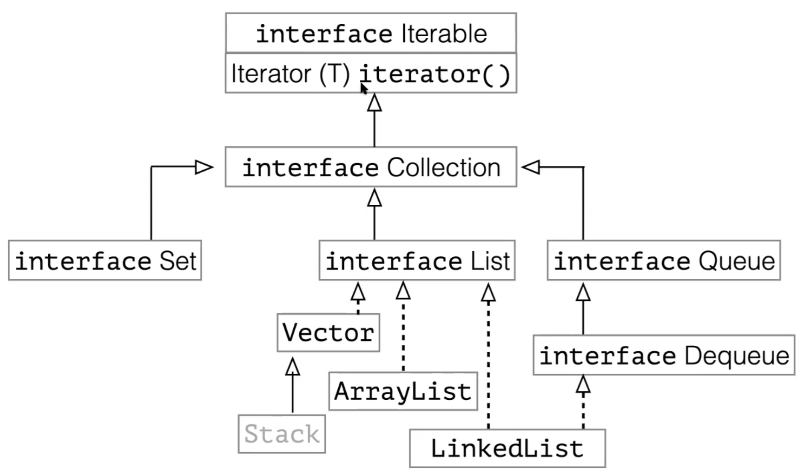

- Normally if using a stack, you'd use a LinkedList. (Stack is deprecated)


**Java API List Interface**

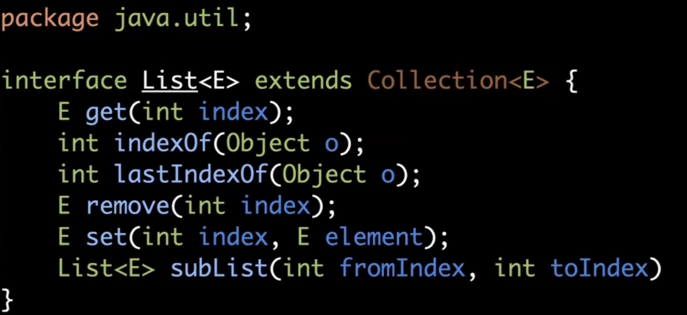


## Queues

**Java Queue Interface**

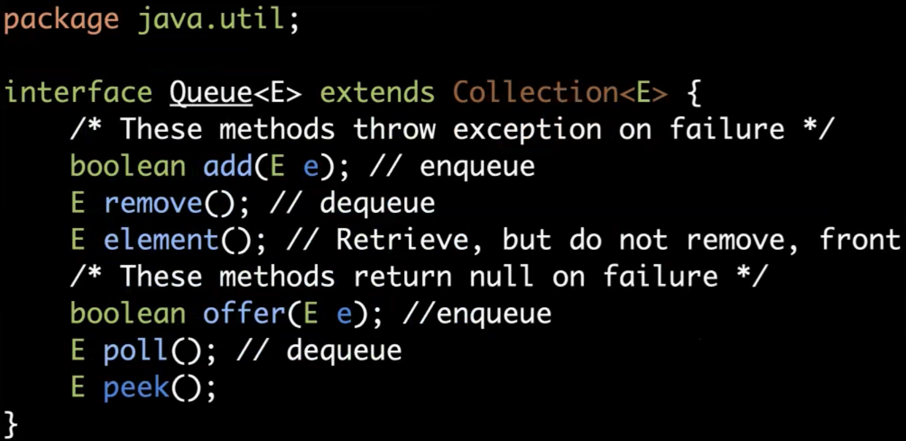

- `add`/`offer` and `remove`/`poll` are similar but behave differently when it comes to error handling
  - ie. If you dequeue from an empty queue, the add/remove method would throw an exception but the offer/poll will just return `null`


## Deques

- A linear collection that supports element insertion and removal at both ends.
- Deque is short for "double ended queue" and is pronounced "deck"

**Java Deque Interface**

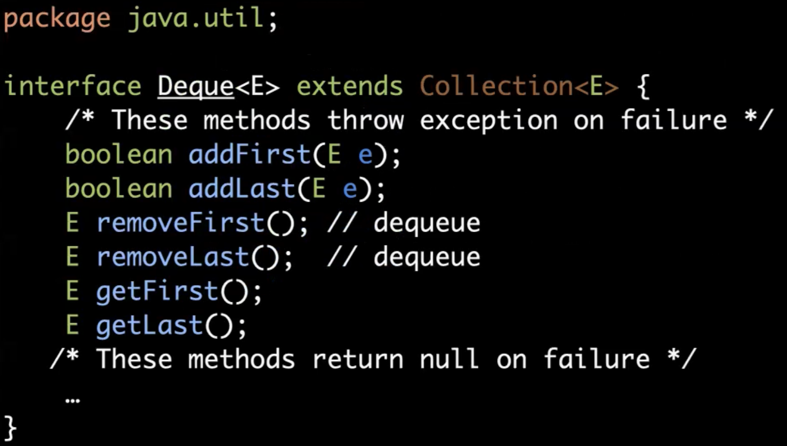


Deques can be queues or stacks.

- Stack view:
  - `addFirst(E e)`	, equivalent to `push(Ee)`
  - `E removeFirst()`  , equivalent to `E pop()`
  - `E getFirst()`  , equivalent to `E peek()/ top()`
- Queue view:
  - `addLast(E e)`  , equivalent to `enqueue(E e)`/ `add(E e)`
  - `E removeFirst()`  , equivalent to `dequeue()`/ `remove()`
  - `E getFirst()`  , equivalent to `element()`


LinkedList uses the `Deque` interface


## Applications for Stacks

- If you need a stack, the easiest way is to use a LinkedList and use the `push` and `pop` methods.

```java
import java.util.LinkedList;

public class StackTest {

  public static void main(String[] args) {

    LinkedList<String> stack = new LinkedList<>();

    stack.push("a");
    stack.push("b");
    stack.push("c");

    while (stack.size() > 0) {
        System.out.println(stack.pop());
    }

  }
}
```


### Balancing Symbols

- Compilers need to check for syntax errors
- Need to make sure braces, brackets, parentheses are well nested
- Easy to verify using a stack
  - For `(`, push it onto stack, if `)`, check if it matches the first item in stack, if match (string comparison), pop `(` off stack. If it doesn't match, we know there's a mismatch
  - Ignores non-brackets; Need to set flag that turns on when `"`, then off when another `"` so brackets within "" will be ignored


- When there's **hierarchical structures**, can consider using stack


### Detecting Palindromes

- Palindrome is a word or phrase that reads the same forward and backward
  - ie. "go hang a salami, i'm a lasagna hog"
- Push characters onto stack until the middle of the string is reached, then, we pop off the stack one char at a time while matching to next char in string. If there's a mismatch at anytime, we know it's not a palindrome

*Implementation in Java:*

```java
import java.util.LinkedList;

public class Palindromes {

    public static boolean isPalindrome(String s) {
        LinkedList<Character> stack = new LinkedList<>();

        int i = 0;
        for (;i < (s.length()/2); i++) {
            stack.push(s.charAt(i));
        }

        if (s.length() % 2 == 1)
            i++; // increases if odd chars in string to skip middle char

        for (; i < s.length(); i++) {
            if (stack.pop() != s.charAt(i)) {
                return false;
            }
        }
        return true;
    }

  public static void main(String[] args) {

        String s = "tacocat";
    if (isPalindrome(s)) {
      System.out.println("IS PALINDROME");
        } else {
        System.out.println("NOT PALINDROME");
    }

  }
}
```


### Postfix Expressions

- Also known as reverse Polish notation

Infix Notation: 5 + 27 / (2 * 3)

**Postfix Notation:** 5 27 2 3 * / +

Prefix Notation: + 5 / 27 * 2 3


**Using a stack to calculate postfix expressions:**

- for c in input
  - if c is an operand, push it
  - if c is an operator x:
    - pop the top 2 operands a~1~ and a~2~
    - push a~3~ = a~2~ X a~1~
- pop the result


**Converting Infix to Postfix Notation**

Input: a + b * c + (d * e + f) * g

Output: a b c * d e * f + g * + +

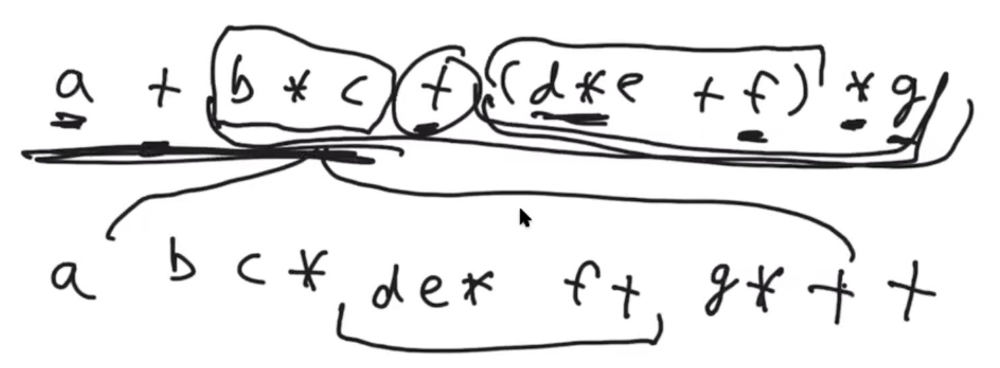

Output 2: a b c * + d e * f + g * +

- Operands have same order, only operators change order


Algorithm:

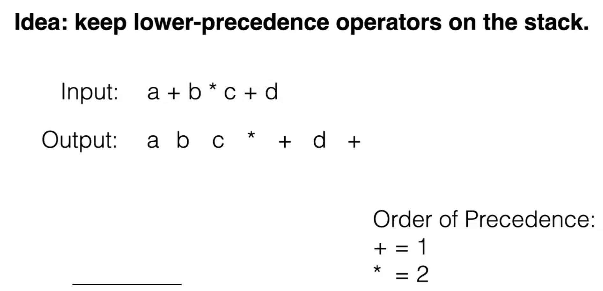

- Write operands
- If operator, check order of precedence with first item in stack, if higher, then push operator onto stack
  - If lower, then pop first operator off stack and write until lower order of precedence, then push original operator onto stack
- Write operand
- Write operators from stack

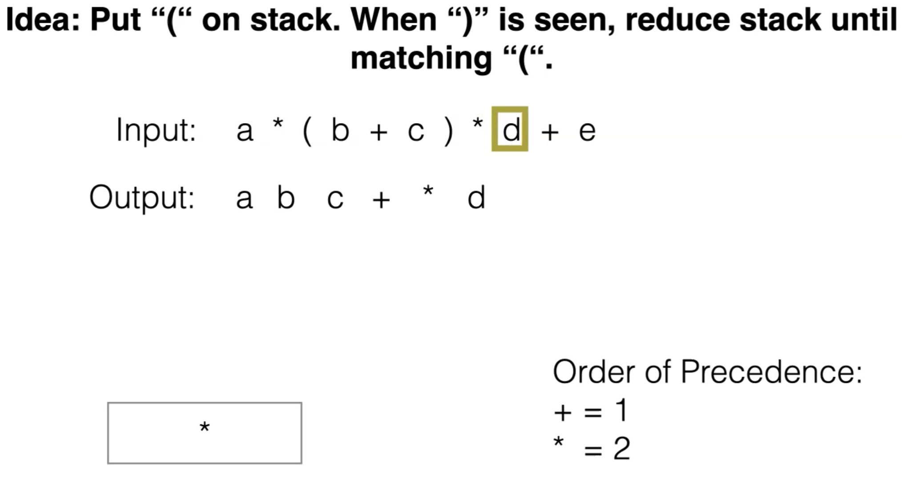

**Pseudocode:**

- for c in input
  - if c is an operand: print c
  - if c is `+`, `*`:
    - While stack is not empty and priority(stack.top()) >= priority(c):
      - Print stack.pop()
    - push c
- while stack is not empty:
  - Print stack.pop()


### Stacks in Hardware

- Stack as a memory abstraction:
  - CPU implements stack (uses register to point to "top" location in main memory; ie. where stack ends)
  - CPU operations push/pop will write/get value and increase/decrease register with a single byte code instruction


**Stack Machines**

- Most modern computers are register machines. To compute 2+3:
  - Move 2 to eax register
  - Move 3 to ebx register
  - Add eax and ebx and write the result back in eax
- In a Stack Machine:
  - Push 2
  - Push 3
  - Add, which stores the result back on the stack
- Hardware stack machines that only have a hardware stack are very rare (ie. apple silicon chips) but many virtual machines (including the JVM) are stack machines.


### Method Call Stacks

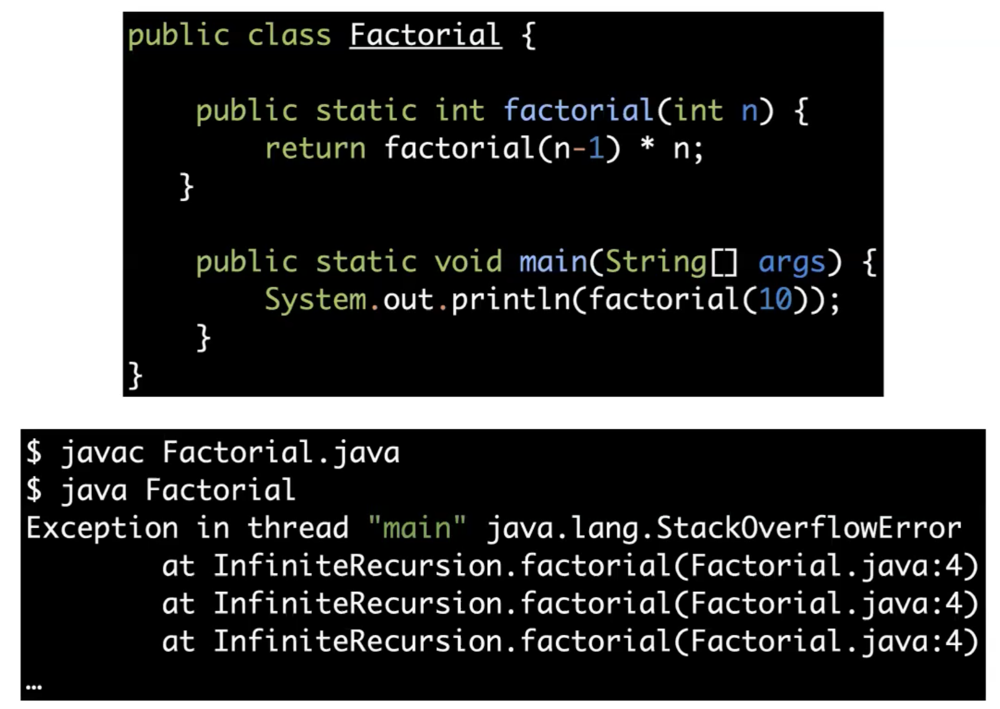

- stack overflow error because no base case defined for the recursion


Every method call keeps a **stack frame** on the **method call** stack.

- Represents the current state of execution of this method (a partially executed method)
- Includes value of local variables and parameters, intermediate results, state of the computation

When a method is called:

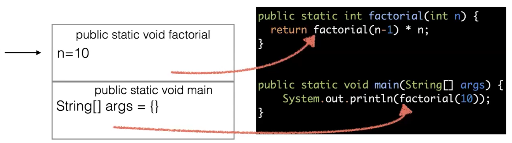

- Execution of the current method is suspended (stack frame remembers where we left off)
- A new stack frame is pushed to the stack
- The new method is run

Stack overflow error is when the stack frame runs out of space.

- In JVM, the default 1MB of space for stack frame
  - Can customize size allocated for stack frame in Java
    - `java -Xss800k JavaProgram` to change size to 800kb


### Stack Frames

JVM stack frame consists of:

- Local variable array (ie. n = 10)
- Operand stack (work area for the method), where the actual computation inside the method happens; also consists of references to program-wide constants
- Size of the stack frame depends on the data types of the local variables

Stack Frame example:

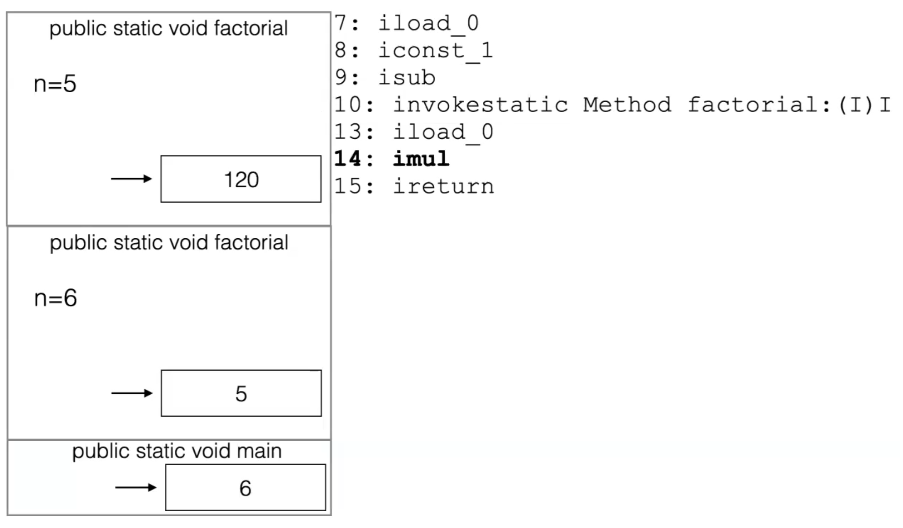

