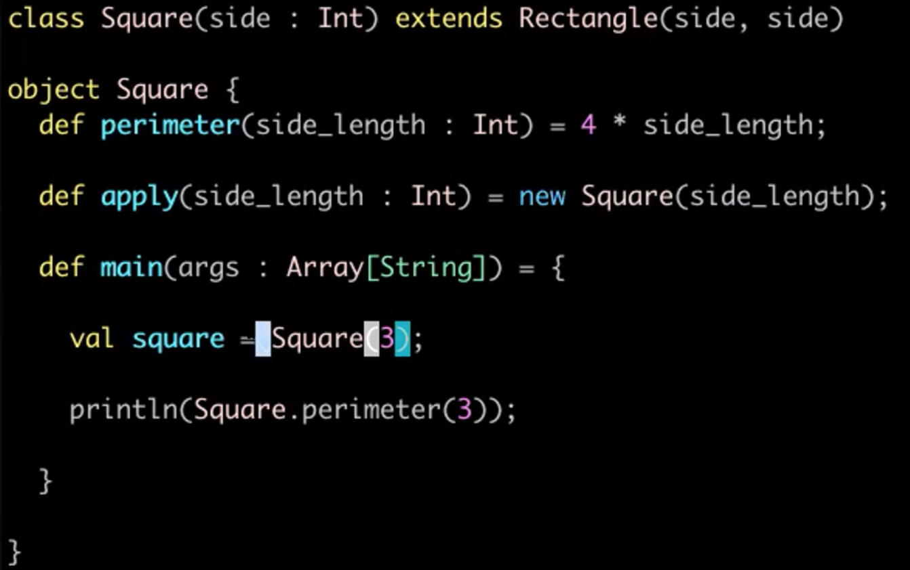

11 Feb 2022

## Inheritance in Scala

We have two classes: Rectangle, and Square, which extends Rectangle. (Rectangle is parent class)

*Rectangle:*

```scala
class Rectangle(val w : Double, val h : Double) {
    def area = w * h;
}
```

*Square:*

```scala
class Square(val side : Double) extends Rectangle(side, side)
```

Test:

```scala
val square = new Square(5)
// val square: Square

square.area
//val res21: Double = 25.0
```


## Companion Object




*Example:*

Creates a Fraction class and defines own * and + methods:

```scala
case class Fraction(numer : Int, denom : Int) {

  def *(other: Fraction): Fraction = Fraction(numer * other.numer, denom * other.denom)

  def +(other: Fraction): Fraction = {
    val my_lcm = Fraction.lcm(denom, other.denom)
    Fraction(numer * (my_lcm / denom) + other.numer * (my_lcm / other.denom), my_lcm)
  }

  override def toString: String = numer.toString + "/" + denom.toString

}

object Fraction {

  def lcm(a : Int, b : Int) = a * b / gcd(a,b)

  def gcd(a: Int, b: Int): Int = {
    if (b == 0) a else gcd(b, a % b)
  }

  def main(args: Array[String]): Unit = {
    val a : Fraction = Fraction(1,2)
    val b : Fraction = Fraction(2, 5)

    println(a * b)
    println(a + b)
  }

}
```


## Pattern Matching and Case Classes

A list in Scala has 2 subtypes, `::(head,tail)` and `Nil`

- List is parent type and the two subtypes (children) are `::` and `Nil`

All these work:

```scala
val x : List[Integer] = List(1,2,3)

val x : List[Integer] = ::(1, Nil)

val x : List[Integer] = Nil
```

Then, we can use pattern matching:

```scala
x match {
    case ::(head,tail) ==>
    case Nil => Nil
}
// val res11: java.io.Serializable = List() (since x = Nil here)
```


Using it in a method:

```scala
def sum_list(li : List[Int]) : Int = li match {
    case Nil => 0
    case ::(head, tail) => head + sum_list(tail)
}
```

Using the _ :

```scala
def sum_list(li : List[Int]) : Int = li match {
    case Nil => 0
    case ::(1, ::(2, _)) => 2
}
```


### Case Classes

- Only child classes are allowed to be case classes

```scala
class Shape

case class Rectangle(w : Int, h : Int) extends Shape

case class Circle(r : Int) extends Shape

val shape = new Rectangle(1, 2)
// val shape: Rectangle = Rectangle(1,2)

val shape : Shape = Rectangle(1, 2)
// val shape: Shape = Rectangle(1,2)

shape match {
    case Rectangle(height, width) => height * width;
    case Circle(radius) => Math.PI * Math.pow(radius, 2)
}
// val res15: Double = 2.0

val shape: Shape = Circle(2)
// val shape: Shape = Circle(2)

shape match {
    case Rectangle(height, width) => height * width;
    case Circle(radius) => Math.PI * Math.pow(radius, 2)
}
// val res16: Double = 12.566370614359172
```

