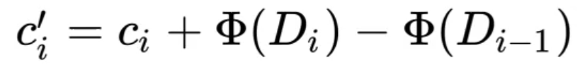
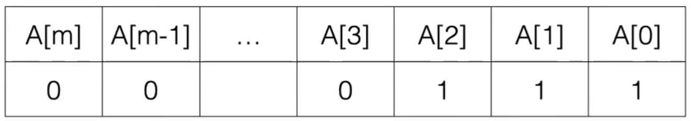

14 Feb 2022

### Rewriting Recursion

In general, any recursion can be replaced by iteration (for example, by using an explicit stack data structure), but recursion is often a lot more readable.


- For iteration, it happens within the same stack frame, so there's no potential for a stack overflow error


### Tail Recursion

- Means that the last thing it does before returning is call itself (the method itself)


*NB: The previous recursion is not tail recursion since there's `* n` after the recursive call*

- Some compilers can detect and remove some types of recursion (the Java Compiler does not, but the Scala Compiler does); called tail recursion optimization


## Amortised Analysis

**Recall: **

- For **Banker's Queue**, the runtime for `enqueue` is constant, and runtime of `dequeue` is linear, but the amortized runtime is still constant (in aggregate)
- The reason for this is because the elements all go through the same push/pop life cycle. It is just divided up unevenly


Traditional worst-case analysis of each operation tends to over-estimate the real cost.

As a result, Big-O bounds are often not tight. It is often better to amortize the cost of an operation in a sequence of operations.

This is particularly useful when dealing with immutable data structures (like Banker's Queue)!


**Three Approaches:**

- Aggregate Analysis
- Banker's Method (Accounting Method)
- Physicist's Method (Potential Method)


*Another Example: **Multi-pop Stack***

Consider a stack with 3 operations:

- Push(x), pop(), multipop(k)
  - Multipop pops the top k elements (or less if there are < k elements on the stack)

```java
T multipop(int k) {
    T x;
    int i = 0;
    while (!This.isEmpty() && i < k) {
        x = this.pop();
        this.size--;
        i++;
    }
}
```

Runtime: O(k)


What is the worst-case runtime of n stack operations?

- What is the worst case runtime of multi-pop?
  - O(n), if the stack contains n-1 elements
- So the total for n multi-pops should be O(n^2^)
- This is correct, but it's not a tightbound, because in order to pop n elements, you need to push n elements


#### Aggregate Analysis

**Aggregate Analysis of Multi-pop**

- Observation: For each time we pop an element to the stack, we need to push it first
- Since each push takes only O(1), we can only call pop() O(n) times - this includes the pop() calls within multi-pop
- Therefore, for any sequence of n stack operations, the total number of push and pop operations is O(n)
- Compute the amortized cost of each stack operation as the **average cost** per operation: O(n)/n = O(1)


*Another Example: **Binary Counter***

Assume you are implementing a binary counter using an array.

- How do you increment the count?

  - 

- What is the worst-case runtime for a single increment operation on an m-bit counter?

  - O(m)

- Total runtime for n increment operations: O(n X m)

- Observation: Not all bits flip every time, so O(m) is not a tight estimate

  - For half the time, only the last bit needs to be flipped, which takes constant time O(1)

- ie:

  - A[0] flips between 0 and 1 on each increment
  - A[1] flips between 0 and 1 every 2 increments
  - A[2] flips between 0 and 1 every 4 increments
  - Worst-case only happens every 2^m^ times

  - So the total runtime of n-increment operations can be analyzed as:

    

    - (m = number of bits, n = number of increment operations)
    - Total runtime is < 2n = O(n)

    - Each operation takes half the time than the previous
    - Therefore, if we go back to **Aggregate Analysis**, a single operation takes O(n)/n = O(1)


#### Banker's Method

Idea: Store some advance 'credit' to each element of the data structure. Use the credit to pay for more expennsive operations later.

- Overcharge some operations to get other operations for free


**Banker's Method: Multipop Stack**

- Actual costs:
  - Push(x): 1
  - Pop(): 1
  - Multi-pop(k): min(k, s), k = # of items to pop, s = size of stack
- **Amortized Costs:**
  - Push(x): 2
  - Pop(): 0
  - Multi-pop(k): k X 0 = 0
  - 


**Banker's Method: Banker's Queue**

- Actual costs:
  - Enqueue(x): O(1)
  - Dequeue(): O(n), n = size of stack
- **Amortized Costs:**
  - Enqueue(x): 3 tokens - one push, one shuffle to second stack, one pop off the second stack
  - Dequeue(): 0 tokens


**Banker's Method: Binary Counter**

- Actual costs:

  - Setting a bit to 1: 1
  - Flipping it back to 0: 1

- **Amortized Costs:**

  - Setting a bit to 1: 2

  - Flipping it back to 0: 0

  - 

    After increment, 1 credit remains per bit.

    

​	

- Every increment operation costs 2
- Total for n operations: 2n = O(n)


#### Physicist's Method

Idea: Store a single **potential** (potential "energy") for the entire data structure. This potential can be used to pay for operations later.

- Let $\phi(D_i)$ be the potential associated with the data structure D at time i

- We perform n data structure operations on D

- The amortized cost for the i'th operation is:

  

  - c~i~ is the actual cost of the operation from D~i-1~ to D~i~
  - D~i~ = potential after operation, D~i-1~ = potential before the operation

- The total amortized cost of n data structure operations is:

  

- Thus, if $\phi (D_n)\ge \phi (D_0)$ (for any n), the amortized cost is an upper bound on the actual cost

  

**Approach:**

- Choose $\phi$ and show that $\phi (D_n)> \phi (D_0)$ for any n
- This shows that the amortized cost represents an upper bound on the true cost; the actual cost can't be higher than the amortized cost
- Then use the potential difference to show the amortized cost for each operation
- Typically, $\phi (D_0)=0$


**Physicist's Method: Multipop Stack**

- Choose $\phi (D_i) = $ number of elements on the stack
  - Hence, $\phi (D_0)=0$ for empty stack
  - The number of elements on the stack can never be negative, so $\phi (D_n)\ge \phi (D_0)$

Now compute the cost for the stack operations.

Amortized cost for one operation:


- Cost of push():

  

- Cost of pop():

  

- Cost of multi-pop(k):

  

  

**Physicist's Method: Binary Counter**



- $\phi (D_i)=$ number of 1's in the counter at time i

- $\phi (D_0)=0$ - Start with value 0, which is all 0's

- $\phi (D_n)\ge\phi (D_0)$ - There cannot be a negative number of 1's

- Amortized cost to set bit to 1:

  1 + number of 1's - number of 1's + 1 = 2

- Amortized cost to flip bit back to 0:

  1 + number of 1's - number of 1's - 1 = 0