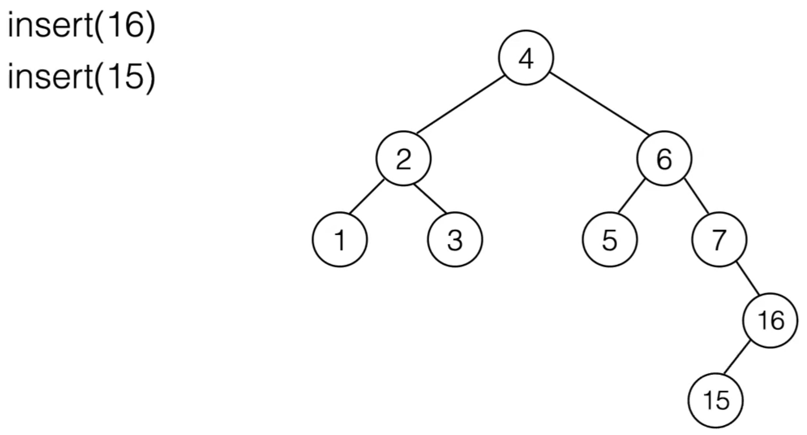
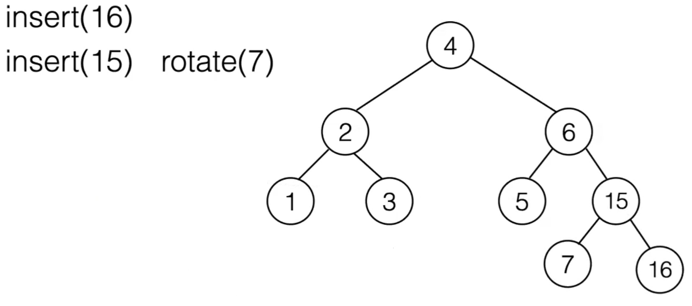
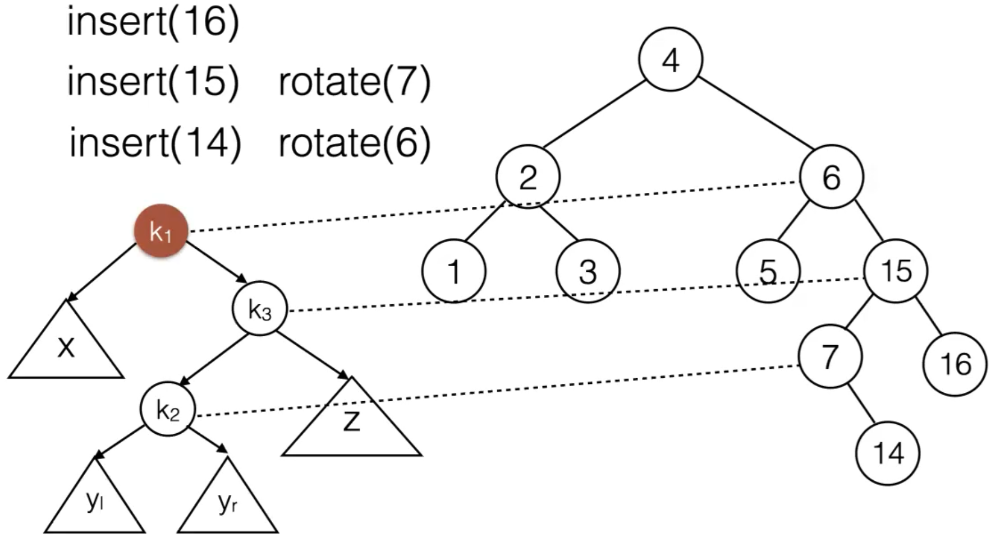

21 Feb 2022

## Proofs by Structural Induction

We are proving a theorem **T** ("This property holds for all cases.")

- Step 1: Base case. We know that **T** holds (trivially) for some small value.
- Step 2: Inductive step:
  - Inductive Hypothesis: Assume **T** holds for all cases up to some limit *k*
  - Show that **T** also holds for *k* + 1
- If the base case and inductive step holds, it proves that **T** holds for any *k*


*Example: **Strong Induction*** (Assuming the statement holds for all values up to k)

**Statement:** Any integer $n\ge 2$ has a factorization into prime numbers

- Base Case: Clearly true for $n=2$ because 2 is itself prime
- Inductive Step:
  - Hypothesis: Assume the statment holds for all integers, $2\le n\le k$
  - Need to show that it also holds for $k+1$
  - There are 2 cases:
    - Case 1: k + 1 is a prime number, then k + 1 can be factored into itself
    - Case 2: k + 1 is not a prime number, so $k+1=pq$, where $p\le k$ And $q\le k$. By the inductive hypothesis, p and q have factorizations, so k + 1 must have a factorization.


We often want to prove properties over tree structures.

- Can use induction:
  - Assume that the property holds for some smaller structure (subtree) and show that it also needs to hold for larger structures
    - Leaf node is typically base case
  - Structural induction over trees comes in two forms: induction over the height, and induction over the number of nodes


**Binary Tree**

A binary tree consists of:

- a root node r
- Zero, one, or two subtrees


### Structural Induction for Binary Trees - Induction over the Height

We want to show that a property holds for all binary trees

- Base case: the property holds for a single node
- Inductive step:
  - Hypothesis: Assume the property holds for each possible subtree
  - Show that it holds for all trees by combining the subtrees with a parent


**Perfect Binary Tree**

- One in which all levels are completely filled including the leaf level
- Note that there are binary trees that are both full and complete, but not perfect


*Example Proof: **Induction Over Height***

Want to show: A perfect binary tree of height h has 2^h+1^ - 1 nodes

- Base Case: A tree of height 0 has 2^0+1^ - 1 = 1 nodes
- Inductive Step:
  - Hypothesis: Assume any perfect binary tree of height k has 2^k+1^ - 1 nodes
  - Show that any perfect binary tree of height k + 1 has 2^k+2^ - 1 nodes

Proof:

- Assume any perfect binary tree of height k has 2^k+1^ - 1 nodes

​		Recursive Construction:

​		

- The number of nodes of a perfect binary tree of height k + 1 is:

  


Using previous proof, we look at the **Minimum Height of A Binary Tree**

- A binary tree of height h has at most n = 2^h+1^ - 1 nodes (perfect tree is an upper bound)

- Therefore, a binary tree of n nodes has at least height log(n + 1) - 1 ; solve for h

  

  $h =\Theta (log\ n)$


## Binary Search Trees

### Map ADT

A map is a collection of (key, value) pairs

- **Keys are unique, values need not be**

- Two operations:

  - `get(key)` - returns the value associated with this key

  - `put(key, value)` - overwrites existing keys

    

  - How do we implement map operations efficiently?


### Binary Search Tree Property

Goal: Reduce finding an item to **O(log N)**

- For every node n with key x:
  - the key of all nodes in the left subtree of n are smaller than x
  - the key of all nodes in the right subtree of n are larger than x


#### Binary Search Tree (BST) ADT

A binary search tree T consists of:

- A root node *r* with key r~item~
- At most two non-empty subtrees T~L~ and T~R~, connected by a directed edge from r

T~L~ and T~R~ satisfy the BST property:

- For all nodes *s* in T~L~, S~item~ < r~item~
- For all nodes *t* in T~R~, t~item~ > r~item~

No key appears more than once in the BST.


#### BST Operations:

- `insert(x)` - add key x to T
- `contains(x)` - check if key x is in T
- `findMin()` - find smallest key in T
- `findMax()` - find largest key in T
- `remove(x)` - remove a key from T


##### Implementation in Java

**`contains`**


**`findMin`**					*-23 Feb 2022-*


- find the left child of the left child of the left child, etc, until leaf
- `findMax` is equivalent, but we look for the rightmost child instead


**`insert`**


- Follow same steps as `contains`

- If x is found, do nothing (no need to insert again if already there since the data(keys) are unique in the tree)

- Otherwise, `contains` stopped at leaf node n <-- where the key should be inserted

  Insert a new node for x as a left or right child of n.

- Then, the recursion returns node and goes back up, reattaching the modified subtree with the added node as left/right child

- Maintains the BST property (left child = less, right child = more)


**`remove`**

- First find x following the same steps as `contains`
  - If item is not found, tree remains unchanged and maybe raise exception
- If x is found in a node s:
  - if s is a leaf, just remove it
  - if s has a single child t, attach t to the parent of s, in place of s
  - If s has two children:
    - Find the smallest node u in the subtree rooted in the right child
    - Replace value of s with value of u
    - Recursively remove u
    - To maintain the BST property, the node that replaces s needs to be:
      - larger than any node in the left subtree
      - but smaller than any node in the right subtree (`findMin`)

```java
private BinaryNode<AnyType> remove( AnyType x, BinaryNode<AnyType> t )
{
    if( t == null )
        return t;   // Item not found; do nothing

    int compareResult = x.compareTo( t.data );

    if( compareResult < 0 )
        t.left = remove( x, t.left );
    else if( compareResult > 0 )
        t.right = remove( x, t.right );
    else if( t.left != null && t.right != null ) // Two children
    {
        t.data = findMin( t.right ).data; // take data from min node and override current node data
        // t.data = findMax(t.left).data; // same but replaces with left subtree instead
        t.right = remove( t.data, t.right ); // need to call remove again on subtree because target removal
        // node is still there, just moved to a leaf node in right subtree. Since it moved to leaf, no more
        // recursive calls need to be made after this
    }
    else // has 1 child or no children
        t = ( t.left != null ) ? t.left : t.right;
        // IN SCALA: if (t.left != null) t.left else t.right
    return t;
}
```

- Not ideal to always replace from only right/left subtree because it can make trees left/right-leaning
- Can use lazy deletion instead
  - Instead of actually deleting node, just flag it as deleted


==Full Implentation of BST:==

```java
// BinarySearchTree class
// From https://users.cs.fiu.edu/~weiss/dsaajava2/code/BinarySearchTree.java

/**
 * Implements an unbalanced binary search tree.
 * Note that all "matching" is based on the compareTo method.
 * @author Mark Allen Weiss
 */
public class BinarySearchTree<AnyType extends Comparable<AnyType>>
{
    /**
     * Construct the tree.
     */
    public BinarySearchTree( )
    {
        root = null;
    }

    /**
     * Insert into the tree; duplicates are ignored.
     * @param x the item to insert.
     */
    public void insert( AnyType x )
    {
        root = insert( x, root );
    }

    /**
     * Remove from the tree. Nothing is done if x is not found.
     * @param x the item to remove.
     */
    public void remove( AnyType x )
    {
        root = remove( x, root );
    }

    /**
     * Find the smallest item in the tree.
     * @return smallest item or null if empty.
     */
    public AnyType findMin( ) // driver method
    {
        if( root == null ) // if tree is empty
            throw new NullPointerException( );
        return findMin( root ).data; // call helper method
    }

    /**
     * Find the largest item in the tree.
     * @return the largest item of null if empty.
     */
    public AnyType findMax( )
    {
        if( root == null )
            throw new NullPointerException( );
        return findMax( root ).data;
    }

    /**
     * Find an item in the tree.
     * @param x the item to search for.
     * @return true if not found.
     */
    public boolean contains( AnyType x )
    {
        return contains( x, root );
    }

    /**
     * Make the tree logically empty.
     */
    public void makeEmpty( )
    {
        root = null;
    }

    /**
     * Test if the tree is logically empty.
     * @return true if empty, false otherwise.
     */
//    public boolean isEmpty( )
//    {
//        return root == null;
//    }

    /**
     * Print the tree contents in sorted order.
     */
    public void printTree( )
    {
        if( root == null )
            System.out.println( "Empty tree" );
        else
            printTree( root );
    }

    /**
     * Internal method to insert into a subtree.
     * @param x the item to insert.
     * @param t the node that roots the subtree.
     * @return the new root of the subtree.
     */
    private BinaryNode<AnyType> insert( AnyType x, BinaryNode<AnyType> t )
    {
        if( t == null ) // Not found, insert HERE
            return new BinaryNode<AnyType>( x, null, null );

        int compareResult = x.compareTo( t.data );

        if( compareResult < 0 )
            t.left = insert( x, t.left ); // eventually new node will be attached
            // IF SCALA: return new BinaryNode(x, insert(x, t.left), t.right);
        else if( compareResult > 0 )
            t.right = insert( x, t.right );
            // IF SCALA: return new BinaryNode(x, t.left, insert(x, t.right));
        else
//            t.data = x; // alternative
            t = new BinaryNode(x, t.left, t.right); // Duplicate; replace with possible new content
        return t;
    }

    /**
     * Internal method to remove from a subtree.
     * @param x the item to remove.
     * @param t the node that roots the subtree.
     * @return the new root of the subtree.
     */
    // returns a subtree because we want to modify and reattach it
    private BinaryNode<AnyType> remove( AnyType x, BinaryNode<AnyType> t )
    {
        if( t == null )
            return t;   // Item not found; do nothing

        int compareResult = x.compareTo( t.data );

        if( compareResult < 0 )
            t.left = remove( x, t.left );
        else if( compareResult > 0 )
            t.right = remove( x, t.right );
        else if( t.left != null && t.right != null ) // Two children
        {
            t.data = findMin( t.right ).data; // take data from min node and override current node data
            // t.data = findMax(t.left).data; // same but replaces with left subtree instead
            t.right = remove( t.data, t.right ); // need to call remove again on subtree because target removal
            // node is still there, just moved to a leaf node in right subtree. Since it moved to leaf, no more
            // recursive calls need to be made after this
        }
        else // has 1 child or no children
            t = ( t.left != null ) ? t.left : t.right;
            // IN SCALA: if (t.left != null) t.left else t.right
        return t;
    }

    private BinaryNode<AnyType> lazyRemove(AnyType x, BinaryNode<AnyType> t)
    {
        if( t == null )
            return t;   // Item not found; do nothing

        int compareResult = x.compareTo( t.data );

        if( compareResult < 0 )
            t.left = lazyRemove( x, t.left );
        else if( compareResult > 0 )
            t.right = lazyRemove( x, t.right );
        else
            t.deleted = true;
        return t;
    }
    /**
     * Internal method to find the smallest item in a subtree.
     * @param t the node that roots the subtree.
     * @return node containing the smallest item.
     */
    private BinaryNode<AnyType> findMin( BinaryNode<AnyType> t )
    {
        if( t == null ) // this should never happen ; error checking
            return null;
        else if( t.left == null ) // reached leaf ; base case
            return t;
        return findMin( t.left );
    }

    /**
     * Internal method to find the largest item in a subtree.
     * @param t the node that roots the subtree.
     * @return node containing the largest item.
     */
    private BinaryNode<AnyType> findMax( BinaryNode<AnyType> t )
    {
        if( t != null )
            while( t.right != null )
                t = t.right;

        return t;
    }

    /**
     * Internal method to find an item in a subtree.
     * @param x is item to search for.
     * @param t the node that roots the subtree.
     * @return node containing the matched item.
     */
    private boolean contains( AnyType x, BinaryNode<AnyType> t )
    {
        if( t == null )
            return false; // reached end of tree; base case

        int compareResult = x.compareTo( t.data );

        if( compareResult < 0 )
            return contains( x, t.left );
        else if( compareResult > 0 )
            return contains( x, t.right );
        else
//            return t.deleted == false;    // use with lazyRemove
            return true;    // Match
    }

    private AnyType find(AnyType x, BinaryNode<AnyType> t)
    {
        if( t == null )
            return null; // reached end of tree; base case

        int compareResult = x.compareTo( t.data );

        if( compareResult < 0 )
            return find( x, t.left );
        else if( compareResult > 0 )
            return find( x, t.right );
        else
            return t.data;    // Match
    }

    /**
     * Internal method to print a subtree in sorted order.
     * @param t the node that roots the subtree.
     */
    private void printTree( BinaryNode<AnyType> t )
    {
        if( t != null )
        {
            printTree( t.left );
            System.out.println( t.data );
            printTree( t.right );
        }
    }

    /**
     * Internal method to compute height of a subtree.
     * @param t the node that roots the subtree.
     */
    private int height( BinaryNode<AnyType> t )
    {
        if( t == null )
            return -1;
        else
            return 1 + Math.max( height( t.left ), height( t.right ) );
    }

    // Basic node stored in unbalanced binary search trees
    static class BinaryNode<AnyType>
    {
        // Constructors
        BinaryNode( AnyType thedata )
        {
            this( thedata, null, null );
        }

        BinaryNode( AnyType thedata, BinaryNode<AnyType> lt, BinaryNode<AnyType> rt )
        {
            data  = thedata;
            left     = lt;
            right    = rt;
        }

        AnyType data;            // The data in the node
        BinaryNode<AnyType> left;   // Left child
        BinaryNode<AnyType> right;  // Right child
        boolean deleted = false; // flag for lazyRemove
    }


    /** The tree root. */
    BinaryNode<AnyType> root;


    // Test program
    public static void main( String [ ] args )
    {
        BinarySearchTree<Integer> t = new BinarySearchTree<Integer>( );
        final int NUMS = 4000;
        final int GAP  =   37;

        System.out.println( "Checking... (no more output means success)" );

        for( int i = GAP; i != 0; i = ( i + GAP ) % NUMS )
            t.insert( i );

        for( int i = 1; i < NUMS; i+= 2 )
            t.remove( i );

        if( NUMS < 40 )
            t.printTree( );
        if( t.findMin( ) != 2 || t.findMax( ) != NUMS - 2 )
            System.out.println( "FindMin or FindMax error!" );

        for( int i = 2; i < NUMS; i+=2 )
            if( !t.contains( i ) )
                System.out.println( "Find error1!" );

        for( int i = 1; i < NUMS; i+=2 )
        {
            if( t.contains( i ) )
                System.out.println( "Find error2!" );
        }
    }
}
```


---


### BST Running Time Analysis

- How long do the BST operations take?

  - Can simplify because all use `contains` method, after which everything is constant work, with the exception of the recursive remove (at most one, so doesn't change runtime analysis)

- Given a BST T, we need a single pass down the tree to access some node s in depth(s) steps

- What is the best/expected/worst-case depth of a node in any BST?

  - Assume we have a BST with N nodes

  - Worst case: T does not branch at all; height(T) = N

    

  - Best case: height(T) = O(log N)

    

### Balanced BST's

- Balance condition: Guarantee that the BST is always close to a *complete* binary tree.
  - Then the height of the tree will be O(log N) and all BST operations will run in O(log N)
- Called **self-balancing** trees
- There are different implementations of self-balancing BST's:
  - AVL trees, Red-Black trees, B+-trees, ...


**Height of an empty subtree:**

- The height of an empty subtree is -1


### AVL Tree Condition

An AVL tree is a **Binary Search Tree** in which the following **balance condition** holds after each operation:

-  For every node, the height of the left and right subtree differs by at most 1

  

  

- Height of an AVL tree is at most

  

  - By allowing a small degree of imbalance, it's slightly worse than log N

- How to maintain the balance condition?

  - Rebalance the tree after each modification (insertion or deletion)
  - Rebalancing must be cheap (not costing more than constant time)


 **Outside Imbalance**:


**Inside Imbalance:**


**Single Rotation:**


**Maintains BST property:**

- x is still left subtree of k~1~
- z is still right subtree of k~2~
- For all keys v in y: k~1~ < v < k~2~  (y becomes new left subtree of k~2~)

**Changed References:**

- k1.right = k2
- k2.left = root(y)

- parent(k2).left = k1 OR parent(k2).right = k1 ; reattach subtree to parent


#### Single Rotation

- After each insertion/deletion, find the **lowest node k** that violates the balance condition (if any), starting at the insertion site, and going back up and recalculating height when returning the recursion calls, and comparing that height with the other subtrees which haven’t changed

- Perform rotation to re-balance the tree

- Rotation maintains original height of subtrees under k before the insertion. No further rotations are needed.

- Invariant:

  After each modification, the tree maintains both the BST property and the AVL condition


- Recalculate height after each operation
- Lowest node that is imbalanced is 3 with RR Outside imbalance
- Important to not check for imbalance at root
  - If I try to fix a higher imbalance, might not result in a proper AVL tree since tree may still be unbalanced


- Now lowest imbalance is at node ‘2’ RR Outside


​				*-28 Feb 2022-*


#### Double Rotation

- y is non-empty (imbalance due to insertion into y or deletion from z)
- so we can view y as a root and two sub-trees


Decompose y into two subtrees:


- either y~L~ or y~R~ is two levels higher than z


**Perform double rotation:**

Visualize as two single rotations:


1. Single rotation at k~1~

   

2. Single rotation at k~3~

   

   


**References to modify for double rotation:**

- k~2~.left = k~1~
- k~2~.right = k~3~
- k~1~.right = root(y~L~)
- k~3~.left = root(y~R~)
- parent(k~3~).left = k~2~ OR parent(k~2~).right = k~2~ (typically done via recursion)


*Example:*



- RL Inside imbalance at node 7

Mapping k~1,2,3~ onto our tree to visualize:


- First Rotation to the **right** around Node 16:


- Second Rotation to the **left** around Node 7:




- Unbalanced at Node 6 RL Inside imbalance



- First Right rotation around 15:


- Second Left rotation around 6:

  

  Now tree is balanced.


==Implementation in Java:==

- Similar to Binary Search Tree
- `balance` modifies the tree just once, after which the tree will be balanced

```java
// AvlTree class
//
// CONSTRUCTION: with no initializer
//
// ******************PUBLIC OPERATIONS*********************
// void insert( x )       --> Insert x
// void remove( x )       --> Remove x (unimplemented)
// boolean contains( x )  --> Return true if x is present
// boolean remove( x )    --> Return true if x was present
// Comparable findMin( )  --> Return smallest item
// Comparable findMax( )  --> Return largest item
// boolean isEmpty( )     --> Return true if empty; else false
// void makeEmpty( )      --> Remove all items
// void printTree( )      --> Print tree in sorted order
// ******************ERRORS********************************
// Throws UnderflowException as appropriate

/**
 * Implements an AVL tree.
 * Note that all "matching" is based on the compareTo method.
 * @author Mark Allen Weiss
 */
public class AvlTree<AnyType extends Comparable<? super AnyType>>
{
    /**
     * Construct the tree.
     */
    public AvlTree( )
    {
        root = null;
    }

    /**
     * Insert into the tree; duplicates are ignored.
     * @param x the item to insert.
     */
    public void insert( AnyType x )
    {
        root = insert( x, root );
    }

    /**
     * Remove from the tree. Nothing is done if x is not found.
     * @param x the item to remove.
     */
    public void remove( AnyType x )
    {
        root = remove( x, root );
    }


    /**
     * Internal method to remove from a subtree.
     * @param x the item to remove.
     * @param t the node that roots the subtree.
     * @return the new root of the subtree.
     */
    private AvlNode<AnyType> remove( AnyType x, AvlNode<AnyType> t )
    {
        if( t == null )
            return t;   // Item not found; do nothing

        int compareResult = x.compareTo( t.element );

        if( compareResult < 0 )
            t.left = remove( x, t.left );
        else if( compareResult > 0 )
            t.right = remove( x, t.right );
        else if( t.left != null && t.right != null ) // Two children
        {
            t.element = findMin( t.right ).element;
            t.right = remove( t.element, t.right );
        }
        else
            t = ( t.left != null ) ? t.left : t.right;
        return balance( t );
    }

    /**
     * Find the smallest item in the tree.
     * @return smallest item or null if empty.
     */
    public AnyType findMin( )
    {
        if( isEmpty( ) )
            throw new UnderflowException( );
        return findMin( root ).element;
    }

    /**
     * Find the largest item in the tree.
     * @return the largest item of null if empty.
     */
    public AnyType findMax( )
    {
        if( isEmpty( ) )
            throw new UnderflowException( );
        return findMax( root ).element;
    }

    /**
     * Find an item in the tree.
     * @param x the item to search for.
     * @return true if x is found.
     */
    public boolean contains( AnyType x )
    {
        return contains( x, root );
    }

    /**
     * Make the tree logically empty.
     */
    public void makeEmpty( )
    {
        root = null;
    }

    /**
     * Test if the tree is logically empty.
     * @return true if empty, false otherwise.
     */
    public boolean isEmpty( )
    {
        return root == null;
    }

    /**
     * Print the tree contents in sorted order.
     */
    public void printTree( )
    {
        if( isEmpty( ) )
            System.out.println( "Empty tree" );
        else
            printTree( root );
    }

    private static final int ALLOWED_IMBALANCE = 1;

    // Assume t is either balanced or within one of being balanced
    private AvlNode<AnyType> balance( AvlNode<AnyType> t )
    {
        if( t == null )
            return null;

        // assuming height is set correctly
        if( height( t.left ) - height( t.right ) > ALLOWED_IMBALANCE )
            if( height( t.left.left ) >= height( t.left.right ) )
                t = rotateWithLeftChild( t ); // LL outside
            else
                t = doubleWithLeftChild( t ); // LR inside
        else
        if( height( t.right ) - height( t.left ) > ALLOWED_IMBALANCE )
            if( height( t.right.right ) >= height( t.right.left ) )
                t = rotateWithRightChild( t ); // RR outside
            else
                t = doubleWithRightChild( t ); // RL inside

        // recalculate height on all nodes on the pass back from insertion site
        t.height = Math.max( height( t.left ), height( t.right ) ) + 1;
        return t;
    }

    public void checkBalance( )
    {
        checkBalance( root );
    }

    private int checkBalance( AvlNode<AnyType> t )
    {
        if( t == null )
            return -1;

        if( t != null )
        {
            int hl = checkBalance( t.left );
            int hr = checkBalance( t.right );
            if( Math.abs( height( t.left ) - height( t.right ) ) > 1 ||
                    height( t.left ) != hl || height( t.right ) != hr )
                System.out.println( "OOPS!!" );
        }

        return height( t );
    }


    /**
     * Internal method to insert into a subtree.
     * @param x the item to insert.
     * @param t the node that roots the subtree.
     * @return the new root of the subtree.
     */
    private AvlNode<AnyType>  insert( AnyType x, AvlNode<AnyType> t )
    {
        if( t == null )
            return new AvlNode<>( x, null, null );

        int compareResult = x.compareTo( t.element );

        if( compareResult < 0 )
            t.left = insert( x, t.left );
        else if( compareResult > 0 )
            t.right = insert( x, t.right );
        else
            ;  // Duplicate; do nothing
        return balance( t ); //the only different line in method from BST
    }

    /**
     * Internal method to find the smallest item in a subtree.
     * @param t the node that roots the tree.
     * @return node containing the smallest item.
     */
    private AvlNode<AnyType> findMin( AvlNode<AnyType> t )
    {
        if( t == null )
            return t;

        while( t.left != null )
            t = t.left;
        return t;
    }

    /**
     * Internal method to find the largest item in a subtree.
     * @param t the node that roots the tree.
     * @return node containing the largest item.
     */
    private AvlNode<AnyType> findMax( AvlNode<AnyType> t )
    {
        if( t == null )
            return t;

        while( t.right != null )
            t = t.right;
        return t;
    }

    /**
     * Internal method to find an item in a subtree.
     * @param x is item to search for.
     * @param t the node that roots the tree.
     * @return true if x is found in subtree.
     */
    private boolean contains( AnyType x, AvlNode<AnyType> t )
    {
        while( t != null )
        {
            int compareResult = x.compareTo( t.element );

            if( compareResult < 0 )
                t = t.left;
            else if( compareResult > 0 )
                t = t.right;
            else
                return true;    // Match
        }

        return false;   // No match
    }

    /**
     * Internal method to print a subtree in sorted order.
     * @param t the node that roots the tree.
     */
    private void printTree( AvlNode<AnyType> t )
    {
        if( t != null )
        {
            printTree( t.left );
            System.out.println( t.element );
            printTree( t.right );
        }
    }

    /**
     * Return the height of node t, or -1, if null.
     */
    private int height( AvlNode<AnyType> t )
    {
        return t == null ? -1 : t.height;
    }

    /**
     * Rotate binary tree node with left child.
     * For AVL trees, this is a single rotation for case 1.
     * Update heights, then return new root.
     */
    private AvlNode<AnyType> rotateWithLeftChild( AvlNode<AnyType> k2 ) // Single Rotation
    // Rotate with Left Child Up ; Right Rotation
    {
        AvlNode<AnyType> k1 = k2.left;
        k2.left = k1.right; // attach subtree y from single rotation
        k1.right = k2;
        k2.height = Math.max( height( k2.left ), height( k2.right ) ) + 1;
        k1.height = Math.max( height( k1.left ), k2.height ) + 1;
        return k1;
    }

    /**
     * Rotate binary tree node with right child.
     * For AVL trees, this is a single rotation for case 4.
     * Update heights, then return new root.
     */
    private AvlNode<AnyType> rotateWithRightChild( AvlNode<AnyType> k1 )
    // Rotate with Right child up ; Left Rotation
    {
        AvlNode<AnyType> k2 = k1.right;
        k1.right = k2.left;
        k2.left = k1;
        k1.height = Math.max( height( k1.left ), height( k1.right ) ) + 1;
        k2.height = Math.max( height( k2.right ), k1.height ) + 1;
        return k2;
    }

    /**
     * Double rotate binary tree node: first left child
     * with its right child; then node k3 with new left child.
     * For AVL trees, this is a double rotation for case 2.
     * Update heights, then return new root.
     */
    private AvlNode<AnyType> doubleWithLeftChild( AvlNode<AnyType> k3 )
    {
        k3.left = rotateWithRightChild( k3.left );
        return rotateWithLeftChild( k3 );
    }

    /**
     * Double rotate binary tree node: first right child
     * with its left child; then node k1 with new right child.
     * For AVL trees, this is a double rotation for case 3.
     * Update heights, then return new root.
     */
    private AvlNode<AnyType> doubleWithRightChild( AvlNode<AnyType> k1 )
    {
        k1.right = rotateWithLeftChild( k1.right );
        return rotateWithRightChild( k1 );
    }

    private static class AvlNode<AnyType>
    {
        // Constructors
        AvlNode( AnyType theElement )
        {
            this( theElement, null, null );
        }

        AvlNode( AnyType theElement, AvlNode<AnyType> lt, AvlNode<AnyType> rt )
        {
            element  = theElement;
            left     = lt;
            right    = rt;
            height   = 0; // 0 for tree with single node
        }

        AnyType           element;      // The data in the node
        AvlNode<AnyType>  left;         // Left child
        AvlNode<AnyType>  right;        // Right child
        int               height;       // Height
    }

    /** The tree root. */
    private AvlNode<AnyType> root;


    // Test program
    public static void main( String [ ] args )
    {
        AvlTree<Integer> t = new AvlTree<>( );
        final int SMALL = 40;
        final int NUMS = 1000000;  // must be even
        final int GAP  =   37;

        System.out.println( "Checking... (no more output means success)" );

        for( int i = GAP; i != 0; i = ( i + GAP ) % NUMS )
        {
            //    System.out.println( "INSERT: " + i );
            t.insert( i );
            if( NUMS < SMALL )
                t.checkBalance( );
        }

        for( int i = 1; i < NUMS; i+= 2 )
        {
            //   System.out.println( "REMOVE: " + i );
            t.remove( i );
            if( NUMS < SMALL )
                t.checkBalance( );
        }
        if( NUMS < SMALL )
            t.printTree( );
        if( t.findMin( ) != 2 || t.findMax( ) != NUMS - 2 )
            System.out.println( "FindMin or FindMax error!" );

        for( int i = 2; i < NUMS; i+=2 )
            if( !t.contains( i ) )
                System.out.println( "Find error1!" );

        for( int i = 1; i < NUMS; i+=2 )
        {
            if( t.contains( i ) )
                System.out.println( "Find error2!" );
        }
 
```


Use a map with a BST:

BstMap.java

```java
import java.util.TreeMap; // java implementation of a tree map

public class BstMap<K extends Comparable<K>,V> { // implements Map<K,V> {

    BinarySearchTree<KVPair<K,V>> theBST;

    public BstMap(){
        theBST = new BinarySearchTree<KVPair<K,V>>();
    }

    public void put(K key, V value) {
        KVPair<K,V> thePair = new KVPair<>(key, value);
        theBST.insert(thePair);
    }

    public V get(K key) {
        KVPair<K,V> keyDummy = new KVPair<>(key, null);
        // creating dummy pair with same key value, just for purpose of searching
        // through the tree for that key. Then, can retrieve real value

        KVPair<K,V> result = theBST.find(keyDummy);
        return result.value;
    }


    public static void main(String[] args) {

        // Red-Black Tree
        TreeMap<Integer, String> map = new TreeMap<>();

        map.put(2,"b");
        map.put(1,"a");
        map.put(3,"c");

        System.out.println(map.get(2));

    }

}
```


KVPair.java

```java
public class KVPair<K extends Comparable<K>,V> implements Comparable<KVPair<K,V>> {

    public K key;
    public V value;

    public KVPair(K theKey, V theValue) {
        key = theKey;
        value = theValue;
    }

    public int compareTo(KVPair<K,V> other) {
        return key.compareTo(other.key);
    }
    
}
```
