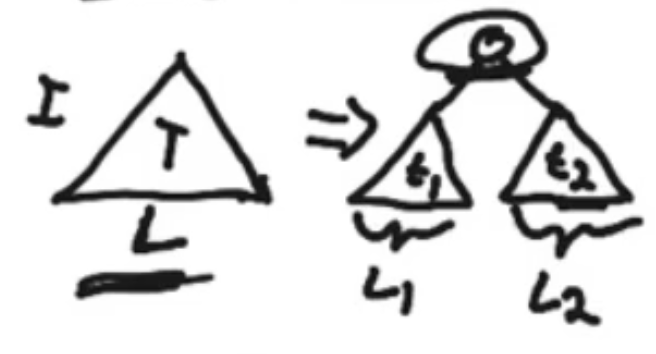
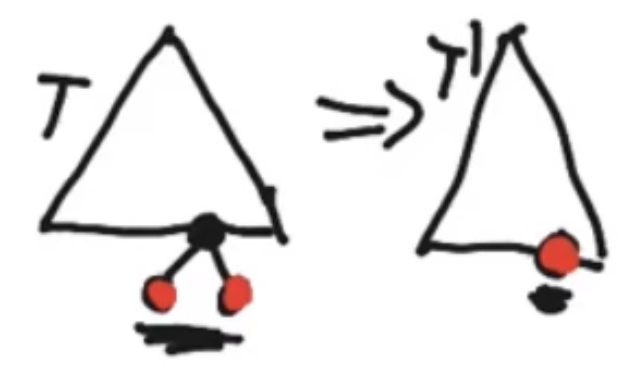

25 Feb 2022

## Proofs By Structural Induction

### Full Binary Trees

In a full binary tree, each node is either:

- A leaf node
- An internal node (with exactly two children)

#### Full Binary Tree Theorem

In any full binary tree, the number of internal nodes is the number of leaves minus one.

==**I = L - 1**==, 		I = number of internal nodes, L = number of leaves

**Proof (Structural Induction):**

*Base Case:*

- A tree with a single node (which has to be a leaf)
- 1 Leaf and 0 Internal Nodes
- I = 1 - 1 = 0

*Inductive Step:* (Recursively decomposing the tree)

Start with some overall tree T, and because it’s a full binary tree, it must consist of a root node and two non-empty subtrees, t~1~ and t~2~

By the inductive hypothesis:

- t~1~ has I~1~ = L~1~ - 1 internal nodes
- t~2~ has I~2~ = L~2~ - 1 internal nodes

- L = L~1~ + L~2~ - No extra leaf nodes (1)

- I = I~1~ + I~2~ + 1 - 1 extra internal node (the new root node)

    = L~1~ - 1 + L~1~ - 1 + 1 (substituting I~1~ and I~2~ with hypothesis)

    = L~1~ + L~2~ - 1

    = L - 1 (subtituting L from (1))

  Therefore, proved I = L - 1

*Approach 2 of Proof:*

**Same Theorem from Above:** In any full binary tree, the number of internal nodes is the number of leaves minus one.				I = L - 1

**Proof (Structural Induction V2):**

*Base Case:*

- Single Node - 1 Leaf, 0 Internal nodes
- I = 1 - 1 = 0

*Inductive Step:*

In a full binary tree T, there must exist an internal node with two leaves as children.

Reduce this tree T into a smaller tree T’ by cutting off the two leaves and turning the internal node into a new leaf.

T’ has L - 2 + 1 = L - 1 leaves (minus two leaves but add one since we cut off two, but then turned internal node into leaf)

By the Inductive Hypothesis:

- T’ has L - 1 - 1 = L - 2 internal nodes

- T has one additional internal node:

  - I = L - 2 + 1 (L - 2 from internal nodes of T’ above)

      = L - 1

    Therefore, proved I = L - 1

For Approach 1, we’re starting with the base case and growing larger and larger trees by combining two subtrees with a root node. Assume theorem holds for t~1~ and t~2~ and show that it also holds for T.

For Approach 2, we’re making the argument backwards, starting with a larger tree and reducing it into a smaller tree. Assume theorem works for T’, and show that it also holds for T.

Step 0: Choose N (What to induct on)

Step 1: Base Case –> min N, prove true

Step 2: Inductive Hypothesis –> N ==> N + 1

Being true for N ==> Being true for N + 1

A full BT with height N has (n(N) - 1)/2 internal nodes ==> A full BT with height N + 1 has n((N+1)-1)/2 internal nodes

full binary trees must always increase N with 2 
