28 Feb 2022

## **M-ary Trees:**

- Each node can have up to M children

- Height of a complete M-ary tree is log~M~ N

  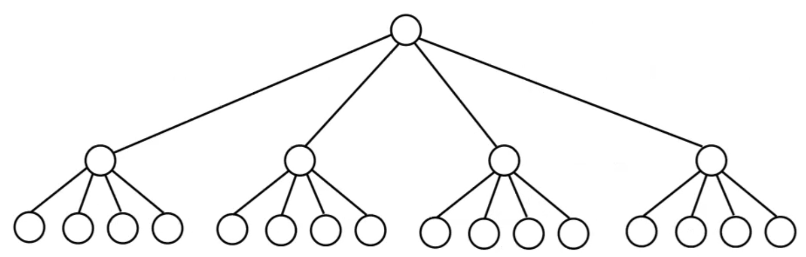

**M-ary Search Tree:**

- Can generalize binary search trees to M-ary search trees
- 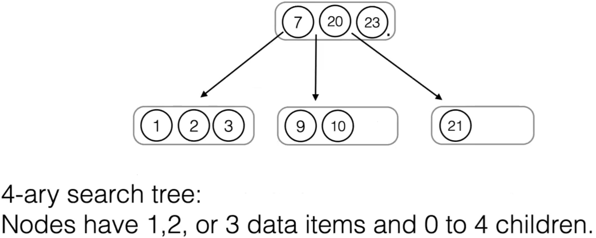

## **2-3-4 Trees:**

A 2-3-4 Tree is a balanced 4-Ary search tree.

- 3 Types of internal nodes:
  - A 2-node has 1 item and 2 children
  - A 3-node has 2 item and 3 children
  - A 4-node has 3 item and 4 children

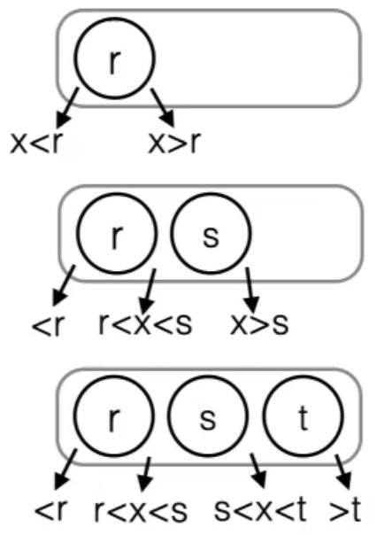

- Balance condition:
- All leaves have the same depth (height of the left and right subtree is always identical)

**`contains` in a 2-3-4 Tree:**

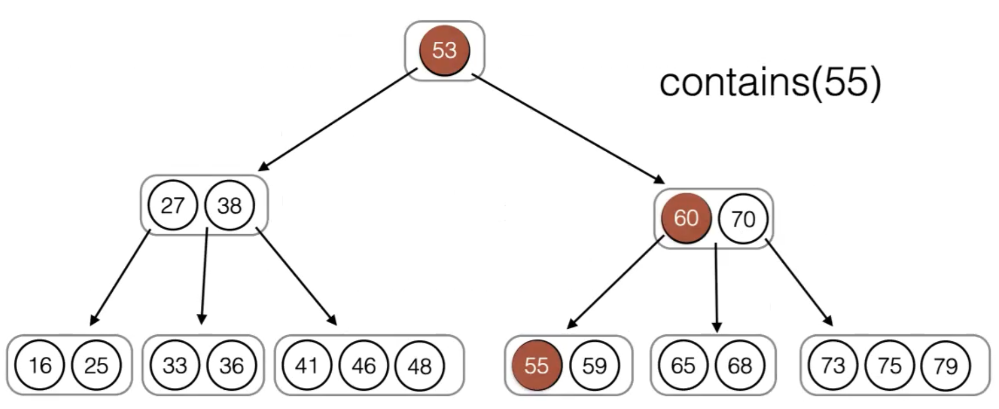

- At each level try to find the item: 2 steps = O(c)
- If not found, follow reference down the tree. There are at most O(height(T)) = O(log N) references.

**`insert` into a 2-3-4 Tree:**

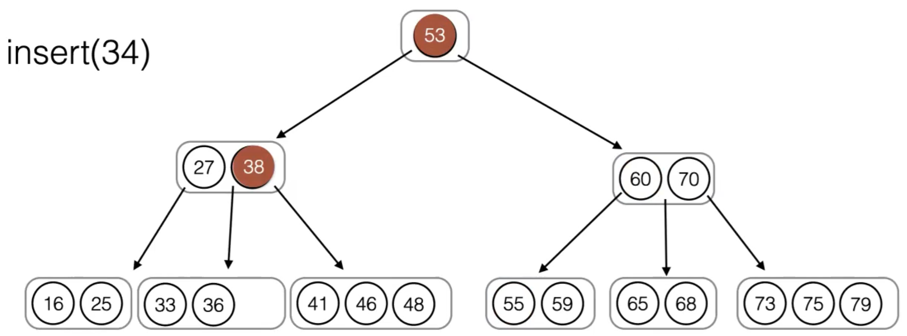

- Follow the same steps as `contains`
- If x is found, do nothing
- If there is still space in the leaf that should contain X, add it

- If the leaf is full, evenly split it into nodes
  - Choose median m of values (out of all the nodes in leaf + x)
  - Left node contains items < m, right node contains items > m
  - Add median item to parent. Add references to the two new nodes left and right of it

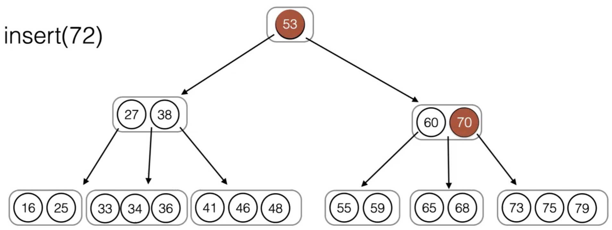

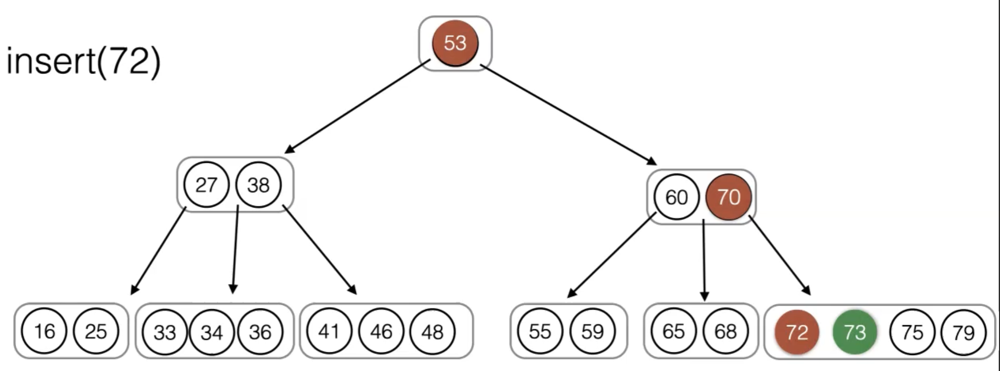

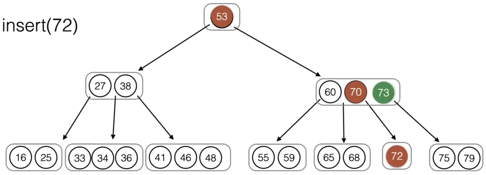

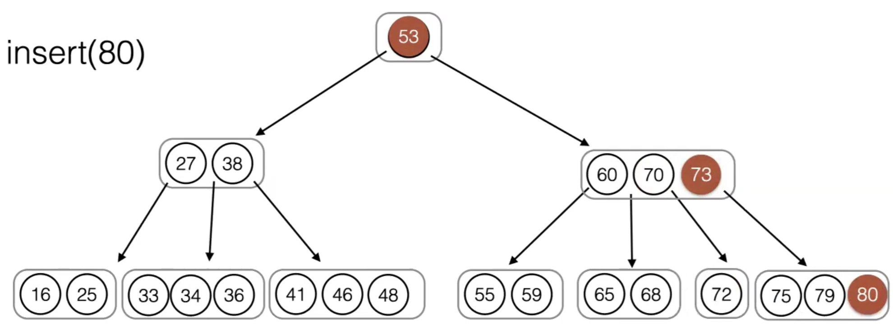

Now the parent node is also full.

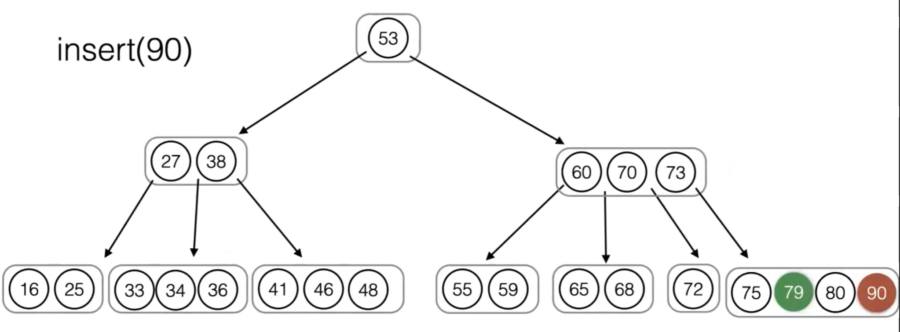

- If parent is also full, continue to split the parent until space can be found.

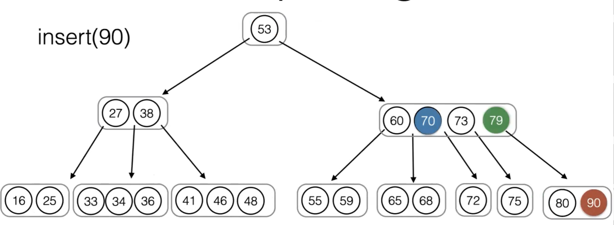

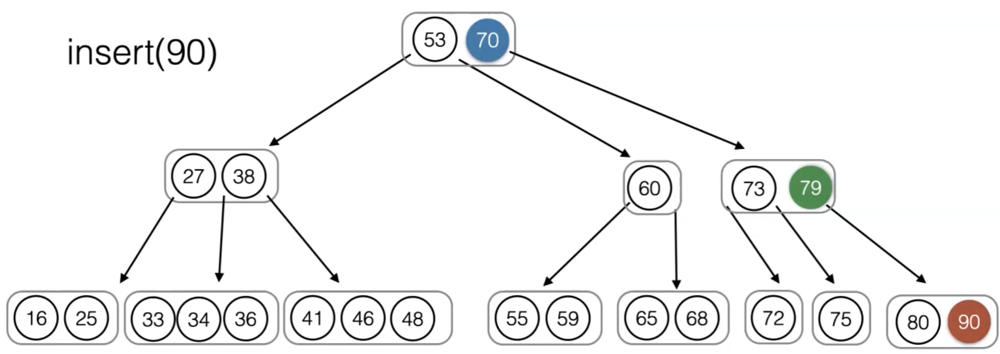

Now the tree is balanced.

- If the parent is also full, continue to split the parent until space can be found.
- If root is full, create a new root with old root as a single child. This is the only time the height increases.

**`remove` from a 2-3-4 Tree:**

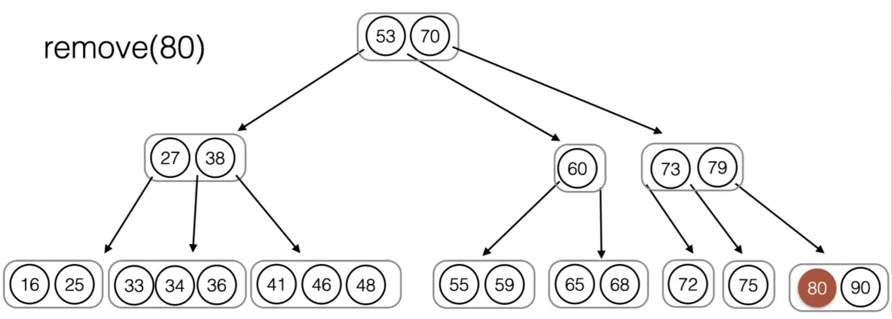

- Item in a 3- or 4-leaf can just be removed

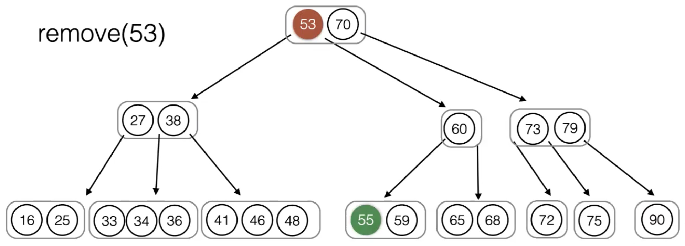

- Removal of an item v from internal node:
  - Continue down the tree to find the leaf with the next highest item w. **Replace v with w**. Remove w from its original position recursively.

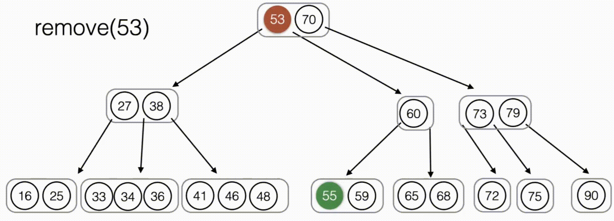

- Removal of an item from a leaf 2-node t:
  - We cannot simply remove t because the parent would not be well formed
  - Move down an item from the parent of t. Replenish the parent moving item from one of t’s siblings

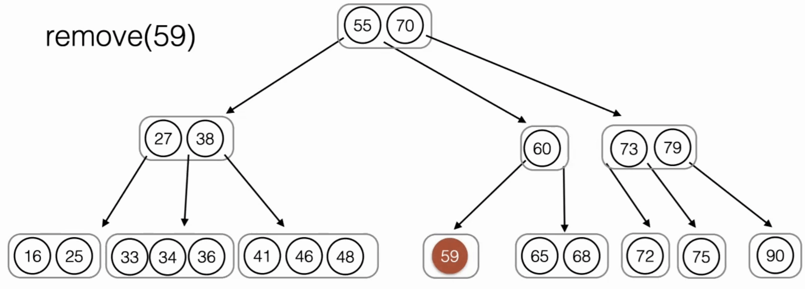

- Removal of an item in a leaf 2-node that has no 3- or 4-node siblings:
  - **Fuse** the sibling node with one of the parent nodes

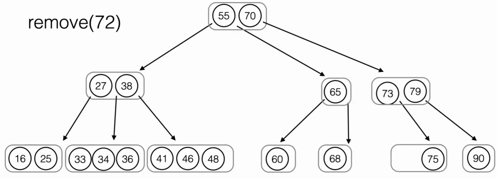

## **B-Trees**

A B-Tree is a generalization of the 2-3-4 tree to M-ary search trees.

- Every internal node (except for the root) has $\lceil M/2\rceil\le d\le M$ children and contains d-1 values
- All leaves contain $\lceil L/2\rceil\le d\le L$ values (usually L = M - 1)
- All leaves have the same depth
- Often used to store large tables on hard disk drives (databases, file systems)

### Memory Hierarchy

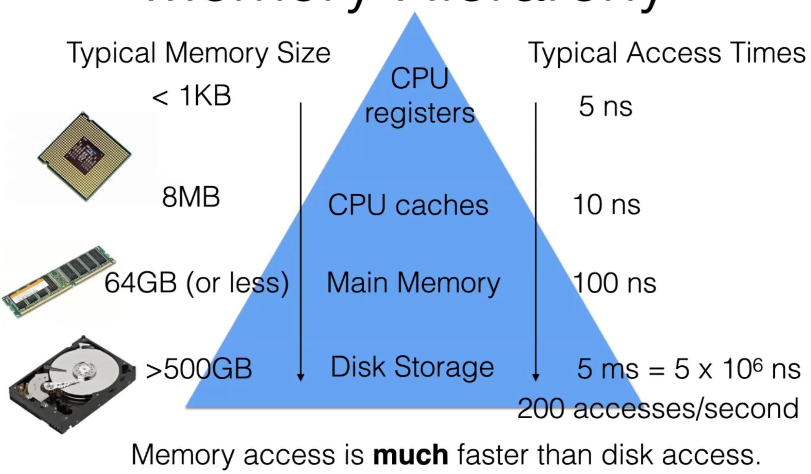

**Large BST on Disk:**

Assume we have a very large database table, represented as a binary search tree:

- 10 million items, 256 bytes each
- 6 disk accesses per second (shared system)

Assume no caching, every lookup requires disk access.

- Disk access time for finding a node in an unbalanced BST:
  - depth of searched node is N in the **worst case:**
    - 10 million items –> 10 million disk accesses
    - 10 million / 200 accesses per second = approx 14 hrs
  - **Expected depth** is 1.38 log N
    - 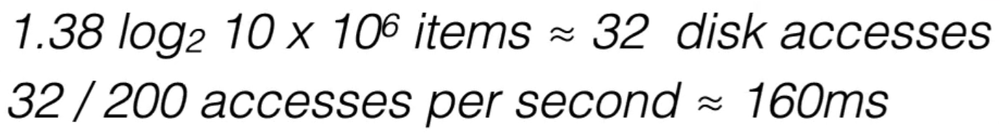
- Even for AVL Tree, the worst case and average case will be around log~2~ N
  - About 24 disk accesses in 4 sec

 **Storing B-Trees on Disk:**

We can use B-Trees to reduce the number of disk accesses. Basic idea:

- Read an entire B-Tree node (containing M items) into memory in *single disk access*. Find the next reference using binary search.
- Worst case height of the B-Tree is about log~M/2~ N because the minimum number of items in each node is M/2.

(Balancing size of the nodes against additional search time through the node)

**B+ Trees on Disk:**

Assume keys are 32 bytes.

- We can fit at most M=205 keys in each node
- Worst case height for 10 million keys: ?
- 3 accesses / 200 seconds per access = 15ms