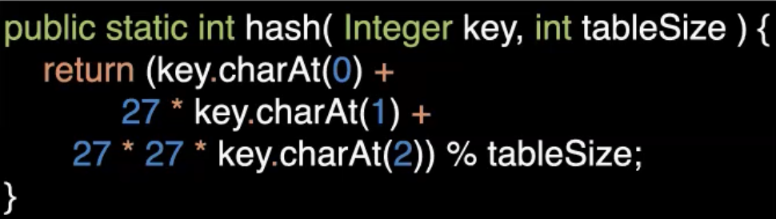

7 Mar 2022

# Hash Tables

## Set ADT

A set is a collection of data items that does not allow duplicates

 

Supported operations:

- insert(x)
- remove(x)
- contains(x)
- isEmpty()
- size()
- addAll(s) / union(s) : combines sets A $\cup$ B
- removeAll(s) : set difference A - B
- retainAll(s) / intersection(s) : items that are in both sets A $\cap$ B


## OrderedSet ADT

A set with a total order defined on the items (all pairs of items are in a < or > relation to each other.


Supported operations:

- all Set operations

- findMin()
- findMax()


## Implementing Sets

Naive implementation: LinkedList, ArrayList (bad!)

- Need to be able to check for item equality
- Running time of all operations at least O(N), because we need to check for membership first

Better: implement ordered sets as search trees

- With balanced search trees:

  O(log N) for insert, remove, contains

- Need to be able to compare every pair of items: Implement the `Comparable` interface


**Arrays as Maps**

- When keys are integers, arrays provide a convenient way of implementing maps

  

- Time for `get` and `put` is O(1)

- Problems: keys are not integers; we don’t know what size to make the array because we don’t know all the keys


# Hash Tables

- Define a table (an array) of some length *TableSize*
- Define a function hash(key) that maps key objects to an integer index in the range 0 … *TableSize - 1*


## Hash Table Collisions

Problem: There is an infinite number of keys, but only *TableSize* entries in the array.

At some point, keys are going to hash to the same index.

- Need to find a hash function that distributes items in the array evenly.


### Choosing a Hash Function

- Hash functions depends on: type of keys we expect (Strings, Integers…) and *TableSize*
- Hash functions need to:
  - Spread out the keys as much as possible in the table (ideal: uniform distribution)
  - Make sure that all table cells can be reached
- Hash functions are one way functions; can’t take a hash value and decode original object


#### Integers

- If the keys are integers, it is often okay to assume that the possible keys are distributed evenly

  `hash(x) = x % TableSize`

  

  

- Any object in Java by default has a hash function that returns an arbitrary integer, which then gets converted into the hash table implementation into that particular index


#### Strings

- Idea 1: Sum up the ASCII (or Unicode) values of all characters in the String

  

  

  Problem:

  - All anagrams will have the same sum
  - Doesn’t work for large table sizes
    - Assume *TableSize = 10,007*
    - Every character has a value in the range 0 and 127
    - Assume keys are at most 8 chars long:
      - hash(key) is in the range 0 and 127 X 8 = 1016
      - Only the first 1017 cells of the array will be used

- Idea 2: Only look at prefix and spread out the value for each character

  

  Problem:

  - Only looking at the first three characters
  - Assumes that all three letter combinations are equally likely at the beginning of a string, which is not the case for natural language (ie. some letter are more frequent than others and some combinations like xvz don’t occur at all)

- Idea 3: Java’s implementation

  


​	Easily will have integer overflow, which is the reason for the check `if(hasVal < 0)`

​		- Works well but slow for large strings


### Combining Hash Functions

In practice, we often write hash functions for some container class:

- Assume all member variables have a hash function (Integers, Strings, …)
- Multiply the hash of each member variable with some distinct, prime number,
- Then sum them all up
  - If we multiply the components by prime numbers, it makes the components less likely to be divisible by each other, therefore reducing collisions
- Sometimes for the same reason, the tablesize is also prime

*Example:*

Our class: 

The hash function: 

- Need a different hash method for each object type you want to hash, which you might not know what they are in advance


### Table Size and Hash Functions

Good Practices to minimize collisions by making TableSize less likely to divide the hash code:

- Keep *TableSize* a prime number
- When combining hash values, make the factors prime numbers


**What Objects can be keys?**

- Anything can be a key, we just need to find a good hash function
- Need to make sure that objects that are used as keys cannot be changed at runtime (they are **immutable**)
  - Otherwise, you will not be able to access the object since the hash code will be different; if inserted again, will create duplicates in hash table
  - If their content changes their hash value should change too


## Dealing with Collisions

#### Separate Chaining

- Instead of storing items directly into an array position, keep a linkedlist of items whose key hashes to the same value into each of these array positions
- Can think of each list as a bucket defined by the hash value
- To insert a new key in cell that’s already occupied, prepend to the list
- Prepend instead of append since prepend is constant time. Also, higher chance to access more recently stored elements compared to older ones


**Analyzing Runtime for Separate Chaining:**

Time to find a key = time to compute hash function + time to traverse the linked list

- Assume hash functions computed in O(1)

Load Factor:

- Let N be the number of keys in the table
- Define the **load factor** as 
- The average length of a list is $\lambda$
- If our load factor is above 1, the runtime for the hash table will no longer be constant


### Overriding Hash Code

Default implementation of hashCode in Object: Return distinct integer for distinct objects (by looking at memory address)

- This does not consider the content of an object
- We need to override the method to write our own implementation
- **Important:** when two objects are equal according to .equals(x), their hashCode methods need to return the same value
  - **Rule of Thumb:** When overriding hashCode, also override .equals, and vice versa
- *Note:* If two objects have the same hash code, they do not have to be equal, because of collisions


### Sets and Maps in the Java API


- TreeSet is a balanced BST : A red-black tree
- HashSet is an implementation of a hash table, which is used to implement a HashMap
- SortedMap is implemented using a balanced BST


Hash Tester:

```java
import java.util.Set;
import java.util.HashSet;

public class HashTest {
    public static void main(String[] args) {
        String s1 = "Hello";
        String s2 = "Hello";
        
        Person p1 = new Person("Jane", "Doe");
        Person p2 = new Person("Jane", "Doe");
        
        Set<String> set = new HashSet<>();
        set.add(s1);
        
        System.out.println(set.contains(s2)); // answer should be yes even though s1 and s2 are different objects, should use equals method to compare

        Set<String> set2 = new HashSet<>();
        set2.add(p1);
        System.out.println(set2.contains(p2)); // returns false   
    }
}
```


Make a Person class:

```java
public class Person {
    private String first;
    private String last;
    
    public Person(String first, String last) {
        this.first = first;
        this.last = last;
    }
}
```


 To look at the contents of Person when calling `contains`, we override hashCode and equals of Person:

```java
public int hashCode() {
    return this.first.hashCode() * 107 + this.last.hashCode();
} // doesn't work unless equals method is implemented correctly

public boolean equals(Object other) {
    if (!(other instanceof Person))
        return false;
    Person otherPerson = (Person) other;
    return this.first.equals(otherPerson.first) && this.last.equals(otherPerson.last);
}
```


#### Implementing Hash Functions in Java

- Every Java Object has an `int hashCode()` method
- The `add(x)` and `put(x)` methods of HashSet and HashMap compute the actual hash value as `x.hashCode() % table size`
  - Therefore, when we make our own class with our own keys, we also have to implement our own `hashCode()` in order to use HashSet/HashMap with it

---


*21 Mar 2022*

### Dealing With Collisions: Closed Hashing (Probing Hash Tables)

- Keep the keys in the hash array itself
- If a collision occurs, move to another array position
- Basically linear search with some tricks
- Worst-case will be linear time


- To look up key 18, we hash 18 and get hash value 7, so we look at index 7, if it’s not there, we look at the next cell, and so on. If we keep probing (looking at next cell)


With a probing hash table, there are no lists each cell in the array, therefore:

the **load factor, $\lambda$** will always be $\lambda \le 1$ and table is full if $\lambda = 1$.


**Collision Resolution Strategies:**

- To insert an item, we probe other table cells in a **systematic way** until an empty cell is found.
- To look up a key, we probe in **the same way** until the key is found


There are different strategies to determine the next cell to probe

- Example: Just try cells sequentially (with wraparound)
- Can describe collision resolution strategies using a function $f(i)$ - *to calculate the offset* - such that the i-th table cell to be probed is: $(hash(x)+f(i))\  \%\  TableSize$


Different strategies:

- Linear Probing (previous example): f(i) is some linear function of i, usually $f(i) = i$
- Quadratic probing: $f(i) = i^2$
- Double hashing: $f(i) = i \cdot hash_2 (x)$ = using a secondary hash function (most probing hashing uses some form of this)


#### Linear Probing

$f(i) = i$

- Can alway find an empty cell (if there is space in the table)

Problem: **Primary Clustering**

- Full cells tend to cluster, with no free cells in between
- Finding an empty cell can take very long if the table is almost full
- Hence, performance can deteriorate

- This gets really bad if $\lambda$ is close to 1

  


#### Quadratic Probing

$f(i) = i^2$


Method:

- hash value of 14 is 3, but 3 is taken, so we look at f(1) for $(hash(x)+f(i))\  \%\  TableSize$, which = 3 + 1 = 4, which is also taken, so we look at f(2) which is 3 + 4 = 7, which is empty so we insert 14 at 7.

**Important:** with quadratic probing, TableSize should be a **prime number**. Otherwise, it’s possible that we won’t find an empty cell, even if there is plenty of space; some of the cells will become unreachable.

- Example:

  

Problem: 

- Additionally, if the table gets too full ($\lambda > 0.5$), it is possible that empty cells become unreachable, even if the table size is prime.

  Ie. 


But, if the load factor, $\lambda < 0.5$, there is a guaranteed empty space.

To prove this, we look at the **Quadratic Probing Theorem**.


#### Quadratic Probing Theorem


Proof by contradiction:


h = the hash code/starting position


Contradictions:

- (i - j)(i + j) cannot be a factor of size, because size is a prime number which has no other factors besides itself and 1
- i + j and i - j cannot both = 0, since $i<j\le TableSize/2$


#### Double Hashing

$f(i) = i \cdot hash_2 (x)$

Like linear hashing, but each offset is different.


Example:


Note:

- We need to choose the secondary hash function wisely

- For example, if we use the same hash function as the secondary:

  

  - Here, if cell 0 was already taken, we would never be able to insert the value since the offset will always be 0 no matter what value i is
  - can degenerate into lineary probing without benefits of secondary hashing


Therefore,

- A good choice for integers is $hash_2 (x) = R-(x\ \%\ R)$
- As with quadratic hashing, we need to choose the table size to be prime (otherwise cells become unreachable too quickly)
- Properly implemented, double hashing produces a good distribution of keys over table cells


### Rehashing

What happens when the load factors become too large? (Approaches 1 with linear probing or 0.5 with quadratic/double probing)?

- Separate chaining hash tables become inefficient if the load factors becomes too large (lists become too long)
- Hash tables with lineary probing become inefficient if the load factor approaches 1 (primary clustering) and eventually fill up
- Hash tables with quadratic probing and double hashing can have failed inserts if the table is more than half full

If this is the case, we need to copy data to a new table that is **at least double the size and round up the the next prime number**


**Increasing table size:**

- Cannot simply copy entries to the new array
  - Will cause a different modulo wraparound that won’t cause the same collisions
  - Since the hash function is based on the original TableSize, keys won’t be in the correct cell
- So, we need to remove all N items and reapply the hash function into the new table
  - Operation takes O(N) but this cost is only incurred occasionally and there will be a reduced insert time because of reduced collisions in the new table


#### Deletion From Probing Hash Tables

Problem: Simply removing an entry causes gaps in the probing sequence. Hence, subsequent items may become inaccessible.


Example:

Blue blocks have same original hash value 7 and yellow blocks have same original hash value 6.

If we deleted element at index 8 and then searched for value 17, we would incorrectly get a result that 17 is not in the table since we stop once we reach the empty cell at index 8.


Instead, we use **Lazy Deletion**

- Simply mark the cell as ‘deleted’, then ignore it on subsequent lookups

  

- If later we reinsert the same value, we can simply remove the ‘deleted’ marker


### Implementation of Quadratic Probing HashTable in Java

```java
// QuadraticProbing Hash table class
//
// CONSTRUCTION: an approximate initial size or default of 101
//
// ******************PUBLIC OPERATIONS*********************
// bool insert( x )       --> Insert x
// bool remove( x )       --> Remove x
// bool contains( x )     --> Return true if x is present
// void makeEmpty( )      --> Remove all items


/**
 * Probing table implementation of hash tables.
 * Note that all "matching" is based on the equals method.
 * @author Mark Allen Weiss
 */
public class QuadraticProbingHashTable<AnyType>
{
    /**
     * Construct the hash table.
     */
    public QuadraticProbingHashTable( )
    {
        this( DEFAULT_TABLE_SIZE );
    }

    /**
     * Construct the hash table.
     * @param size the approximate initial size.
     */
    public QuadraticProbingHashTable( int size )
    {
        allocateArray( size );
        doClear( );
    }

    /**
     * Insert into the hash table. If the item is
     * already present, do nothing.
     * @param x the item to insert.
     */
    public boolean insert( AnyType x )
    {
            // Insert x as active
        int currentPos = findPos( x );
        // findPos finds where the element should be located, where the actual hashing happens
        if( isActive( currentPos ) )
            // If the position returned by findPos is active, it means the value is already in the table and hasn't been deleted
            return false;

        if( array[ currentPos ] == null )
            ++occupied;
        array[ currentPos ] = new HashEntry<>( x, true ); // true flag sets the item to `not deleted`
        theSize++;
        
            // Rehash; see Section 5.5
        if( occupied > array.length / 2 )
            rehash( );
        
        return true;
    }

    // Modify insert to change to HashMap instead of HashTable
    public boolean insert( AnyType x, Value value)
    {
        // Insert x as active
        int currentPos = findPos( x );
        // findPos finds where the element should be located, where the actual hashing happens
        if( isActive( currentPos ) )
            // If the position returned by findPos is active, it means the value is already in the table and hasn't been deleted
            return false;

        if( array[ currentPos ] == null )
            ++occupied;
        array[ currentPos ] = new HashEntry<>( x, value ); // true flag sets the item to `not deleted`
        theSize++;

        // Rehash; see Section 5.5
        if( occupied > array.length / 2 )
            rehash( );

        return true;
    }

    /**
     * Expand the hash table.
     */
    private void rehash( )
    {
        HashEntry<AnyType> [ ] oldArray = array;

            // Create a new double-sized, empty table
        allocateArray( 2 * oldArray.length );
        occupied = 0;
        theSize = 0;

            // Copy table over
        for( HashEntry<AnyType> entry : oldArray )
            if( entry != null && entry.isActive )
                // if entry !isActive, it means it's been deleted via lazy deletion, and doesn't need to be copied
                insert( entry.element );
   }

    /**
     * Method that performs quadratic probing resolution.
     * @param x the item to search for.
     * @return the position where the search terminates.
     */
    private int findPos( AnyType x )
    {
        //int offset = 1;

        int i = 0; // first probing step for the offset

        int original_hash = myhash(x); // where hashCode executes

        int currentPos = original_hash; 
        
        while( array[ currentPos ] != null &&
                !array[ currentPos ].element.equals( x ) )
        {
            
            currentPos = original_hash + i*i;  // Compute ith probe
            i += 1;
            
            currentPos = currentPos % array.length; // if currentPos goes beyond range of index
        }
        
        return currentPos;
    }

    /**
     * Remove from the hash table.
     * @param x the item to remove.
     * @return true if item removed
     */
    public boolean remove( AnyType x )
    {
        int currentPos = findPos( x );
        if( isActive( currentPos ) )
        {
            array[ currentPos ].isActive = false;
            theSize--;
            return true;
        }
        else
            return false;
    }
    
    /**
     * Get current size.
     * @return the size.
     */
    public int size( )
    {
        return theSize;
    }
    
    /**
     * Get length of internal table.
     * @return the size.
     */
    public int capacity( )
    {
        return array.length;
    }

    /**
     * Find an item in the hash table.
     * @param x the item to search for.
     * @return the matching item.
     */
    public boolean contains( AnyType x ) // if value is in the table
    {
        int currentPos = findPos( x );
        return isActive( currentPos );
    }

    public boolean get( AnyType x )
    {
        int currentPos = findPos( x );
        return isActive( currentPos );
    }

    // To modify this HashTable into HashMap
//    public Value get( AnyType x )
//    {
//        int currentPos = findPos( x );
//        if (isActive( currentPos )) {
//            return array[ currentPos ].value;
//        }
//    }

    /**
     * Return true if currentPos exists and is active.
     * @param currentPos the result of a call to findPos.
     * @return true if currentPos is active.
     */
    private boolean isActive( int currentPos )
    {
        return array[ currentPos ] != null && array[ currentPos ].isActive;
    }

    /**
     * Make the hash table logically empty.
     */
    public void makeEmpty( )
    {
        doClear( );
    }

    private void doClear( )
    {
        occupied = 0;
        for( int i = 0; i < array.length; i++ )
            array[ i ] = null;
    }
    
    private int myhash( AnyType x )
    {
        int hashVal = x.hashCode( );

        hashVal %= array.length;
        if( hashVal < 0 )
            hashVal += array.length;

        return hashVal;
    }
    
    private static class HashEntry<AnyType, Value>
    {
        public AnyType  element;   // the element
        public Value theValue; 
        public boolean isActive;  // false if marked deleted

        public HashEntry( AnyType e )
        {
            this( e, true );
        }

        // To modify this HashTable into a HashMap
        public HashEntry(AnyType key, Value value) {
            element = key;
            theValue = value;
            isActive = true;
        }

        public HashEntry( AnyType e, boolean i )
        {
            element  = e;
            isActive = i; // true = not deleted/active, false = deleted/inactive
        }
    }

    private static final int DEFAULT_TABLE_SIZE = 101;

    private HashEntry<AnyType> [ ] array; // The array of elements
    private int occupied;                 // The number of occupied cells
    private int theSize;                  // Current size

    /**
     * Internal method to allocate array.
     * @param arraySize the size of the array.
     */
    private void allocateArray( int arraySize )
    {
        array = new HashEntry[ nextPrime( arraySize ) ];
    }

    /**
     * Internal method to find a prime number at least as large as n.
     * @param n the starting number (must be positive).
     * @return a prime number larger than or equal to n.
     */
    private static int nextPrime( int n )
    {
        // if n is even, go to the next odd number
        if( n % 2 == 0 )
            n++;

        for( ; !isPrime( n ); n += 2 )
            ;

        return n;
    }

    /**
     * Internal method to test if a number is prime.
     * Not an efficient algorithm.
     * @param n the number to test.
     * @return the result of the test.
     */
    private static boolean isPrime( int n )
    {
        if( n == 2 || n == 3 )
            return true;

        if( n == 1 || n % 2 == 0 )
            return false;

        // search all numbers from 3 until the square root of n and if there's a factor, it's not prime
        // only need to go till square root because if you go over it, you hit the other side of the factors
        for( int i = 3; i * i <= n; i += 2 )
            if( n % i == 0 )
                return false;

        return true;
    }


    // Simple main
    public static void main( String [ ] args )
    {
        QuadraticProbingHashTable<String> H = new QuadraticProbingHashTable<>( );

        
        long startTime = System.currentTimeMillis( );
        
        final int NUMS = 2000000;
        final int GAP  =   37;

        System.out.println( "Checking... (no more output means success)" );


        for( int i = GAP; i != 0; i = ( i + GAP ) % NUMS )
            H.insert( ""+i );
        for( int i = GAP; i != 0; i = ( i + GAP ) % NUMS )
            if( H.insert( ""+i ) )
                System.out.println( "OOPS!!! " + i );
        for( int i = 1; i < NUMS; i+= 2 )
            H.remove( ""+i );

        for( int i = 2; i < NUMS; i+=2 )
            if( !H.contains( ""+i ) )
                System.out.println( "Find fails " + i );

        for( int i = 1; i < NUMS; i+=2 )
        {
            if( H.contains( ""+i ) )
                System.out.println( "OOPS!!! " +  i  );
        }
        
        long endTime = System.currentTimeMillis( );
        
        System.out.println( "Elapsed time: " + (endTime - startTime) );
    }

}
```


In some situations, can use TreeMap to implement the same concept.

If we use AVL trees, the key has to implement `Comparable` and `compareTo`, but some keys can’t be compared.
