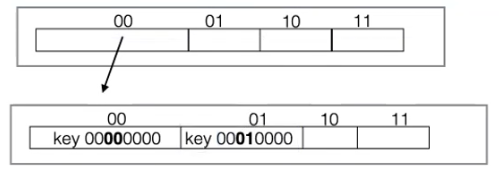
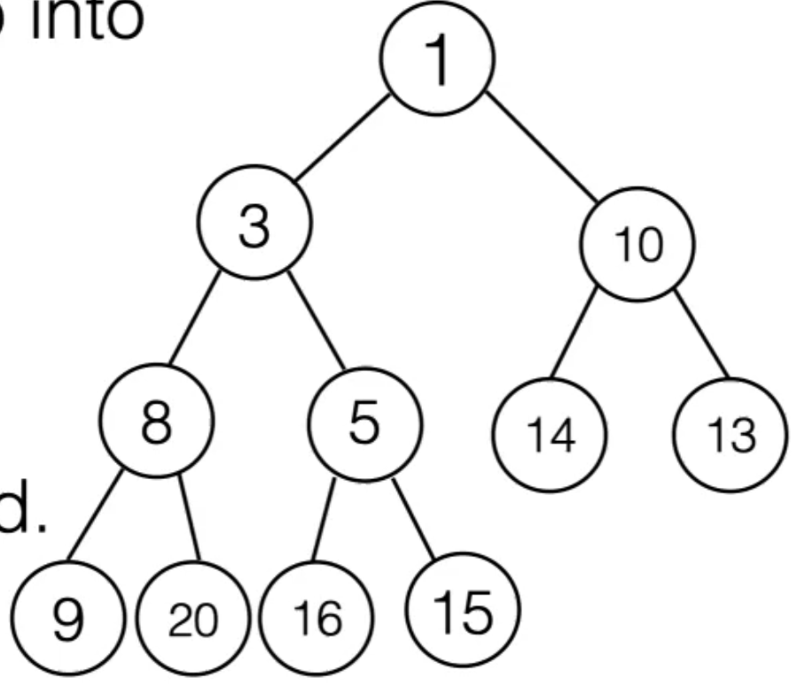
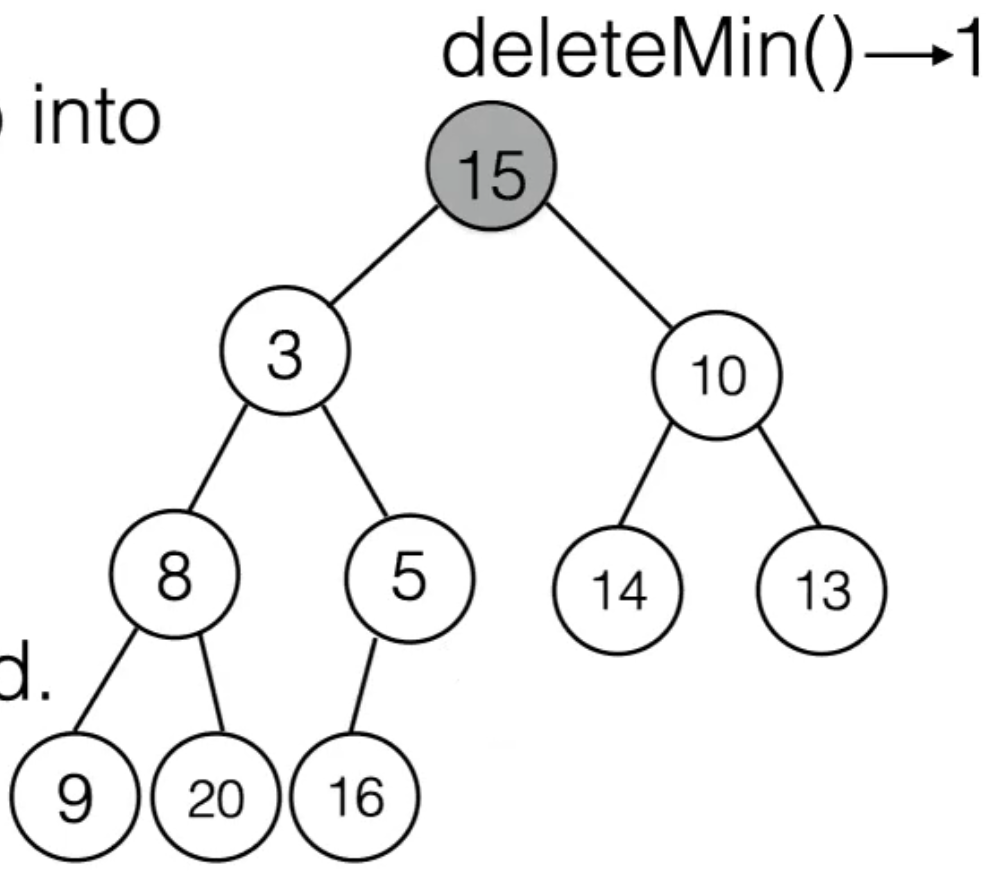

23 Mar 2022

# Hash Tries

**Some Issues with Hash Tables:**

- Collisions are relatively frequent because of limited table size. Search/probing can lead to unpredictably long lookup times, worst case O(n).
- Table needs to grow periodically, which requires re-hashing.
- Table is initially sparse – most entries are empty, but still consume memory

**Implementing Immutable Sets/Maps:**

How should we implement an immutable set or map?

- Balanced BSTs are an option, but require that keys are comparable. Lookup time O(log N), when ideally we’d want a constant lookup time
- Hash tables are not a good fit, at first glance, because they require writing to an array and re-allocating new arrays

**Tries** offer an alternative.

## Trie/Prefix Tree Data Structure

Requirement: Keys are sequences (for example, strings)

- n-ary tree. Each internal node corresponds to a prefix of a key. Root corresponds to an empty prefix
- Edges correspond to the next symbol in the key
- Key is not stored in full, but is implied by the structure of the tree
- Data only stored at nodes with complete keys
- To search for a key, traverse the trie until either the key is found (hit) or no further child exists for the next symbol (miss)
- Good when the keys can be decomposed into a sequence of subkeys

Example: dog, dock, doll, and do stored in this trie

- Worst case for lookup is height of the tree if the tree is like this
- Store child references in an array, so moving to the next symbol is O(1)

- Overall lookup time: O(len(key))

- Although we have to reallocate the array, because the array has constant size, the runtime for that will still be constant

 ## Hash Tries

Idea: Store keys in the trie, indexed by prefix of their hash code.

- Can be implemented immutably

- Use **binary representation of the hash**, use the next k-bits to determine the next reference to follow
- Each node stores an array, containing **either a key, or a reference** to the next node

- If we look at 00 in the trie and there are no other entries in the 00 cell, we don’t need to traverse the trie until we reach the next leaf node
- If in the root node of the trie, the cell refers to a key, we’re done and we’ve found our key

### Hash Tries: Lookup

At each node, use the next k-bits to index array:

- If entry is null: fail (ie. 01, 10)
- If entry is key, key found and return corresponding value
- If entry is reference, go to next node

Length of lookup is the depth of the trie, which is the length of the hash divided by the length of the index value - k-bits (in this case, 4)

- In practice, people normally use 32-bit hash codes and 4-bit or 8-bit tables

If a key is not in the trie, it fails early (first two bits for hash starting with 01 or 10)

- In the same case, it can find a key early 

### Hash Tries: Insert

Insert 00010000:

- When we get a collision from inserting, it’s because it has the same prefix as an existing key.

- Follow steps of lookup. If collision occurs, replace existing key entry with new reference.

Because runtime of insertions only depends on the length of the hash code and the length of k, insertions and lookups are constant (doesn’t depend on how many items there are).

- There is a possibility that two different objects will evaluate to the same hash code. In practice, it’s not very common.
  - To deal with this corner case, instead of just having the option to store a key/null/reference, we also add the option to store multiple keys (a list of keys); resort to separate chaining technique.
  - Worst case lookup will be O(n) if the hash function hashes to the same hash value all the time

---

# Priority Queues

There are different implementations:

- Standard implementation is a **binary heap**, which is an mutable data structure that uses an array
  - There is an implentation that doesn’t use an array and is immutable called a **leftist heap**

**The Selection Problem:**

Given we have some unordered array of N numbers, and we would like to find the k-th largest, how do we do it?

- If k is 1:
  - `findMax` algorithm: iterates through the array and compares with value at the first position, then switches the positions if a larger value is found.
- If k is 3:
  - We can sort the array first then take the 3rd element
    - Problem is that sorting takes O(n log n)
  - Instead we can take the same approach as if k = 1, but store 3 elements in the first position instead, then compare the rest of the values with the min of the 3 elements stored, once we switch a value, reevaluate the min of the 3 elements.
    - Will take k X n time
      - If k < log n, this method is better than sorting
    - Will take constant time to find the minimum and log k time for insert

In other words,

- Solution 1: Sort in O(N log N), then select index k-1

- Solution 2: Select the maximum k times and remove from sequence. O(N) to find each max, so total O(k N). If k depends on N, then O(N^2^)

- Solution 3: Maintain a small collection of k elements, representing the k largest values seen so far.

  - Initially, use the first k from the sequence.

    For each number x in the sequence, check if it should be included in the k largest (that means, x > min of the collection)

Example:

For [1, 4, 8, 2, 9, 7, 12, 5], find 3 largest:

- [9, 12, 8], collection of items of length k, finding min takes O(k)
- Total runtime: O(N k)

## Process Scheduling

Assume a system with a single CPU core.

- Means only one process can run at the same time

- Simple approach: Keep new processes on a queue, schedule them in FIFO order.

  - A stack is a bad idea because the latest process will run first but the first scheduled might never get processed

  

- Problem: Long processes may block CPU (usually we don’t even know how long each process takes)
- Observation: Processes may have different priority (CPU vs. I/O bound, critical real time systems)

### Round Robin Scheduling

Idea: processes take turn running for a certain time in round robin fasthion.

- ie. Process 1 gets to run for 200ms, then process 2 will run for 200ms, and process 1 goes back to the queue, then process 1 gets run again for 200ms, and process 3 joins the queue, etc.
- Problem, sometimes process 3 is so crucial that we don’t want to wait for its turn
  - Thus, we need to assign a priority to each process

### Priority Scheduling

Idea: Keep processes ordered by priority. Run the process with the highest priority first.

- Usually lower number = higher priority

Process 3 has higher priority, so run process 3 first:

## The Priority Queue ADT

A colletion Queue of comparable elements (comparable by their priority), that supports the following operations:

- `insert(x)`: add an element to queue (compare to enqueue)
- `deleteMin()`: return the minimum element in queue and delete it from queue (compare to dequeue)

- could also be a `getMin()` that can be compared to peek; finds the minimum priority element

## Implementing Priority Queues

- Idea 1: Use a Linked List
  - `insert(x)`: O(1), `deleteMin()`: O(N)
- Idea 2: Use a balanced BST
  - `insert(x)`: O(log N), `deleteMin()`: O(log N)
  - But doesn’t support duplicates, all keys have to be unique

We can do better with a **Heap** data structure:

- `getMin()` in O(1)
- Inserting N items in O(N)
- This gives a sorting algorithm in O(N log N)

**Review: Complete Binary Trees**

- All levels are completely full (except possibly the last, but all elements are in their leftmost position)

  

**Storing Complete Binary Trees in Arrays:**

- The shape of a complete binary tree with N nodes is unique

- We can store such trees in an array in level-order

- Traversal is easy:

  - leftChild(i) = 2i
  - rightChild(i) = 2i + 1
  - parent(i) = floor(i/2)

  - Note: Keep first entry empty

    

## Heap

A heap is a complete binary tree stored in an array, with the following **heap order property:**

- For every node *n* with value x:
  - The values of all nodes in the subtree rooted in *n* are greater or equal than x
  - This is a **Min Heap**

Therefore, the minimum value of all nodes is the root of the tree

We can do the reverse to make a **Max Heap**:

With the maximal element at the root of the tree.

It will therefore have the following **heap order property**:

- For every node *n* with value x:
  - The values of all nodes in the subtree rooted in *n* are **less or equal** than x

### Min Heap: `insert(x)`

- Attempt to insert at last array position (next possible leaf in the last layer, ie. at the end of the array)
- If heap order property is violated when value is inserted (ie. it is smaller than its root), **percolate** the value **up**.
  - Swap that value (‘hole’) and value in the parent cell, then try the new cell
  - If heap order is still violated, continue until correct position is found

 

Note: In a standard binary tree, we can’t easily go back up to the parent to compare

### Min Heap - `deleteMin()`

- The minimum is always at the root of the tree
- Remove lowest item, creating an empty cell in the root
- Try to place last item in the heap (last item in array) into the root
  - If heap order is violated, **percolate** the value **down**:
    - Swap with smaller child until correct position is found

Compare 15 to the smaller one of its two children (3), then swap

Compare 15 to 5, so we swap 15 with 5

- We swap with the smallest child to keep the heap order property.
  - If we swapped with the larger child, the larger child will now be the parent of the smaller child, violating the order property

### Running Time for Heap Operations

Because a Heap is a complete binary tree, it’s height is about log N

- Worst case running time for `insert(x)` and `deleteMin()` is therefore O(log N)
- `getMin()` is O(1)

### Building a Heap

If we had an initial unordered collection of n items and want to convert them into a heap

- We could simply `insert(x)` each element, which takes O(log N) in the worst case, so the total time is O(N log N).
- There is a better way to do gives a tighter bound, O(N)

**Building a Heap Bottom-Up (Heapify):**

Start with an unordered array

- Start with the parent of the last leaf (denoted in red) and call `percolateDown(i)`, which restructures the subtree of that parent node:

  

- Then we move to the sibling of the parent and do the same:

  

- Then we move up to the rightmost node of previous layer, and restructure it’s subtree:

  

- Then we move to its sibling and restructure its subtree:

  

- `percolateDown(i)` assumes that both subtrees under *i* are already heaps

- Idea: Restore heap property bottom-up

  - Make sure all subtrees in the two last layers are heaps
  - Then move up layer-by-layer

- Starting at n = index of last item in the array/heap and iterate backwards, ending at 1:

  

  ie. for n/2, then for n/2 - 1, then for n/2 - 2 … until 1 and call `percolateDown(i)` on each

#### Running Time

Not all nodes have to travel the depth of the tree.

In particular, the leaf nodes don’t have to percolate down.

The parents have to move at most one step down.

If we sum up the total steps, we get O(n).

- 

​	Double the first expression, then subtract original expression from the doubled one to get:

= 

- h becomes log (n + 1)

- Because half of the nodes in a perfect binary tree are leaves, half of the nodes don’t have to move, so the running time ends up being linear

  