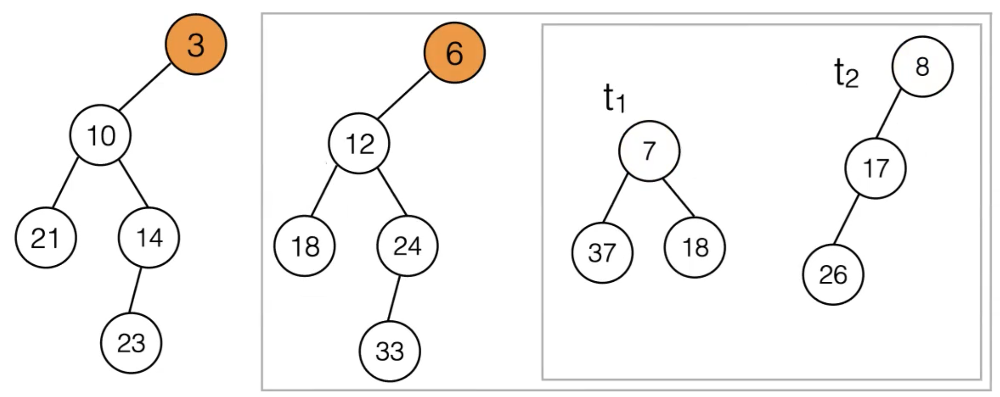

28 Mar 2022

# Sorting


- **Comparison Based Sorting: ** we talk about sorting, we’re usually interested in in-place sorting, rather than creating a new list


## Heap Sort

- First convert an unordered array into a heap in O(n) time
- Then perform N `deleteMin` operations to retrieve the elements in sorted order
  - each `deleteMin` is O(log N)
- Problem: This algorithm requires a second array to store the output: O(n) space
- Idea: Reuse the freed space after each `deleteMin`

Example:

Start with unordered array:


Build heap in O(n) time with `heapify`:


- swap the deleted min element with the last element in heap that is switched to the root

  

  Call `deleteMin` again:

  

  

  

Result:


- Can also use two pointers that start at the beginning and end and swap the elements, until the pointers point to the same element to get a list in increasing order


==Implementation of Min Heap in Java:==

```java
import java.util.Arrays;

/**
 * Data Structures in Java 
 * COMS W3137, Columbia University - Spring 2018
 * 
 * Implements a generic Binary Min Heap. 
 * All "matching" is based on the compareTo method in java.lang.Comparable. 
 * Adapted from Weiss, Data Structures and Algorithm Analysis in Java. 3rd ed. 
 * http://users.cis.fiu.edu/~weiss/dsaajava3/code/BinaryHeap.java
 */
public class BinaryHeap<T extends Comparable<? super T>> {

    private static final int DEFAULT_CAPACITY = 100;
    private int currentSize; // Number of elements in heap, to distinguish between the slots in the array and elements logically in the data structure
    private T [ ] array; // The heap array

    /**
     * Construct the binary heap.
     */
    public BinaryHeap( ) {
        this( DEFAULT_CAPACITY );
    }

    /**
     * Construct the binary heap.
     * @param capacity the capacity of the binary heap.
     */
    @SuppressWarnings("unchecked")
    public BinaryHeap( int capacity ) {
        currentSize = 0;
        array = (T []) new Comparable[ capacity + 1 ]; //leaving first element empty; can't allocate generic arrays in Java so we need to cast down
    }

    /**
     * Test if the priority queue is logically empty.
     * @return true if empty, false otherwise.
     */
    public boolean isEmpty( ) {
        return currentSize == 0;
    }

    /**
     * Test if the priority queue is logically full.
     * @return true if full, false otherwise.
     */
    public boolean isFull( ) {
        return currentSize == array.length - 1;
    }

    /**
     * Make the priority queue logically empty.
     */
    public void makeEmpty( ) {
        currentSize = 0;
    }

    /**
     * Insert into the priority queue, maintaining heap order.
     * Duplicates are allowed.
     * @param x the item to insert.
     * @exception IndexOutOfBoundsException if container is full.
     */
    public void insert( T x ) throws IndexOutOfBoundsException {
        if( isFull( ) )
            throw new IndexOutOfBoundsException( ); //could implement an array resizing and copy over to larger array

        int position = ++currentSize; //starts at last available element in heap

        // percolate up
        while (position > 1 && (x.compareTo(array[position / 2]) < 0)) {
                array[position] = array[position / 2];
                position = position / 2;     
        }
        
        array[position] = x; //x is only inserted after insertion point found
    }

    /**
     * Find the smallest item in the priority queue.
     * @return the smallest item, or null, if empty.
     */
    public T findMin( ) {
        if( isEmpty( ) )
            return null;
        return array[ 1 ]; // element in root
    }

    /**
     * Remove the smallest item from the priority queue.
     * @return the smallest item, or null, if empty.
     */
    public T deleteMin( ) {
        if( isEmpty( ) )
            return null;

        T minItem = findMin( );
        T last = array[currentSize]; //take last element
        array[currentSize--] = null; //blank out last element
        array[ 1 ] = last; //write last element to root
        percolateDown( 1 );

        return minItem;
    }

        /**
     * Establish heap order property from an arbitrary
     * arrangement of items. Runs in linear time.
     */
    private void buildHeap( ) { // a.k.a heapify
        for( int i = currentSize / 2; i > 0; i-- )
            percolateDown( i );
    }

    /**
     * Internal method to percolate down in the heap.
     * @param hole the index at which the percolate begins.
     */
    private void percolateDown( int position ) { //position initially 1
        
        boolean flag = true;
        T tmp = array[position];
        while (flag && position*2 <= currentSize) { //haven't reached last position (leaf node) yet

            // obtain left child content
            int child = position * 2;

            // if right child exists: 
            if (child != currentSize) {
                // obtain right child content
                int right_child = child + 1; 
                if (array[right_child].compareTo(array[child]) < 0)
                    child = right_child; // if right child is smaller, remember it
            }
            // now child is the index of the smaller one of the two children 

            if (array[child].compareTo(array[position]) < 0) {
                array[position] = array[child];
            } else {
                flag = false;
            }
            position = child;
        }
        array[position] = tmp; 

    }

    /**
     * Get a string representation of the heap array.
     * @return string representation of the array backing the this heap.
     */
    public String printArray() {
        return Arrays.asList(array).toString();
    }
    
    /**
     * Get a string representation of the heap. 
     * @return a tree representing the tree encoded in this heap. 
     */
    public String printAsTree() {
        StringBuilder sb = new StringBuilder();
        printAsTree(sb,1);
        return sb.toString(); 
    }
   
    /**
     * Recursive internal method to assemble a tree
     * string representing the heap.
     */ 
    private void printAsTree(StringBuilder sb,int i) {
        if (2*i <= currentSize) {  // has left child
            sb.append("("); 
            sb.append(array[i]);
            sb.append(" ");
            printAsTree(sb,2*i); 
            if ((2*i + 1) <= currentSize){  // has right child
                sb.append(" ");
                printAsTree(sb, 2*i+1);
            }
            sb.append(")");
        } else {
            sb.append(array[i]);
        }
    }

    public static void main( String [ ] args ) {
        BinaryHeap<Integer> h = new BinaryHeap<>( 20 );
        h.insert(1);  
        h.insert(4);  
        h.insert(2);
        h.insert(3);  
        h.insert(5);  
        h.insert(6);  

        System.out.println(h.printArray());
        System.out.println(h.printAsTree());


        System.out.println(h.deleteMin());
        
        System.out.println(h.printArray());
        System.out.println(h.printAsTree());

    }
}
```


---


- Assumes priority can only lessen


# Leftist Heap

How can we implement a heap/priority queue using immutable data structures?

- Cannot use an array, so use regular binary tree implementation (linked nodes)

Basic Idea: A tree data structure that allows you to efficiently **merge** two heaps

- `insert:` Create a new heap with a single node, merge with the existing heap
- `deleteMin:` remove the root node, merge the two subtrees
- Merge guranteed to be O(log n)


## Null-Path Length

The **null-path length** of a node n, is the length of the shortest path from *n* to a node with 0 or 1 children (distance to the closest “null” node).


## Leftist Tree

In a **leftist tree**, for each node, the null-path length of its left subtree is greater than or equal the null-path length of its right subtree. (above is example)

- Generally results in the left being “bushier” or more complicated than the right subtree which discourages branching on the right


A **leftist heap** is a leftist tree that obeys the heap-order property

- doesn’t have to be a complete binary tree anymore, just any arbitrary binary tree that obeys the heap-order property

- Want the right half of the tree to be as short as possible since we only look at the right when merging


### Merging Leftist Heaps

- Compare the two root nodes. Let t1 be the tree with the smaller root and t2 be the tree with the larger root.
- Merge t2 with the right subtree of t1
- Then attach the result to the right of the root of t1
- If necessary, flip the subtrees of the smaller root to maintain the leftist property





### Length of the Right Path

In a leftist tree with N nodes, the null path length at the root node is at most floor(log(n + 1)) nodes.

Therefore, the merge operation takes at most O(log m + log n), where m and n are the sizes of the two trees.


