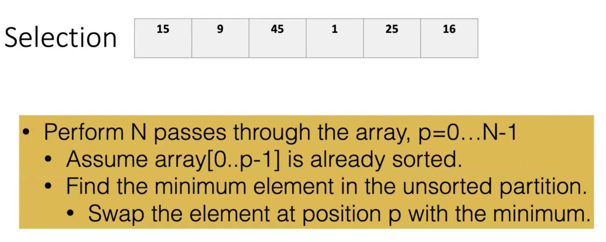
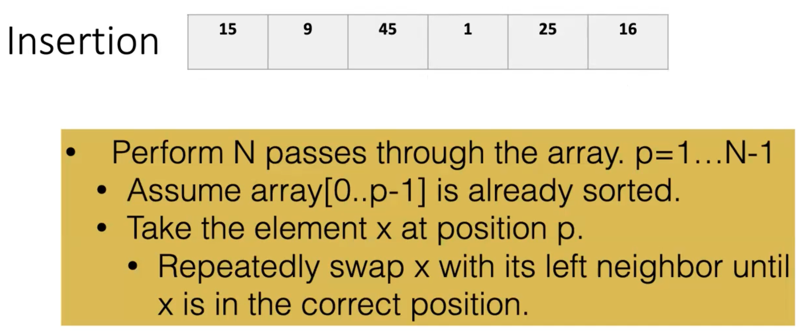
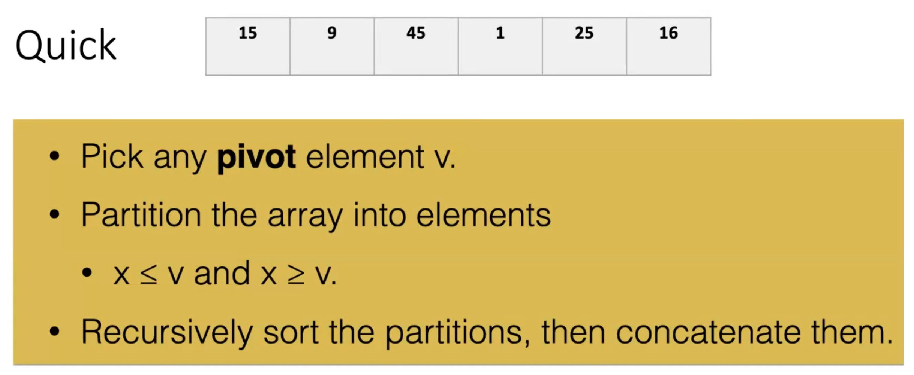
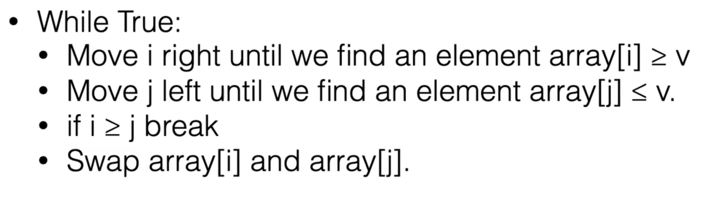

8 Apr 2022

Runtime: O(n^2^)

Runtime: Best Case: O(n), Worst Case: O(n^2^)

- Method to pick pivot can drastically change runtime, especially in average case

Usually can break down until 2 or 3 elements then sort them using whatever sorting method you prefer.

- Bucket sort is a pretty bad choice for this array because there are only 6 elements in the array but the range of the values is much larger: 1 - 45
- Need to know what the possible values are for bucket sort