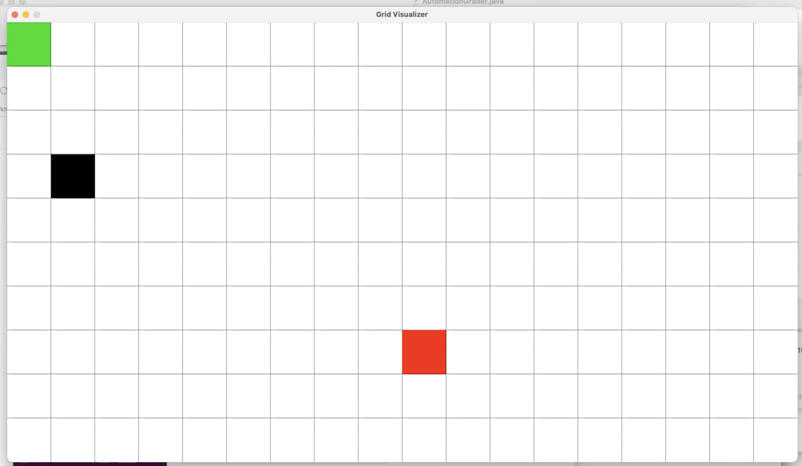

15 Apr 2022

```java
import java.awt.Canvas;
import java.awt.Graphics;
import javax.swing.JFrame;
import java.util.List;
import java.util.LinkedList;
import java.util.PriorityQueue;
public class GridVisualizer extends Canvas {
    // allows us to visualize in 2D space
  
  static int rows = 10;
  static int columns = 18;
  static int cell_size = 80; // in pixels for visualizer
  boolean[][] obstacles; //represents where obstacles are located
  boolean[][] discovered;
  boolean[][] visited; 
  static int startRow = 0; //location of start square
  static int startColumn = 0;  
  static int destRow = 7; //location of target square
  static int destColumn = 6;
  public void drawSquare(Graphics g, int i, int j, java.awt.Color color) {
    g.setColor(java.awt.Color.black);
    g.drawRect(j*cell_size, i*cell_size, (j+1)*cell_size, (i+1)*cell_size);
    g.setColor(color);
    g.fillRect(j*cell_size, i*cell_size, (j+1)*cell_size, (i+1)*cell_size);
  }
  public void paint(Graphics g) {
      //displays graphically the grid
    for (int i = 0; i < rows; i++)  
      for (int j = 0; j < columns; j++) { 
        if (i == startRow && j == startColumn) {
          drawSquare(g, i,j,java.awt.Color.green);
        } else if (i == destRow && j == destColumn) {
          drawSquare(g, i,j,java.awt.Color.red);
        } else if (obstacles[i][j]) {
          drawSquare(g, i,j,java.awt.Color.black);
        } else if (visited[i][j]) {
          drawSquare(g, i,j,java.awt.Color.yellow);
        } else if (discovered[i][j]) {
          drawSquare(g, i,j,java.awt.Color.pink);
        } else {
          drawSquare(g, i,j,java.awt.Color.white);
        }
      } 
  }
  private static class Cell implements Comparable<Cell>{
    public int row;  
    public int column;
      
    public Cell(int r, int c){
      row = r; 
      column = c;
    }  
    public String toString() {
      return Integer.toString(row) + ":"+ Integer.toString(column);
    }
    public int compareTo(Cell other) {
      if (distanceToGoal() > other.distanceToGoal()) 
        return 1;
      else if (distanceToGoal() < other.distanceToGoal())   
        return -1;
      return 0;
    }
    public double distanceToGoal() {
      return Math.sqrt(Math.pow(row - destRow, 2) + Math.pow(column - destColumn, 
2)); // distance formula
    }
  } 
  // transition function (instead of keeping adjacency list)
    // save memory, don't need to store all edges
  public List<Cell> getAdjacentCells(Cell cell) {
   
    List<Cell> result = new LinkedList<>();
 
    for (int i = 1; i >= -1; i--) // can go diagonally
      for (int j = 1; j >= -1; j--) 
        if (! (i==0 && j==0)) {
          int newRow = cell.row + i;
          int newColumn = cell.column + j;
          if ((newRow >= 0 && newColumn >= 0 && newRow < rows && newColumn < 
columns) && 
             (! obstacles[newRow][newColumn]))
                result.add(new Cell(newRow, newColumn));
        }
    return result; 
  }
  public void runBfs() throws InterruptedException {
   
    LinkedList<Cell> queue = new LinkedList<>();
    
    queue.addLast(new Cell(startRow, startColumn)); //adds starting position
    boolean foundGoal = false;
    while (!foundGoal && queue.size() > 0) {
      // visit next
      Cell next = queue.pollFirst(); 
      System.out.println("\nvisiting "+ next);
      visited[next.row][next.column] = true;
      
      repaint();
      Thread.sleep(100);
      for (Cell adjacent : getAdjacentCells(next)) {
        if (! discovered[adjacent.row][adjacent.column]) { // discover adjacent
          System.out.println("discovering"+ adjacent);
          discovered[adjacent.row][adjacent.column] = true;
          queue.addLast(adjacent);
          if (adjacent.row == destRow && adjacent.column == destColumn) { 
            foundGoal = true;
            System.out.println("found goal!");
            break; // terminate the for loop 
          }
        }
      }
    repaint(); // provided by Canvas class, calls paint() to redraw
    Thread.sleep(100); // to give the current grid time to display
    }           
  }
  
  public void runDfs() throws InterruptedException {
   
    LinkedList<Cell> queue = new LinkedList<>();
    
    queue.push(new Cell(startRow, startColumn));
    boolean foundGoal = false;
    while (!foundGoal && queue.size() > 0) {
      // visit next
      Cell next = queue.pop(); 
      System.out.println("\nvisiting "+ next);
      visited[next.row][next.column] = true;
      
      repaint();
      Thread.sleep(100);
      for (Cell adjacent : getAdjacentCells(next)) {
        if (! discovered[adjacent.row][adjacent.column]) { // discover adjacent
          System.out.println("discovering"+ adjacent);
          discovered[adjacent.row][adjacent.column] = true;
          queue.push(adjacent);
          if (adjacent.row == destRow && adjacent.column == destColumn) { 
            foundGoal = true;
            System.out.println("found goal!");
            break; // terminate the for loop 
          }
        }
      }
    repaint();
    Thread.sleep(100);
    }           
  }
  public void runBestFirst() throws InterruptedException {
   //will visit cell with shortest distance to goal first
    PriorityQueue<Cell> queue = new PriorityQueue<>();
      //using priorityqueue means we need the Cell class to be Comparable
    
    queue.add(new Cell(startRow, startColumn));
    boolean foundGoal = false;
    while (!foundGoal && queue.size() > 0) {
      // visit next
      Cell next = queue.poll(); 
      System.out.println("\nvisiting "+ next);
      visited[next.row][next.column] = true;
      
      repaint();
      Thread.sleep(100);
      for (Cell adjacent : getAdjacentCells(next)) {
        if (! discovered[adjacent.row][adjacent.column]) { // discover adjacent
          System.out.println("discovering"+ adjacent);
          discovered[adjacent.row][adjacent.column] = true;
          queue.add(adjacent);
          if (adjacent.row == destRow && adjacent.column == destColumn) { 
            foundGoal = true;
            System.out.println("found goal!");
            break; // terminate the for loop 
          }
        }
      }
    repaint();
    Thread.sleep(100);
    }           
  }
  public GridVisualizer() {
    obstacles = new boolean[rows][columns];
    obstacles[3][1] = true;
    obstacles[3][2] = true;
    obstacles[3][3] = true;
    obstacles[3][4] = true;
    obstacles[3][5] = true;
    obstacles[3][6] = true;
    obstacles[3][7] = true;
    obstacles[3][8] = true;
    obstacles[3][9] = true;
    obstacles[3][10] = true;
    obstacles[3][11] = true;
    obstacles[3][12] = true;
    obstacles[3][13] = true;
    discovered = new boolean[rows][columns];
    visited = new boolean[rows][columns];
  }
  public static void main(String[] args) {
    JFrame frame = new JFrame("Grid Visualizer");
    GridVisualizer canvas = new GridVisualizer(); 
    canvas.setSize(cell_size * columns, cell_size * rows); 
    frame.setResizable(false);
    frame.add(canvas);
    frame.pack();
    frame.setVisible(true);
    try {
      canvas.runBestFirst();
    } catch (InterruptedException e)  {
      
    }
  }
}
```



Find shortest path from green square to red square

- Can move up, down, left, right, and diagonally
- Can’t move through black squares


Represent Grid with rows/columns:


- Keep an adjacency list of possible squares that can be moved to
  - Each square coordinate is a vertex
- An undirected graph since square can move in both directions


If exploring the graph in a BFS:

- Adjacent squares of visited square will be added to the agenda
- Visit next square on agenda and add its adjacent squares to agenda
- Continues until red square is reached


If exploring the graph in a DFS:

- Will visit square in different order since stack
- Only when we reach a corner will we “backtrack”