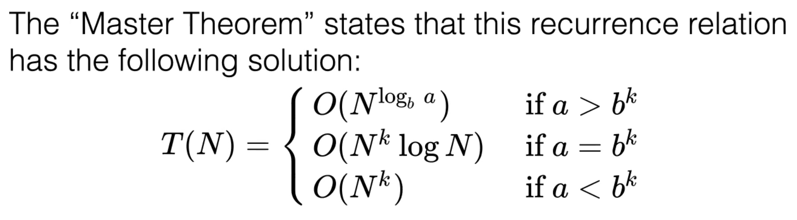
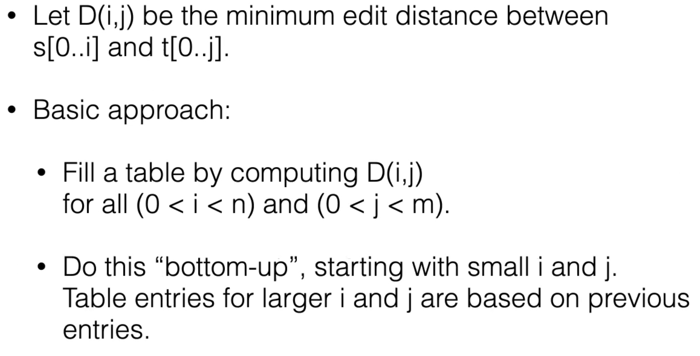
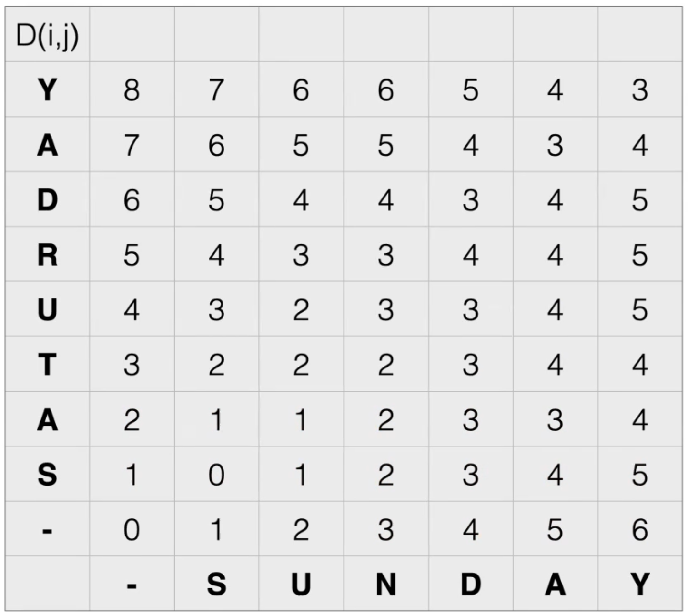
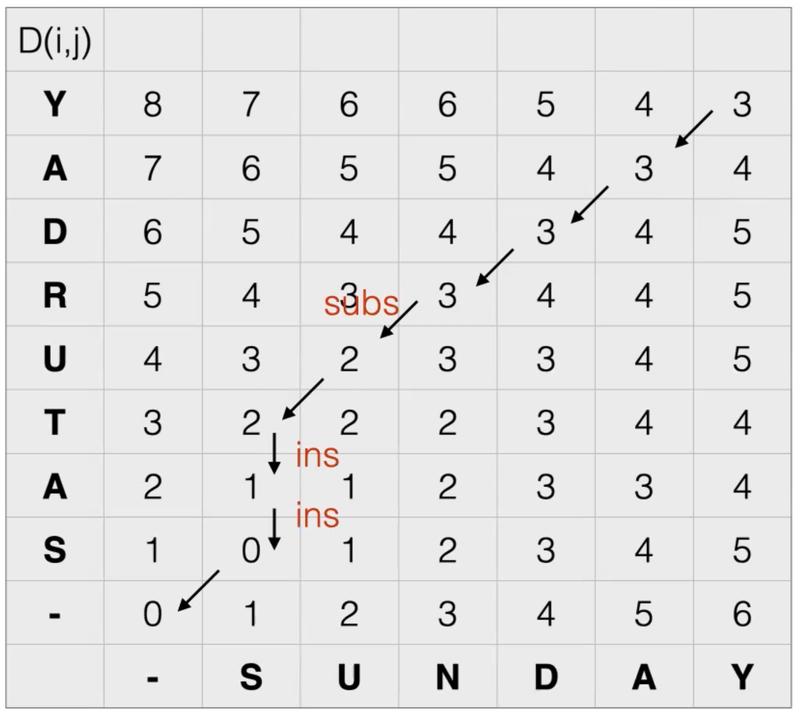

27 Apr 2022

 # Algorithms and Problem Solving

## Common Types of Algorithms

## Greedy Algorithms

 ### New Example of Greedy Algorithm: Huffman Coding

- Compression scheme for text data

- Usually text is stored as ASCII encoding

  

- Since some letters might be used more often, it would be more efficient to have a shorter code to represent these more frequent letters

- Example: A 5-character alphabet:

  

  - Note: 111 is not occupied

    

- Can encode these bits in a **Trie/Prefix Tree**

  

- Idea of **Huffman Coding** is that characters that occur frequently can be assigned higher in the prefix tree, resulting in a shorter code/storage space

  - Prefix “11” is not used for any other character than *nl*

  - Can move it higher to 11

    

    

    - ie. 000110 is ambiguous:

      Could be: , , etc

    - So characters are only allowed to appear in the leaf nodes

  ### Huffman Code

  

  

  - would correspond to s e a t nl
  - 146 bits vs 175 from previously when all codes where 5 bits

How do we implement this?

Entering in the greedy algorithm:

- s is at 0 position, nl is in 1 position

- Weight of T4 should be 25

Result:

- All trees in heap
- Deleting min takes log N
- N = number of characters = max elements that end up on heap
- Also a pre-processing step of computing the frequencies of characters

## Divide and Conquer Algorithms

Examples:

- efficient when subproblems have no overlap

### Merge Sort

#### Running Time

Analysis for merge sort and quick sort with perfect pivot by unrolling the recursion:

Because most of the runtimes of divide and conquer algorithms are similar, we have a standard formula for them:

**Master Theorem:**

- a = number of subproblems to solve
- b = how small the different subproblems are relative to overall n
- $\Theta$(N^k^) = time incurred to merge solutions back together

*Example: Binary Search*

a = 1, b = 2, k = 0 <– merging solutions back together takes constant time

- Case 2: 1 = 2^0^
- Total runtime : O(N^0^ log N) = O(log N)

**ANALYSE TOWERS OF HANOI PROBLEM USING MASTER THEOREM**

## Dynamic Programming Algorithms

- ie. solve from k = 1 up to N
- ie. Recursive doesn’t work efficiently for fibonacci because we are duplicating work

Example:

Broken Fibonacci:

Analysing the recursive fibonacci solutions:

- Approx O(2^N^)

Dynamic Programming Fibonacci:

- No recursion, computing the fibonacci numbers incrementally
- T(N) = O(N)

Example:

All-pairs shortest paths:

- If graph is not sparse, T(N) > O(|V|^3^)
- **Floyd-Warshall** better if graph is dense

- u now has to be on the shortest path from s to v

- rows represent source vertex and columns represent target vertex

- looks a little like the adjacency matrix

- In this case, d~k~[u] [v] gets updated from 7 to 5 since it’s cheaper to go from u to v via k

- Vertices are integers, and we visit them in ascending order of the integers
  - Arbritrary naming scheme

- Dynamic programming because the table of d is not computed recursively, but is incrementally updated step by step as k increases

Runtime:

O(|V|^3^)

Example:

**Longest Increasing Subsequence** : Recursive Solution

- Edges missing in diagram from two

- Recursively compute the longest sub-sequence from index 0 to i - 1
- Longest sub-sequence from index 0 to 7 (value 7) for example, is the longest sub-sequence from index 0 - 6 that ends with a value less than 7 + 1 (value 7)

- overlapping subsolutions

Dynamic Programming solution:

- Only gives length of increasing subsequence
- To keep track of the actual subsequence, can store a backpointer

Runtime: O(N^2^)

*Example:*

**Minimum Edit Distance:**

Edit distance as search:

- Subs for SATURDAY is wrong; or could be replacing S with S

Dynamic Programming Algorithm for Edit Distance:

- i = length of prefix in s, j = length of prefix in t
- Eventually, D(i, j) will give the minimum edit distance of both entire words

- Filling up table diagonally from bottom left corner

Recursive definition:

- if one word is empty the other has a prefix of i chars, the only way to get from the empty word to the other is with i insertions
- For D(i - 1, j) and D(i, j - 1), we do one insertion
- For D(i - 1, j - 1)
  - if s~i~ != s~j~, we replace one character
  - if s~i~ = s~j~, we don’t have to do anything since they’re identical

- For SATURDAY, - to S costs 1 insertion, - to SA costs 2 insertions, etc

- Looking at D(i - 1, j - 1), s~i~ = s~j~, so we do nothing

- Looking at D(i - 1, j - 1), s~i~ != s~j~, so we add 1 since S and U are different

Result: - 3 on upper right cell is the total minimum edit from SUNDAY to SATURDAY

