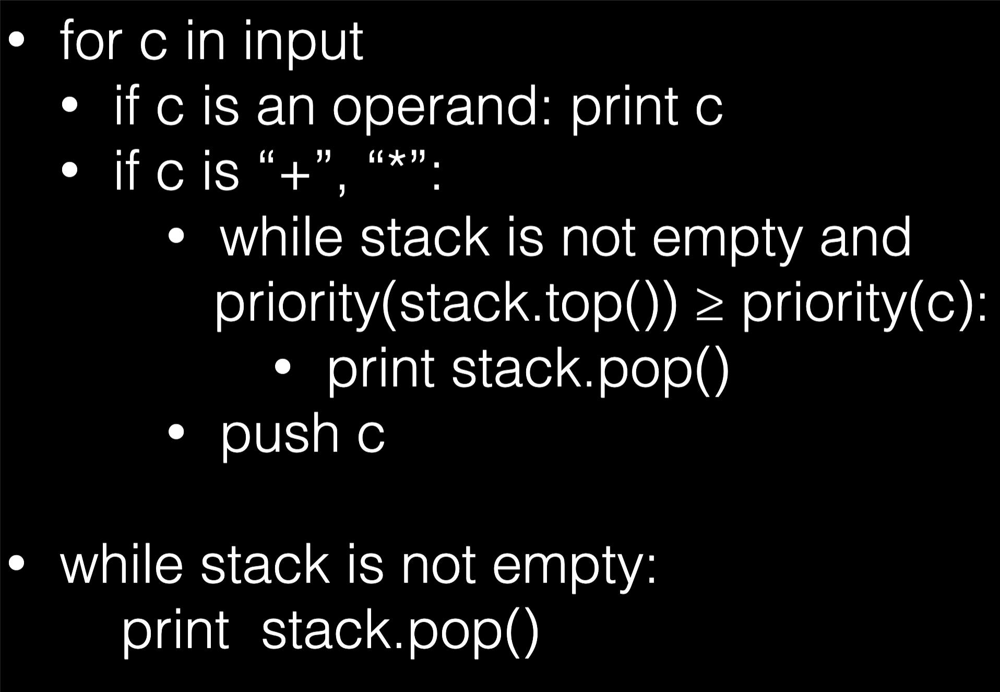

COMS W3137 - Honors Data Structures Final Review - Spring 22

Daniel Bauer April 27, 2022

Topics marked with ∗ will not be tested on the final.

Bring:

- Water
- Scratch paper
- Can bring calculator but not necessary

- One induction proof

- Two or three programming problems

- Short answer problems (No MC)

- Primarily do this algorithm on paper type problems

  - Some example of Djikstra’s or Prim’s like the table like HW
  - Problem involving AVL rotations
  - Problem involving sorting (understand algorithms step by step)

- Focused on second half of the semester

- Still will be Big O questions

- One scala problem (programming problem doesn’t involve writing code from scratch)

  - Modify data structure so it does something
  - Higher order functions/idea of pattern matching/immutable data structure/difference between var and val
  - Look at scala problem about tree and prefix/postfix

- Know implications for NP-complete and how reductions work

  - Won’t need to do reductions specifically
  - Not going to ask about the halting problem 
  - Not going to ask about different complexity classes and how they’re related
  - Know what it would mean if P = NP, what would happen? Implications?

- Won’t ask about scala/java API

  - No need to know method names

- Somewhat similar to homework problems (especially theory)

  - Look at sample solutions

  

Weiss Textbook Chapters

- Chapter 1 (entirely)

- Chapter 2 (entirely)

- Chapter 3 (entirely)

- Chapter 4.1, 4.2, 4.3, 4.4, and 4.6 (and 4.7∗)

- Chapter 5.1 through 5.5.

- Chapter 6.1 through 6.5, and 6.6.

- Chapter 7.1 through 7.3, 7.5 through 7.7, and 7.11

- Chapter 8.1 through 8.5 (this is about the disjoint set. Not all details are needed, just the basic data structure with path compression).

- Chapter 9.1 through 9.3.3, 9.5, 9.6.2∗, 9.6.3., 9.7

- Chapter 10.1.2, 10.2.1, 10.3.1

  

## Material from Outside the Textbook

- Towers of Hanoi.

- Amortized Analysis (the Weiss textbook discusses Amortized Analysis in chapter 11, but using data structures we did not yet discuss in class. Instead, please refer to the chapter from the Cormen, Leiserson, Rivest, and Stein Algorithms textbook, which you can find as a PDF on Courseworks).

- Lower-bound proof for comparison based sorting (CLRS Chapter)

  

- Immutable data structures.
- Scala (see below, please refer to the recitation nodes).
- Longest increasing subsequence problem
  - Can google

## General Concepts

- Abstract Data Types vs. Data Structures. 
- Recursion.
- Basic proofs by structural induction.
  - Similar to the one in midterm

## Java Concepts

- Won’t be problems like iterator problem in midterm
- Basic Java OOP: Classes / Methods / Fields. Visibility modifiers. 
- Generics.
- Inner classes (static vs. non-static).
- Interfaces.
- Iterator/ Iterable. 
- Comparable.

## Scala Concepts

There will not be a Scala programming problem on the midterm.

- REPL vs. compiled scala code.
- var vs. val.
- Everything is an expression.
- Basic functional programming: First class and higher-order functions, function literals(with right arrows) (vs. methods defined with def).
- Basic OOP in Scala (classes, methods, fields/instance variables).
- Case classes and pattern matching.
  - Might show up in code but don’t need to write out
  - Instance variables set by the constructor in the definition
    - Automatically get a constructor without having to write one specifically
- Multiple return values with tuples.
  - ie. stack: returning element popped and stack after pop
  - pair returned is a case class so can pattern match against it
- Immutable lists in scala (and using them as stacks).
  - cons operator; head and tail

- map, and folds.
  - Can separate process of traversing a data structure from the operation performed on it
  - expression tree: specify base case (leaf) and internal node, get two subresults and combine it with the parent

- Banker’s queue.
- Binary tree implementation and tree traversals. 
- Leftist heaps.
  - Don’t need to know in scala

## Analysis of Algorithms

- Big-O notation for asymptotic running time: O(f(n)), Θ(f(n)), Ω(f(n)).

  - Unless specified, all Big-O questions will be worst case

- No amortized analysis

- Typical growth functions for algorithms.

- Worst case, best case, average case.

- Recursion (Towers of Hanoi, recursive Fibonacci implementation, Binary Search) and runtime behavior of recursive programs. Logarithms in the runtime. Tail recursion.

- Master theorem for divide and conquer algorithms ∗

- Basic understanding of amortized analysis (Aggregate method, Banker’s method,

  Physicists/Potential method).∗

- Skills: Compare growth of functions using big-O notation. Given an algorithm (written in Java or Scala), estimate the asymptotic run time (including nested loops and simple recursive calls). Solving recurrences using the recursion tree method and ‘unrolling‘.

  

## Lists

- Not going to ask much about lists
- Look at doubly linked lists
- Difference in list implementations runtime performance
  - ArrayList, then getting an element in the middle is constant time
  - LinkedList, getting an element in the middle is linear
  - Prepending element in LinkedList is constant

- List ADT, including typical List operations. 
- ArrayList:

- –  Running time for insert, remove, get, contains at different positions in the list.

- –  Increasing the array capacity when the array is full.

  • LinkedList:

- –  Single vs. doubly linked list.
- –  Running time for insert, remove, get, contains at different positions in the list.
- –  Sentinel (beginMarker/head and endMarker/tail) nodes.

- Skills: Implement iterators. Implement additional list operations (such as reversal, but think of others, such as removing duplicates etc.).

- Lists in the Java Collections API∗.

  

## Stacks and Queues

- Stack ADT and operations (push, pop, peek). LIFO.

- Queue ADT and operations (enqueue, dequeue). FIFO.

- All operations should run in O(1).

- Stack implementation using List data structures, directly on an array, or using immutable lists.

- Stack applications:

  - **–  Symbol balancing, detecting palindromes.**
  - **–  Reordering sequences (in-order to post-order etc.).**
    - 
    - If brackets added:
      - For `(`, push onto stack.
      - When `)`, reduce stack until element popped = `(`
  - **–  Storing intermediate computations on a stack (evaluating post-order expressions).**
  - **–  Building expression trees.**
  - Can perform them on paper if asked

- Method call stack, stack frames ∗, relation between stacks and recursion.

  - Know significance of method call stack and what it means for recursion
  - Stack overflow error if recursion with no base case

- Tail recursion.

  - Last thing in a method being the recursive call with no operation afterwards
    - In java, compiler doesn’t optimize tail recursion so will be the same as loop
    - In other languages with the optimization, tail recursion can be elegant to write algorithms

- Queue implementation using Linked List.

- Queue implementation using a Circular Array.

- Banker’s queue.

- Stacks and queues in the Java Collections API (java.util.LinkedList supports all stack operations)∗.

- Skills: Implement stacks and queues. Use stacks and queues in applications.

  - Can try to build queue implementation/stack implentation with linkedlist/array

  

## Trees

- Should be able to build from scratch

- Recursive definition of a tree.

- Tree terminology (parent, children, root, leafs, path, depth, height)

- Different tree implementations (one instance variable per child, list of children, siblings as linked list)

  - Siblings as linked list: take a look
    - Root node, first child, next sibling with all siblings on same level
    - Same data structure logically as binary tree

  

- Binary trees:
  - –  Full / complete/ perfect binary trees.
  - –  Tree traversals: in-order, pre-order, post-order.
  - –  Expression trees - pre-fix, post-fix (a.k.a. reverse Polish notation), and in-fix notation.
  - –  Constructing an expression tree using a stack.
  - –  **Relation between number of nodes and height of a perfect/complete binary tree.**
  - –  Structural induction over binary trees (two versions: induction over height, induction over number of nodes).
    - Number of nodes: Start with full binary tree, remove two leaf nodes, turn one internal node into a leaf, by induction, show something holds for smaller tree, then do for larger tree
- Skills: Perform tree traversals on paper. Implement different tree traversals using recursion. Use these traversals to implement operations on trees (for example, summing up, computing tree properties, such as height). Convert between in-fix, post-fix, pre- fix notation using a tree. Structural induction proofs for binary tree properties.

Binary Search Trees

- Way of implementing Map
  - Keys have to be unique, can only appear once in tree

- Map ADT.
- BST property.
- BST operations and how they’re implented: contains, findMin, findMax, insert, remove (three cases for remove).
  - **Removing leaf node**
  - **Removing root with one child**
  - **Removing root with two children**
- Runtime performance of these operations, depending on the height of the tree.
  - Generally for BST: O(n)
- Lazy deletion ∗.
- Skills: Perform BST operations (contains, insert, delete) on paper.

AVL Trees

- Balanced BSTs. AVL balancing property.

- Maintaining AVL balance property on insert:

  - –  Outside imbalance, single rotation.
  - –  Inside imbalance, double rotation.
    - Be able to name outside/inside imbalance correctly (RL outside imbalance, etc)
  - –  Verifying that a tree is balanced as you come out of the recursion. Finding the location of an imbalance (bottom-up).
    - Should be able to do on paper (inserting values into empty AVL tree)

- Skills: Perform AVL rotations on paper, detect imbalances.

  

B-Trees ∗ 

## Hash Tables

- Hash functions.

- Collision Resolution Strategies 

  – Separate Chaining
   – Linear Probing
   – Quadratic Probing

  – Double Hashing

- Rehashing

  - When hash table is filled up, depends on load factor. If 1, means its full for probing
  - For quadratic probing, want the load factor to be < 0.5 because of quadratic probing theorem
  - Allocate new table and reinsert elements one by one, reapplying hash function to each element with different modulo of new table size

- Lazy deletion

  - Must lazy delete for probing hash table so it doesn’t break the probing when trying to access it again
  - Can incorrectly assume that there are no more such items for a hash value

- HashSets and HashMaps in the Java Collections API ∗.

- Quadratic Probing Theorem ∗

- Skills: Perform hash inserts, lookups, and rehashes on paper. Understand the consequences of the various collision resolution strategies. Be able to recognize a bad hash function. Implement hashCode and equals in Java classes.

  - How to implement own hashcode for object you write
  - Implement both hashcode and equals method
    - Since if they’re multiple objects with different/same hashcodes and end up in same position in hash table, have to check them one by one to see if it’s the one I’m looking for, this comparison is done using equals

- **Hash Tries?**

  

## Priority Queues

- Priority Queue ADT

- Binary Heaps.

- Tree and Array representations of Binary Heap.

- Complete tree and heap order property.

- Min-heaps vs. Max-heaps.

  - Constant time to get min/max

- Min-max heaps ∗

- The insert and deleteMin/deleteMax operations and running time

- Percolate up and percolate down.

- Calculating the parent and child nodes in the array representation, leaving first index empty

- The buildheap/heapify operation and its cost (O(n))

- The decreaseKey operation and why it is useful.

  - If reinserting value that’s already in heap, rather than inserting a copy of it, should change the priority in the position that it’s already located in (percolate up until it’s in correct position?)

- Leftist heaps (leftist property, merge operation and how to use it to implement insert and deleteMin).

  - Important to know: how **merging operation** works
  - Binary trees represented as linked node structures, satisfy heap order property
  - Can implement both deletemin and insert by merging
    - Insert: allocate new node and merge new node with existing tree
    - Deletemin: delete node and merge two remaining subtrees
  - Merge operation will only traverse rightmost subtree of both trees, can contain merge time as log n and log m (n and m being the no. of nodes in each tree)

- Skills: Perform heap operations (insert/deleteMin/buildheap) on paper. Merge two leftists heaps. Understand BinaryHeap implementation in Java.

  

## Sorting

- Familiar with all of them to be able to do them on paper

- Build from scratch except quick sort and heap sort

  - insertion/selection/merge sort

- Insertion sort

- Selection sort (not in the Weiss book)

- Heap Sort (in-place, that is, with replacement)

- Merge Sort, recursive implementation

- Iterative Merge Sort ∗.

- Quick Sort, partitioning happens before recursive steps, and pivot selection (median-of-three).

  - n^2^ if bad pivot selection

- Ω(nlogn) lower-bound for comparison-based sorting. (decision tree proof ∗)

- Bucket sort, counting sort, radix sort.

- Skills: Know the big-O costs of all of the algorithms listed (best and worst case). Be able to perform the sorting algorithms on paper. Understand when it might be appropriate to use one algorithm over the other. Implement basic sorting al- gorithms in Java, or at least understand the various implementations discussed in class.

  

## Graphs

- Basic definitions - vertices and edges, directed vs. undirected, weighted vs. un- weighted, Directed Acyclic Graphs (DAGs), connectivity (strong vs. weak in the case of directed graphs), complete graphs. Dense (no. of edges close to v^2^) vs. sparse (no. of edges far from v^2^, possibly in v).

- Graph representations: adjacency matrix vs. adjacency lists.

- Topological Sorting on DAGs.

- Earliest completion time on event node graphs ∗.

- Breadth First Search (BFS) vs. Depth First Search (DFS).

  - BFS uses queue, DFS uses stack

- Single-source unweighted shortest paths using BFS (known when discover vertex)

- Dijkstra’s algorithm for single-source weighted shortest paths (known when visit vertex)

  - DecreaseKey

- Minimum Spanning Trees: 

  – Prim’s algorithm

  – Kruskal’s algorithm (using union-find a.k.a. disjoint set data structure).

- DFS spanning trees.

  - Know how they look

- Biconnected components and articulation points ∗.

- Euler paths/circuits (preconditions and linear time algorithm for finding them (splicing)).

- Hamiltonian cycles.

- The Traveling Salesperson Problem (TSP).

  - Brute force 
  - Nearest neighbor approximation
  - Why it’s not optimal

- deterministic vs. non-deterministic machines ∗.

- P vs. NP, NP-hard and NP-complete.

- Reductions. (∗ you will not be asked to do a reduction on the final, but you should

  understand their significance).

- Nearest Neighbor Approximation vs. Brute Force Solution to TSP.

- MST approximation for TSP ∗. 2-opt ∗.

- Undecidability and the Halting Problem ∗.

- Skills: Perform topological sort, BFS for unweighted shortest paths, Dijkstra’s (not from scratch but may need to modify), Prim’s on paper (table format discussed in class and on homework 4). Compute a DFS spanning tree. Perform the Euler circuit algorithm on paper. Understand various graph implementations in Java. (adjacency list vs adjacency matrix in particular)

  

## Algorithm Design Strategies

- Greedy algorithms (examples include nearest neighbor approximation for TSP, Dijkstra’s/Prim’s, huffman coding).
- Divide-and-conquer algorithms and the master theorem (∗).
- Dynamic programming
   – Fibonacci sequence and how to optimize with DP
   – Longest increasing subsequence (hw5). 

​		– Edit distance ∗.

- Skills: Perform LCS DP algorithm on paper (fill out table).

