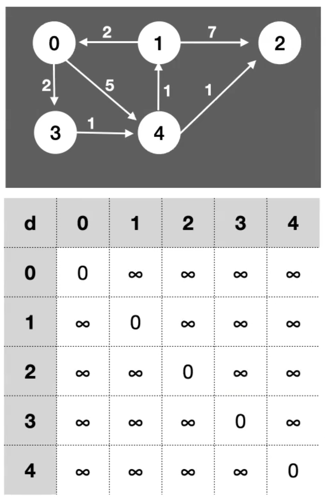
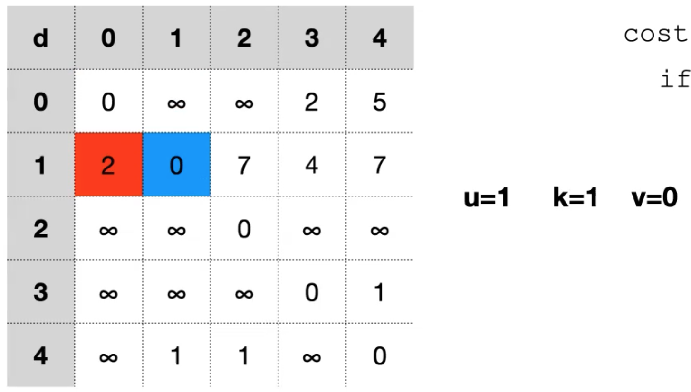

## Floyd-Warshall Algorithm

- NOT ON FINAL

Initialize with Adjacency Matrix:

Implementation:

Iterate through all vertices k:

For each vertix k, loop through all vertices u and all vertices v

- First obtain cost to go from u - v via k

- Result

